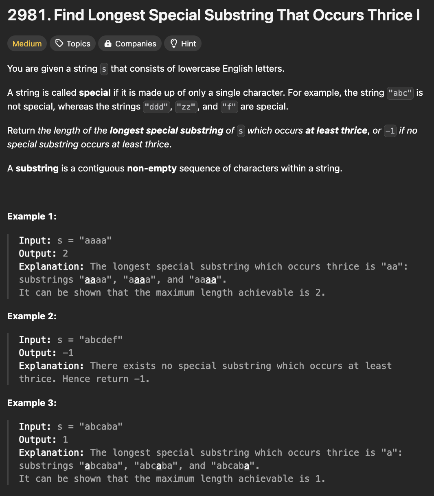
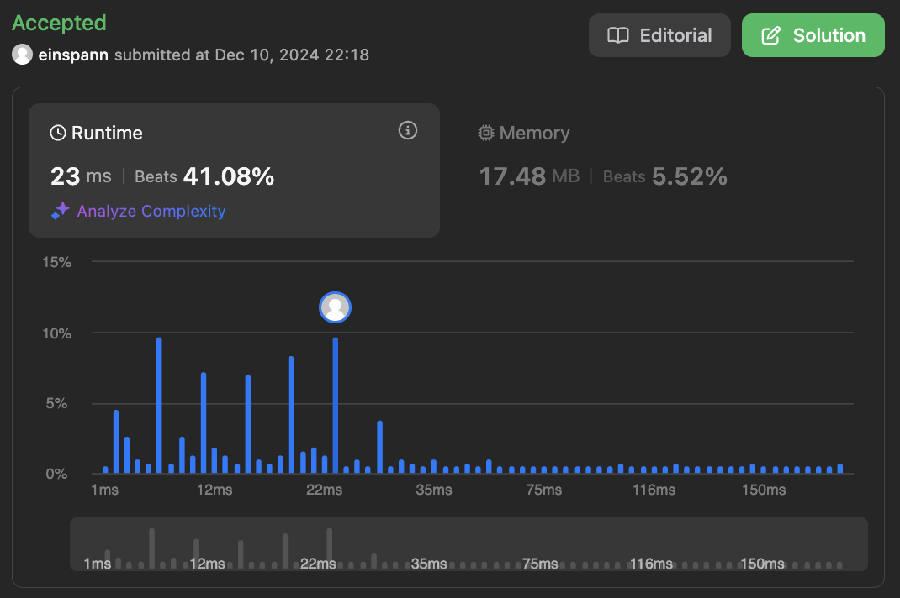

# 문제 설명
이 문제는 문자열이 주어지면, 해당 문자열에서 특정 문자열이 3번 이상 반복되는 가장 긴 부분 문자열의 길이를 반환하는 문제이다.



## 풀이 및 해설

## 풀이
```python
class Solution:
    def maximumLength(self, s: str) -> int:
        # create a dictionary to store the count of all substrings
        count = {}
        count_strings = 0
        for start in range(len(s)):
            character = s[start]
            substring_length = 0
            for end in range(start, len(s)):
                if character == s[end]:
                    substring_length += 1
                    count[(character, substring_length)] = (
                        count.get((character, substring_length), 0) + 1
                    )
                else:
                    break
        
        ans = 0
        for i in count.items():
            length = i[0][1]
            if i[1] >= 3 and length > ans:
                ans = length
        if ans == 0:
            return -1
        return ans
```

## Complexity Analysis


### 시간 복잡도
- O(N^2) ; N is the length of the string

### 공간 복잡도
- O(N^2) ; N is the length of the string

## Constraint Analysis
```
Constraints:
3 <= s.length <= 50
s consists of only lowercase English letters.
```

# References
- [2981. Find Longest Special Substring That Occurs Thrice I](https://leetcode.com/problems/find-longest-special-substring-that-occurs-thrice-i/)