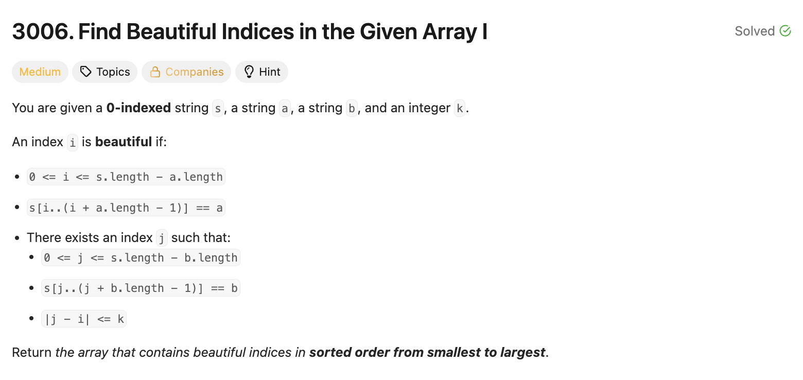

# 문제 설명
이 문제는 다음 조건을 만족하는 아름다운 인덱스의 개수를 찾는 문제입니다.

* 0 <= i <= s.length - a.length
* s[i..(i + a.length - 1)] == a
* There exists an index j such that:
    * 0 <= j <= s.length - b.length
    * s[j..(j + b.length - 1)] == b
    * |j - i| <= k

즉, 아름다운 조건은 다음과 같다:
- 인덱스 i에서 시작하는 부분 배열이 a와 일치해야 한다.
- 인덱스 j에서 시작하는 부분 배열이 b와 일치해야 한다.
- 인덱스 i와 j 사이의 거리가 k 이하이어야 한다.



## 풀이 및 해설
- 이 문제를 풀기 위해서는 저는 다음과 같이 접근했습니다.
1. 배열 s를 순회하며 부분 배열이 a와 일치하는 모든 시작 인덱스를 찾고, b와 일치하는 모든 시작 인덱스를 찾습니다.
2. 이중 for문을 사용하여 a와 b의 시작 인덱스 쌍을 비교하고, |j - i| <= k 조건을 만족하는지 확인합니다.

이렇게 했을 때 풀리기는 하지만 시간 복잡도가 O(N^2)으로 비효율적일 수 있습니다.

## 풀이 1
```python
class Solution:
    def beautifulIndices(self, s: str, a: str, b: str, k: int) -> List[int]:
        na, nb = len(a), len(b)
        a_indices = []
        b_indices = []

        for i in range(len(s)):
            # find indexes of occurrences str a
            if i+na<=len(s) and s[i:i+na]==a:
                a_indices.append(i)

            # find indexes of occurrences str b
            if i+nb<=len(s) and s[i:i+nb]==b:
                b_indices.append(i)
        
        ans = []
        for i in a_indices:
            for j in b_indices:
                if abs(j-i) <= k:
                    ans.append(i)
                    break
        
        return ans
```


따라서, 두번째 부분의 이중 for문을 대신하여 bisect를 쓰면 O(N)을 O(N log N)으로 줄일 수 있습니다.

## 풀이 2 - Bisect 활용
```python
class Solution:
    def beautifulIndices(self, s: str, a: str, b: str, k: int) -> List[int]:
        na, nb = len(a), len(b)
        a_indices = []
        b_indices = []

        for i in range(len(s)):
            # find indexes of occurrences str a
            if i+na<=len(s) and s[i:i+na]==a:
                a_indices.append(i)

            # find indexes of occurrences str b
            if i+nb<=len(s) and s[i:i+nb]==b:
                b_indices.append(i)
        
        ans = []
        for i in a_indices:
            for j in b_indices:
                if abs(j-i) <= k:
                    ans.append(i)
                    break
        
        return ans
```

## Complexity Analysis


### 시간 복잡도
- O(N log N): 배열 s를 한 번 순회하는데 O(N)이 걸리고, bisect를 사용하여 각 a의 인덱스에 대해 b의 인덱스를 찾는 데 O(log N)이 걸리기 때문입니다.

### 공간 복잡도
- O(N): a와 b의 시작 인덱스를 저장하는 데 추가 공간이 필요하기 때문입니다.

## Constraint Analysis
```
Constraints:
1 <= k <= s.length <= 10^5
1 <= a.length, b.length <= 10
s, a, and b contain only lowercase English letters.
```

# References
- [3006. Find Beautiful Indices in the Given Array I - LeetCode](https://leetcode.com/problems/find-beautiful-indices-in-the-given-array-i/)