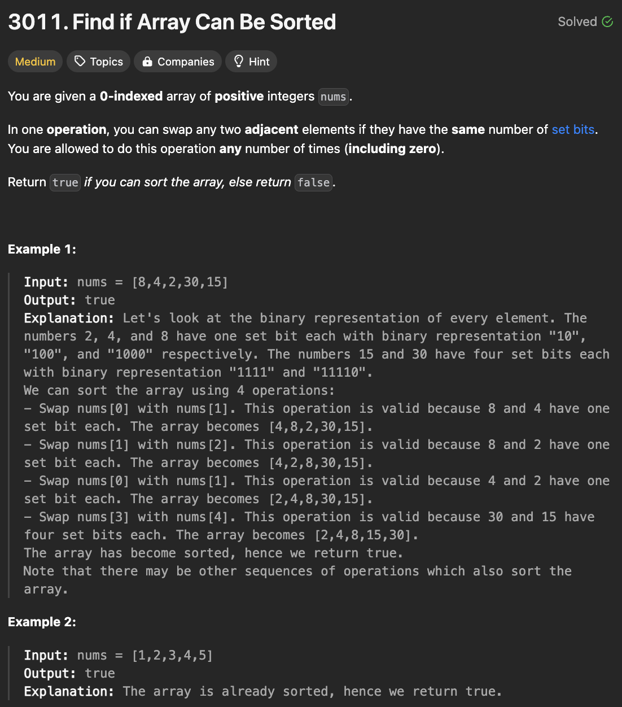
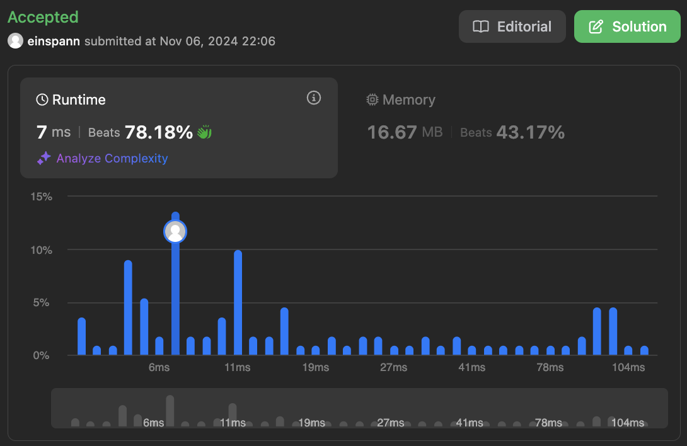

# 문제 설명
이 문제는 주어진 배열을 정렬할 수 있는지 확인하는 문제이다.

이때, 정렬이 가능하다는 것은 다음과 같은 조건을 만족해야 한다.

- 배열의 set bits(1의 개수)가 같은 모든 연속된 숫자들은 오름차순으로 정렬되어야 한다.



## 풀이 및 해설
- n만큼 순회하며 각 숫자의 set bits(1의 개수)를 확인한다.
- 현재 숫자의 최소값과 최대값을 저장하며, 이를 이용해 다음 그룹이 이전 그룹 뒤에 올 수 있는지 확인한다.

## 풀이
```python
def canSortArray(self, nums: List[int]) -> bool:
    prev_max = 0
    i = 0
    n = len(nums)

    while i < n:
        # count set bits(1s) of current number
        count = nums[i].bit_count()
        j = i + 1
        min_val = max_val = nums[i]

        # find all adjacent numbers with the same set bit count
        while j < n and nums[j].bit_count() == count:
            min_val = min(min_val, nums[j])
            max_val = max(max_val, nums[j])
            j += 1
        
        # check if this group can be placed after the previous group
        if prev_max > min_val:
            return False
        
        prev_max = max_val
        i = j
    
    return True
```

## Complexity Analysis


### 시간 복잡도
- O(N): 주어진 배열을 한 번 순회하며 정렬 가능 여부를 확인한다.

### 공간 복잡도
- O(1): 상수 개수의 변수만 사용한다.

## Constraint Analysis
```
Constraints:
1 <= nums.length <= 100
1 <= nums[i] <= 2^8
```

# References
- [3011. Find if Array Can Be Sorted](https://leetcode.com/problems/find-if-array-can-be-sorted/)