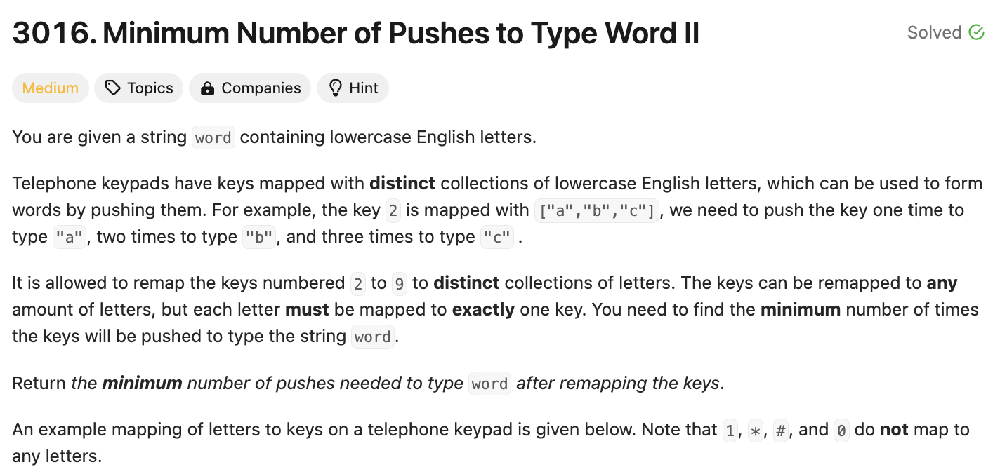
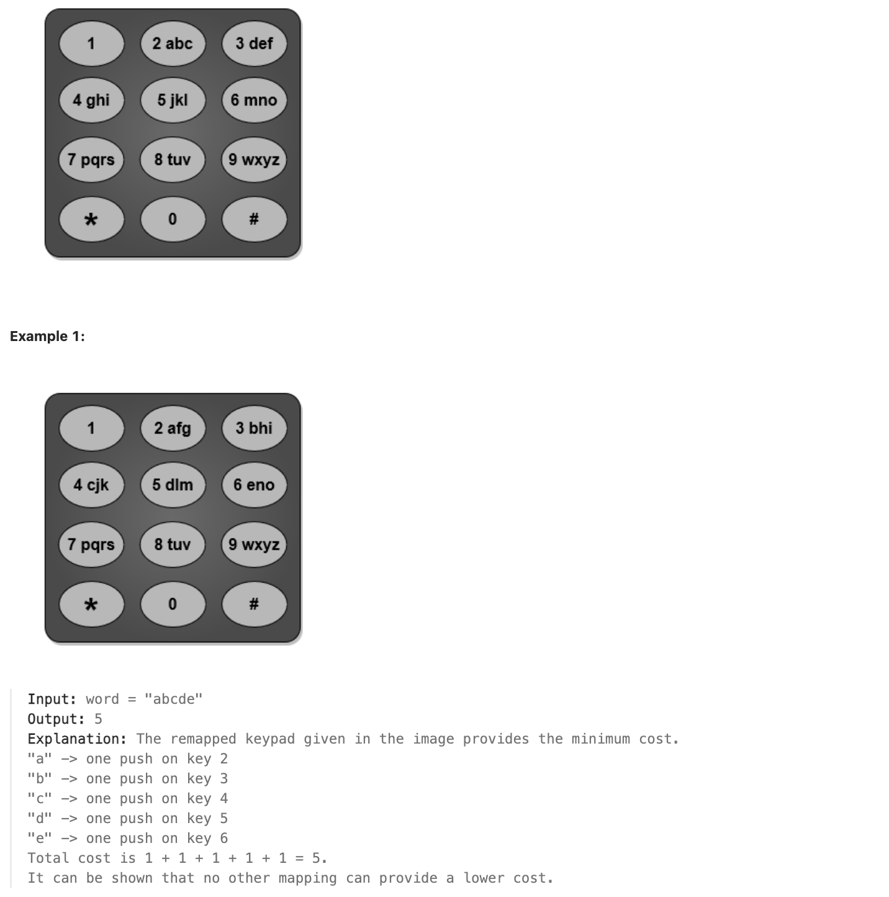
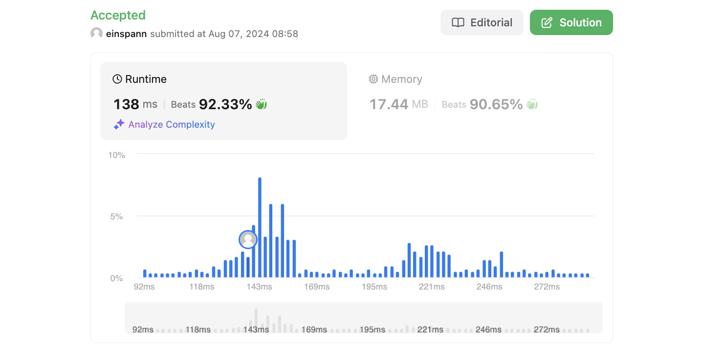

# 문제 설명
특정 문자열을 타이핑하는데 필요한 최소한의 푸시 횟수를 구하는 문제다.






## 풀이 및 해설


## 풀이
```python
def minimumPushes(self, word: str) -> int:
        # Count letters by frequency and then sort them
        alph = Counter(word)
        sorted_alph = alph.most_common()
        print(sorted_alph)
        
        # Initialize variables
        pushes = 0
        count = 0
        cycle = 1
        
        # Iterate over the sorted alphabet
        for key, value in sorted_alph:
            pushes += cycle * value
            count += 1
            
            # Increase cycle every 8 keys
            if count % 8 == 0:
                cycle += 1
            
        return pushes
```
- 문자열을 카운트하고 정렬한다.
- 푸시 횟수를 초기화하고, 카운트와 사이클을 초기화한다.
- 정렬된 알파벳을 순회하며 푸시 횟수를 계산한다.
- 8개의 키마다 사이클을 증가시킨다.
- 푸시 횟수를 반환한다.

## Complexity Analysis


### 시간 복잡도
- O(N) ; N은 문자열의 길이
- O(NlogN) ; Counter를 사용하여 정렬

총 O(NlogN)이다.

### 공간 복잡도
공간 복잡도는 O(N)이다.

## Constraint Analysis
```
Constraints:
1 <= word.length <= 10^5
word consists of lowercase English letters.
```

# References
- [LeetCode - 3016](https://leetcode.com/problems/minimum-number-of-pushes-to-type-word-ii/)
- [Split STR into list of chars](https://www.geeksforgeeks.org/python-split-string-into-list-of-characters/)
- [most_common() Counter](https://stackoverflow.com/questions/20950650/how-to-sort-counter-by-value-python)