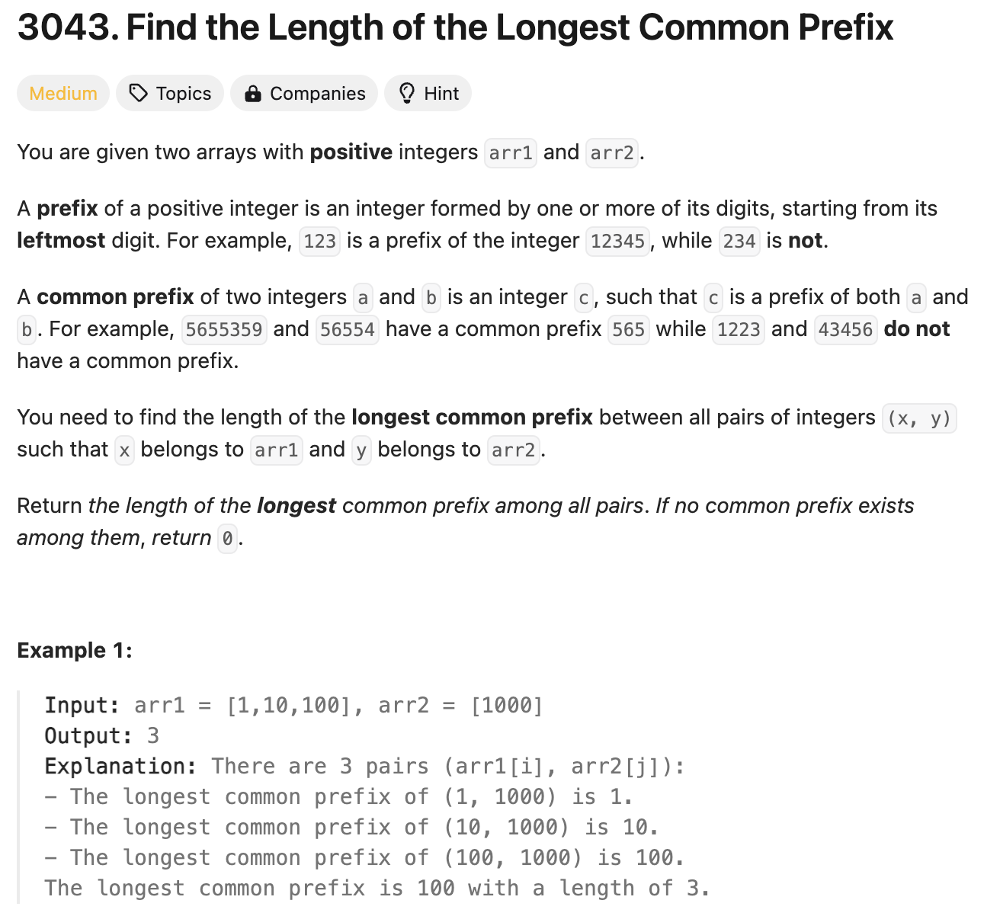
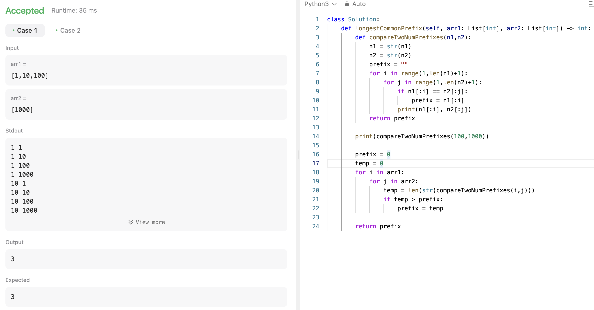
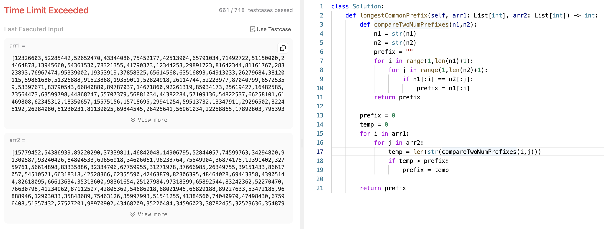
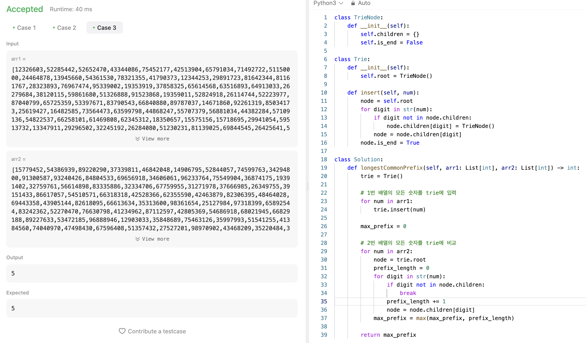

# 문제 설명
숫자 배열이 두개가 주어진다. 두 배열의 가장 긴 공통 접두사의 길이를 반환하라.



# 1차 시도

## 풀이 및 해설
이 문제는 한번에 풀면 힘들것 같아서, 조금 돌아가더라도 작은 문제로 나눠서 풀어보려고 시도해봤다.

모든 숫자들에 대해서 가장 짧은 접두사를 바로 찾기보다, 숫자 두개가 주어졌을 때, 두 숫자의 가장 긴 접두사를 찾는 함수를 만들었다.

이후, 모든 숫자에 대해서 이 함수를 반복하면서, 가장 긴 접두사를 찾아보려고 했다.

## 풀이
```python
def longestCommonPrefix(self, arr1: List[int], arr2: List[int]) -> int:
    def compareTwoNumPrefixes(n1,n2):
        n1 = str(n1)
        n2 = str(n2)
        prefix = ""
        for i in range(1,len(n1)+1):
            for j in range(1,len(n2)+1):
                if n1[:i] == n2[:j]:
                    prefix = n1[:i]
                print(n1[:i], n2[:j])
        return prefix

    print(compareTwoNumPrefixes(100,1000))

    prefix = 0
    temp = 0
    for i in arr1:
        for j in arr2:
            temp = len(str(compareTwoNumPrefixes(i,j)))
            if temp > prefix:
                prefix = temp

    return prefix
```



일단 테스트는 통과했다. 그러나 아마 실제로 제출하면 시간 복잡도 때문에 통과하지 못할 것 같다.

역시나 TLE다. 여기서 이제 어떻게 더 최적화를 진행할 수 있을지 생각해보자.




# 2차 시도

## 풀이 및 해설
trie 데이터 구조를 사용하니까 바로 풀린다. 기존에는 nested loop이 많아서 상당히 오래 걸렸다면, 이번에는 arr1에 있는 모든 숫자들을 trie에 넣는다. 이때 그러면 숫자의 digit이 하나의 노드가 되면서 123의 경우에 1의 자식이 2, 2의 자식이 3이 되는 식이다. 이렇게 모든 숫자들을 넣는다.

이어서 arr2에 있는 모든 숫자들을 trie에 검색해본다. 이때, 가장 긴 접두사를 계속 업데이트해나가면서, 가장 긴 접두사를 찾아낸다.

## 풀이
```python
class TrieNode:
    def __init__(self):
        self.children = {}
        self.is_end = False

class Trie:
    def __init__(self):
        self.root = TrieNode()

    def insert(self, num):
        node = self.root
        for digit in str(num):
            if digit not in node.children:
                node.children[digit] = TrieNode()
            node = node.children[digit]
        node.is_end = True

class Solution:
    def longestCommonPrefix(self, arr1: List[int], arr2: List[int]) -> int:
        trie = Trie()

        # 1번 배열의 모든 숫자를 trie에 입력
        for num in arr1:
            trie.insert(num)
        
        max_prefix = 0

        # 2번 배열의 모든 숫자를 trie에 비교
        for num in arr2:
            node = trie.root
            prefix_length = 0
            for digit in str(num):
                if digit not in node.children:
                    break
                prefix_length += 1
                node = node.children[digit]
            max_prefix = max(max_prefix, prefix_length)
        
        return max_prefix
```



이런 긴 자료구조를 정의해야 할때는 확실히 여러번 써서 외워야 할것 같다.

## Complexity Analysis


### 시간 복잡도
- O(N*M+K+L) : N은 arr1의 길이, M은 arr1에 있는 숫자들의 평균 길이, K는 arr2의 길이, L은 arr2의 숫자의 평균 길이

### 공간 복잡도
- O(N*M) : N은 arr1의 길이, M은 arr1에 있는 숫자들의 평균 길이

## Constraint Analysis
```
Constraints:
1 <= arr1.length, arr2.length <= 5 * 10^4
1 <= arr1[i], arr2[i] <= 10^8
```

# References
- [3043. Find the Length of the Longest Common Prefix](https://leetcode.com/problems/find-the-length-of-the-longest-common-prefix/)