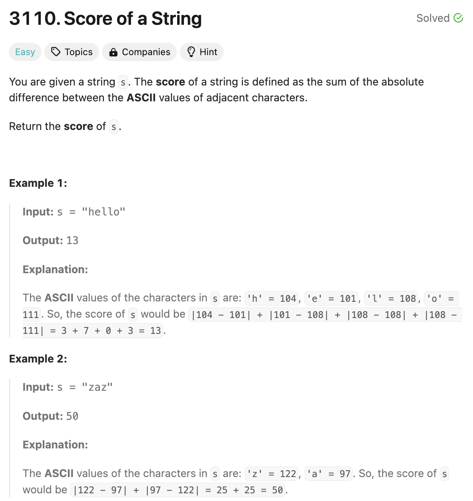

# 문제 설명
지난 6월 문제를 시간 되돌리기 티켓을 사용해서 풀었다. 정확히는 리트코드 데일리 6/1일 문제다.  

easy난이도 문제라 간단하게 참고 안하고 혼자서 바로 풀었다.



## 풀이 및 해설
- 문자열 s가 주어진다.
- len(s) - 1 만큼 반복하면서
  - s[i]와 s[i+1]의 아스키 코드 차이를 구해서 절대값을 구한다.
    - abs(ord(s[i+1]) - ord(s[i]))
  - 이 값을 score에 더해준다.
- score를 반환한다.

## 풀이
```python
def scoreOfString(self, s: str) -> int:
    score = 0
    for i in range(len(s) -1):
        score += abs(ord(s[i+1]) - ord(s[i]))
    
    return score
```

## Complexity Analysis


### 시간 복잡도
- O(N)

### 공간 복잡도
- O(1)

## Constraint Analysis
```
Constraints:
2 <= s.length <= 100
s consists only of lowercase English letters.
```

# References
- [3110. Score of a String](https://leetcode.com/problems/score-of-a-string/)