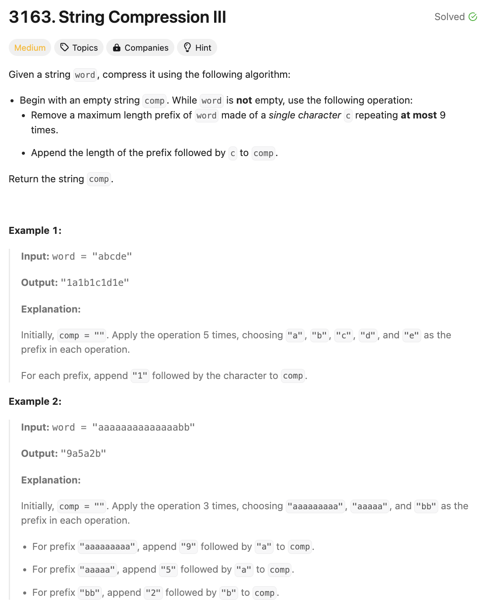
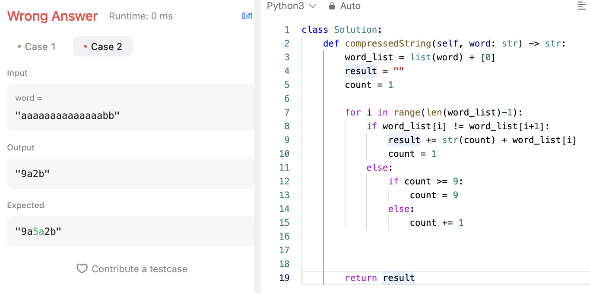
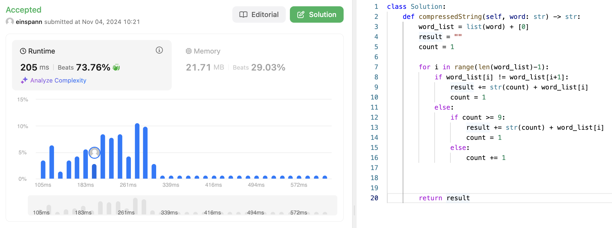

# 문제 설명
이 문제는 문자열을 줄이는 문제다. 예시로 aaabb가 있으면 3a2b로 줄일 수 있다.

그러나, 조건이 하나 포함되어 있는데, a가 9까지 올 경우 두개로 나눠야 한다. 예로 9a2a2b 이런식으로 말이다.



## 풀이 및 해설
일단 처음에는 조건을 못 지켜서 아래와 같이 틀렸다.


조건만 조금 고쳐주니까 바로 풀렸다. 거의 처음으로 푸는 몇 안되는 참고 안한 미디엄 문제다. 뿌듯하다.

## 풀이
```python
def compressedString(self, word: str) -> str:
    word_list = list(word) + [0]
    result = ""
    count = 1

    for i in range(len(word_list)-1):
        if word_list[i] != word_list[i+1]:
            result += str(count) + word_list[i]
            count = 1
        else:
            if count >= 9:
                result += str(count) + word_list[i]
                count = 1
            else:
                count += 1
    
    return result
```

## Complexity Analysis


### 시간 복잡도
- O(N) ; N은 word의 길이

### 공간 복잡도
- O(N) ; N은 word의 길이

## Constraint Analysis
```
Constraints:
1 <= word.length <= 2 * 10^5
word consists only of lowercase English letters.
```

# References
- [3163. String Compression III](https://leetcode.com/problems/string-compression-iii/)