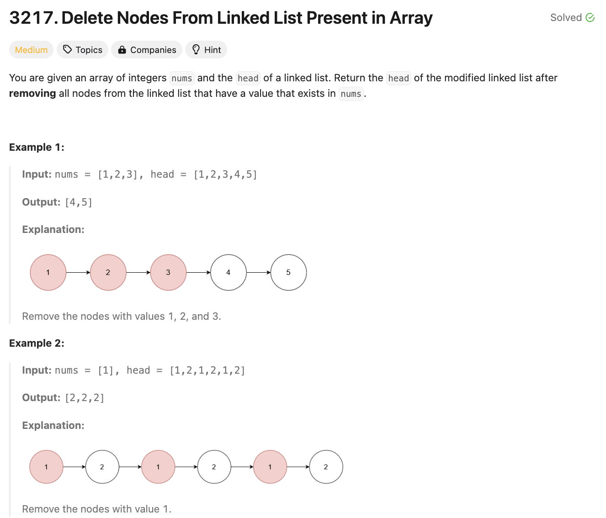

# 문제 설명
Linked List와 Array가 주어질 때, Array에 있는 값들을 Linked List에서 제거하는 문제이다.




## 풀이 및 해설
Linked List를 순회하면서, Array에 있는 값이면 제거해주면 된다. 이때, 제거할 때는 이전 노드의 next를 현재 노드의 next로 바꿔주면 된다.

## 풀이
```python
def modifiedList(self, nums: List[int], head: Optional[ListNode]) -> Optional[ListNode]:
    nums_set = set(nums)

    dummy = ListNode(0)
    dummy.next = head
    current = dummy

    while current.next:
        if current.next.val in nums_set:
            current.next = current.next.next
        else:
            current = current.next
    
    return dummy.next
```
- 중복 값들을 제거하기 위해 nums 배열을 set으로 변환한다.
- dummy 노드를 생성하고, head를 dummy.next로 설정한다.
- Linked List를 순회하면서, nums_set에 있는 값이면 current.next를 current.next.next로 바꿔줘서 건너뛴다.
- nums_set에 없는 값이면 current를 current.next로 바꿔주면서 current를 이동시킨다.
- dummy.next를 반환해줌으로써, dummy를 제외한 Linked List를 반환한다.

## Complexity Analysis


### 시간 복잡도
- O(n) ; n은 Linked List의 노드 개수

### 공간 복잡도
- O(n) ; n은 nums 배열의 길이

## Constraint Analysis
```
Constraints:
1 <= nums.length <= 10^5
1 <= nums[i] <= 10^5
All elements in nums are unique.
The number of nodes in the given list is in the range [1, 10^5].
1 <= Node.val <= 10^5
The input is generated such that there is at least one node in the linked list that has a value not present in nums.
```

# References
- [3217. Delete Nodes From Linked List Present in Array](https://leetcode.com/problems/delete-nodes-and-return-forest/)