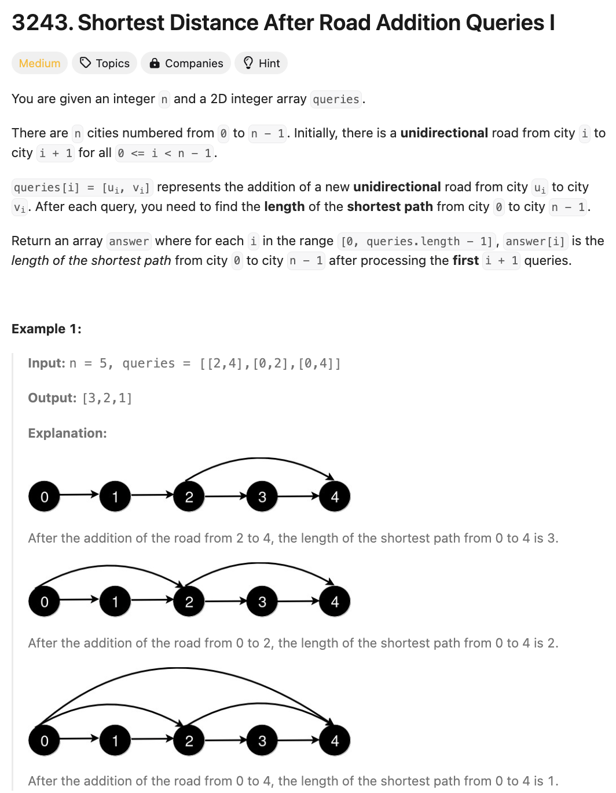

# 문제 설명
이 문제는 0에서 n-1개의 노드가 주어지고, 여기에 새로운 경로가 들어있는 paths가 주어집니다.

이때, 해당 path가 추가될때마다 0부터 n-1까지의 최단거리를 구하는 문제입니다.



## 풀이 및 해설

## 풀이
```python
class Solution:
    def shortestDistanceAfterQueries(self, n: int, queries: List[List[int]]) -> List[int]:
        def shortestPath(self, n, paths: dict) -> int:
            # paths : {0: [1], 1: [2], 2: [3, 4], 3: [4]}
            start = 0
            end = n-1

            queue = deque([(start, 0)])
            visited = set([start])

            while queue:
                node, distance = queue.popleft()
                if node == end:
                    return distance

                for neighbor in paths.get(node, []):
                    if neighbor not in visited:
                        visited.add(neighbor)
                        queue.append((neighbor, distance+1))
            
            return -1
        
        paths = {i:[i+1] for i in range(n-1)}
        shortest_dists = []

        for q in queries:
            start, end = q[0],q[1]
            paths[start].append(end)
            shortest_dists.append(shortestPath(self, n, paths))

        return shortest_dists
```
- BFS를 이용하여 최단 거리를 구하는 함수 shortestPath를 정의한다. 
- 모든 query에 대해 paths를 업데이트하고, shortestPath를 호출하여 최단 거리를 구한다.
- 최단 거리를 저장한 리스트를 반환한다.

## Complexity Analysis


### 시간 복잡도
- O(n+q) : n은 노드의 개수, q는 query의 개수

### 공간 복잡도
- O(n) : n은 노드의 개수

## Constraint Analysis
```
Constraints:
3 <= n <= 500
1 <= queries.length <= 500
queries[i].length == 2
0 <= queries[i][0] < queries[i][1] < n
1 < queries[i][1] - queries[i][0]
There are no repeated roads among the queries.
```

# References
- [3243. Shortest Distance After Road Addition Queries I](https://leetcode.com/problems/shortest-distance-after-road-addition-queries-i/)