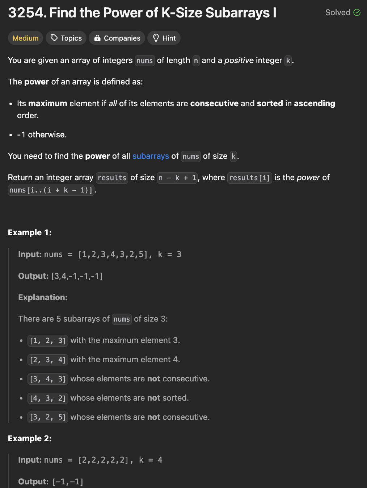
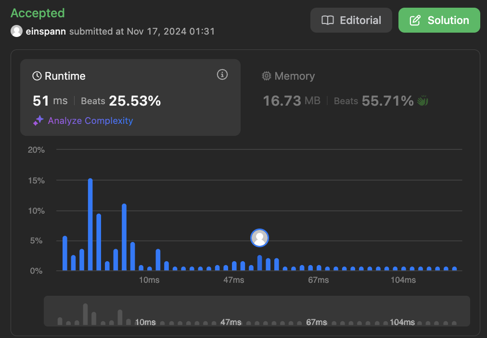

# 문제 설명

이 문제는 n 길이의 'nums' 배열과 k의 양의 정수가 주어진다. 이때, 배열의 power은 다음 조건을 만족하는 경우이다:

- 배열이 연속적이고 정렬되어 있는 경우, 최대값.
- 그렇지 않은 경우, -1.

이때, k 크기의 subarray의 power를 모두 찾아서 반환하는 문제이다.




## 풀이 및 해설

## 풀이
```python
def resultsArray(self, nums: List[int], k: int) -> List[int]:
    length = len(nums)
    result = [0] * (length - k + 1)
    for start in range(length - k + 1):
        is_consecutive_and_sorted = True


        for i in range(start, start + k - 1):
            if nums[index+1] != nums[index] + 1:
                is_consecutive_and_sorted = False
                break
        
        if is_consecutive_and_sorted:
            result[start] = nums[start + k - 1]
        else:
            result[start] = -1
    
    return result
```
- 결과를 저장할 배열을 초기화한다.
- 배열의 길이에서 k를 뺀 만큼 반복한다.
- 연속적이고 정렬되어 있는지 확인하는 변수를 초기화한다.
- k 크기의 subarray를 확인한다.
- subarray가 연속적이고 정렬되어 있는 경우, 최대값을 저장한다.
- 그렇지 않은 경우, -1을 저장한다.
- 결과를 반환한다.

## Complexity Analysis


### 시간 복잡도
- O(nk) ; n은 배열의 길이, k는 subarray의 길이.
- n만큼 반복하고, k만큼 반복한다.

### 공간 복잡도
- O(1) ; 추가적인 공간이 필요하지 않다.

## Constraint Analysis
```
Constraints:
1 <= n == nums.length <= 500
1 <= nums[i] <= 10^5
1 <= k <= n
```

# References
- [3254. Find the Power of K-Size Subarrays I](https://leetcode.com/problems/find-the-power-of-k-size-subarrays-i/)