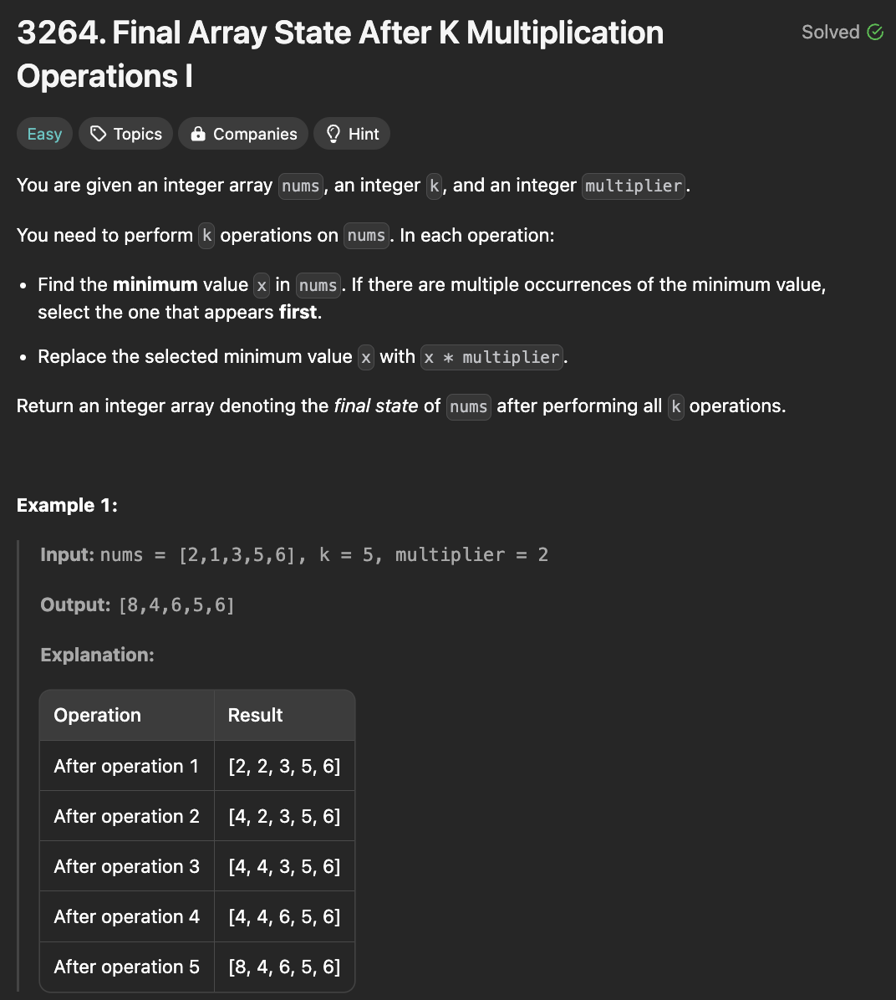

# 문제 설명
이 문제에서는 다음 연산을 k번 수행한다. 이때, 모든 연산을 수행한 후 배열의 상태를 반환하라.  

연산:  
- 배열에서 가장 작은 값을 찾는다.
- 배열에서 가장 작은 값을 찾아 multiplier로 곱한다.
- 배열에서 가장 작은 값을 찾아 multiplier로 곱한 값을 대체한다.



## 풀이 및 해설


## 풀이
```python
class Solution:
    def getFinalState(self, nums: List[int], k: int, multiplier: int) -> List[int]:
        for i in range(k):
            minval = min(nums)
            for j in range(len(nums)):
                if nums[j] == minval:
                    nums[j] = nums[j] * multiplier
                    break
        
        return nums
```

## Complexity Analysis


### 시간 복잡도
- O(kn)
- O(n)은 최소값을 찾는데, O(k)는 k번의 연산을 수행하는데 소요된다.

### 공간 복잡도
- O(1)


# Heap을 활용한 개선

## 풀이
```python
class Solution:
    def getFinalState(self, nums: List[int], k: int, multiplier: int) -> List[int]:
        heap = [(num, i) for i,num in enumerate(nums)]
        heapq.heapify(heap)
        
        for i in range(k):
            minval, idx = heapq.heappop(heap)

            new_val = minval * multiplier
            nums[idx] = new_val

            heapq.heappush(heap, (new_val, idx))
        
        return nums
```

## Complexity Analysis


### 시간 복잡도
- O(nlogn)
- O(nlogn)은 heapify에 소요되는 시간이다.
- O(klogn)은 k번의 연산을 수행하는데 소요된다.
- 따라서, O(nlogn + klogn) = O(nlogn)

### 공간 복잡도
- O(n)
- heap에 nums의 모든 요소를 저장한다.

확실히 빨라진 것을 확인할 수 있다.


## Constraint Analysis
```
Constraints:
1 <= nums.length <= 100
1 <= nums[i] <= 100
1 <= k <= 10
1 <= multiplier <= 5
```

# References
- [3264. Final Array State After K Multiplication Operations I](https://leetcode.com/problems/final-value-of-variable-after-performing-operations/)