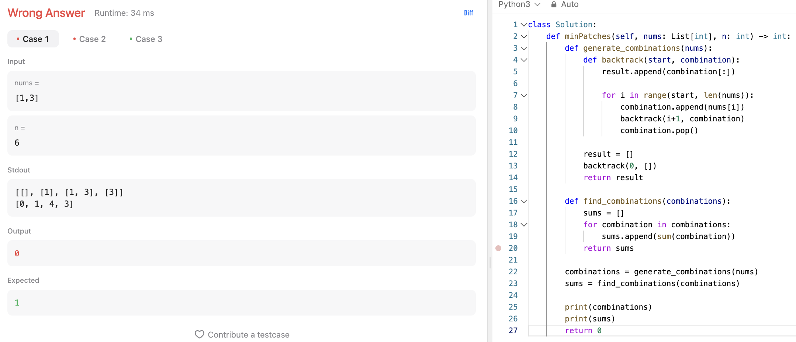

# 문제 설명
2024년 6월 16일에 출제된 데일리 문제다. 

배열에 숫자를 추가하여 만들 수 있는 숫자의 범위를 최대로 하는 문제다.


## 풀이 및 해설
처음에는 모든 combination을 다 찾고, 그 중 가능한 합들을 다 계산하는 함수를 다음과 같이 만들어서 풀려고 했는데, 비효율적이라고 생각했다.



```python
def generate_combinations(nums):
    def backtrack(start, combination):
        result.append(combination[:])

        for i in range(start, len(nums)):
            combination.append(nums[i])
            backtrack(i+1, combination)
            combination.pop()

    result = []
    backtrack(0, [])
    return result

def find_combinations(combinations):
    sums = []
    for combination in combinations:
        sums.append(sum(combination))
    return sums
```

## 풀이
```python
def minPatches(self, nums: List[int], n: int) -> int:
    patches = 0
    i = 0
    miss = 1
    while miss <= n:
        if i < len(nums) and nums[i] <= miss:
            miss += nums[i]
            i += 1
        else:
            miss += miss
            patches += 1
    return patches
```

## Complexity Analysis


### 시간 복잡도
- O(min(m, log n)) ; m은 nums의 길이, n은 n이다.

### 공간 복잡도
- O(1)

## Constraint Analysis
```
Constraints:
1 <= nums.length <= 1000
1 <= nums[i] <= 10^4
nums is sorted in ascending order.
1 <= n <= 2^31 - 1
```

# References
- [330. Patching Array](https://leetcode.com/problems/patching-array/)