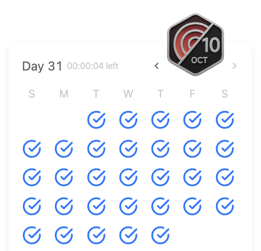

# 문제 설명
이 문제는 6/2일 데일리 문제로 나왔다. 시간 되돌리기 티켓을 써서 풀게 되어, 6월을 완료할 수 있었다.

문자열을 뒤집는 문제다.


## 풀이 및 해설
간단한 문제로, two pointer를 사용해서 풀 수 있다.

## 풀이
```python
class Solution:
    def reverseString(self, s: List[str]) -> None:
        """
        Do not return anything, modify s in-place instead.
        """
        left = 0
        right = len(s) - 1

        while left < right:
            s[left], s[right] = s[right], s[left]
            left += 1
            right -= 1
```

## Complexity Analysis


### 시간 복잡도
- O(N)

### 공간 복잡도
- O(1)

## Constraint Analysis
```
Constraints:
1 <= s.length <= 10^5
s[i] is a printable ascii character.
```

## 회고
이렇게 해서 6월을 travel back in time 티켓으로 다 복구했다.  
기분이 좋다.


 

 

# References
- [344. Reverse String](https://leetcode.com/problems/reverse-string/)