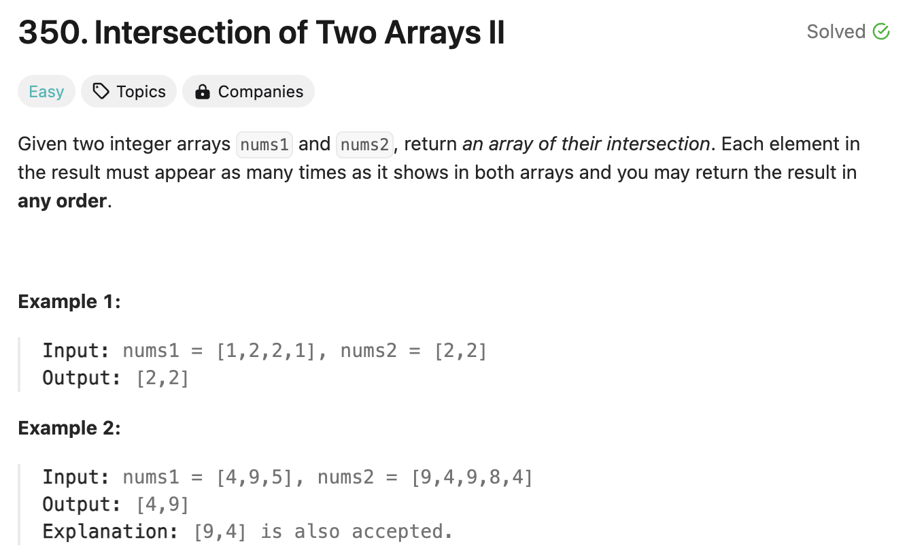

# 문제 설명
두 배열의 교집합을 구하는 문제다.



## 풀이 및 해설
해당 문제에서는 두가지 작업을 진행해야 한다.
- 두 배열의 각 요소의 개수를 세어야 한다.
- 두 배열의 교집합을 구해야 한다.

이걸 하기 위해서 `collections` 모듈의 `Counter` 클래스를 사용할 수 있다. `Counter` 클래스는 요소의 개수를 세어주는 클래스다. 또한, `set` 클래스를 사용하여 교집합을 구할 수 있다.

## 풀이
```python
from collections import Counter

class Solution:
    def intersect(self, nums1: List[int], nums2: List[int]) -> List[int]:
        # count how many instances of each value appear in each list
        counter1 = Counter(nums1)
        counter2 = Counter(nums2)

        # count how many instances appear in both lists and append them to a new list
        common_el = set(nums1) & set(nums2)
        common_co = []

        for element in common_el:
            count1 = counter1[element]
            count2 = counter2[element]
            for _ in range(min(count1, count2)):
                common_co.append(element)
        
        return common_co
```
- `Counter` 클래스를 사용하여 두 배열의 요소의 개수를 센다.
- `set` 클래스를 사용하여 두 배열의 교집합을 구한다.
- 교집합을 구한 후, 두 배열의 요소의 개수를 비교하여 작은 개수만큼 교집합 리스트에 추가한다.
- 교집합 리스트를 반환한다.

## Complexity Analysis


### 시간 복잡도
- O(n1+n2) : 두 배열의 요소의 개수를 세는데 n1의 길이와 n2의 길이를 더한 값이 걸린다.
- O(n1+n2) : 두 배열의 교집합을 구하는데 n1의 길이와 n2의 길이를 더한 값이 걸린다.
- O(min(n1, n2)) : 교집합 리스트를 만드는데 n1과 n2 중 작은 값이 걸린다.

따라서, 요약하면 O(n)이다.

### 공간 복잡도
- O(n1 + n2) : counter1, counter2
- O(min(n1, n2)) : common_el
- O(min(n1, n2)) : common_co

총 O(n)이다.

## Constraint Analysis
```
Constraints:  
1 <= nums1.length, nums2.length <= 1000  
0 <= nums1[i], nums2[i] <= 1000  
```

# References
- [LeetCode](https://leetcode.com/problems/intersection-of-two-arrays-ii/)
- [Set](https://docs.python.org/3/library/stdtypes.html#set)
