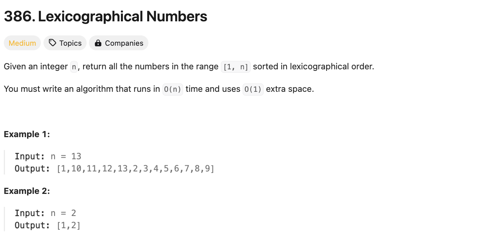

# 문제 설명
1부터 n까지의 숫자를 사전식 순서로 출력하는 문제다. 다만, 해당 정렬을 O(n) 시간 복잡도와 O(1) 공간 복잡도로 해결해야 한다.



## 풀이 및 해설
일단 푸는건 어렵진 않은데 O(n) 시간 복잡도와 O(1) 공간 복잡도로 풀어야 한다는게 문제다. 이걸 어떻게 해결할 수 있을까?  
내장 함수는 nlogn이므로 사용할 수 없다. 뭔가 하나씩 10으로 곱하거나 1을 더하면서 풀어야 할 것 같다.

## 풀이
```python
def lexicalOrder(self, n: int) -> List[int]:
    arr = []
    current = 1
    for _ in range(n):
        arr.append(current)
        if current * 10 <= n:
            current *= 10
        else:
            if current >= n:
                current //= 10
            current += 1
            while current % 10 == 0:
                current //= 10

    return arr
```
- n만큼 반복한다.
- 현재 숫자를 배열에 추가한다.
- 만약 현재 숫자에 10을 곱한 값이 n보다 작다면, 현재 숫자에 10을 곱한다.
- 그렇지 않다면, 현재 숫자가 n보다 크거나 같다면, 현재 숫자를 10으로 나눈다.
- 이어서 현재 숫자에 1을 더한다.
- 현재 숫자가 0으로 끝나는 경우, 10으로 나눈다.
- 배열을 반환한다.

## Complexity Analysis


### 시간 복잡도
- O(n) ; n만큼 반복한다.
- for문은 O(n)이다.
    - while문은 O(1)이다.

### 공간 복잡도
- O(1) ; 추가적인 공간이 필요하지 않다.

## Constraint Analysis
```
Constraints:
1 <= n <= 5 * 10^4
```

# References
- [386. Lexicographical Numbers](https://leetcode.com/problems/lexicographical-numbers/)