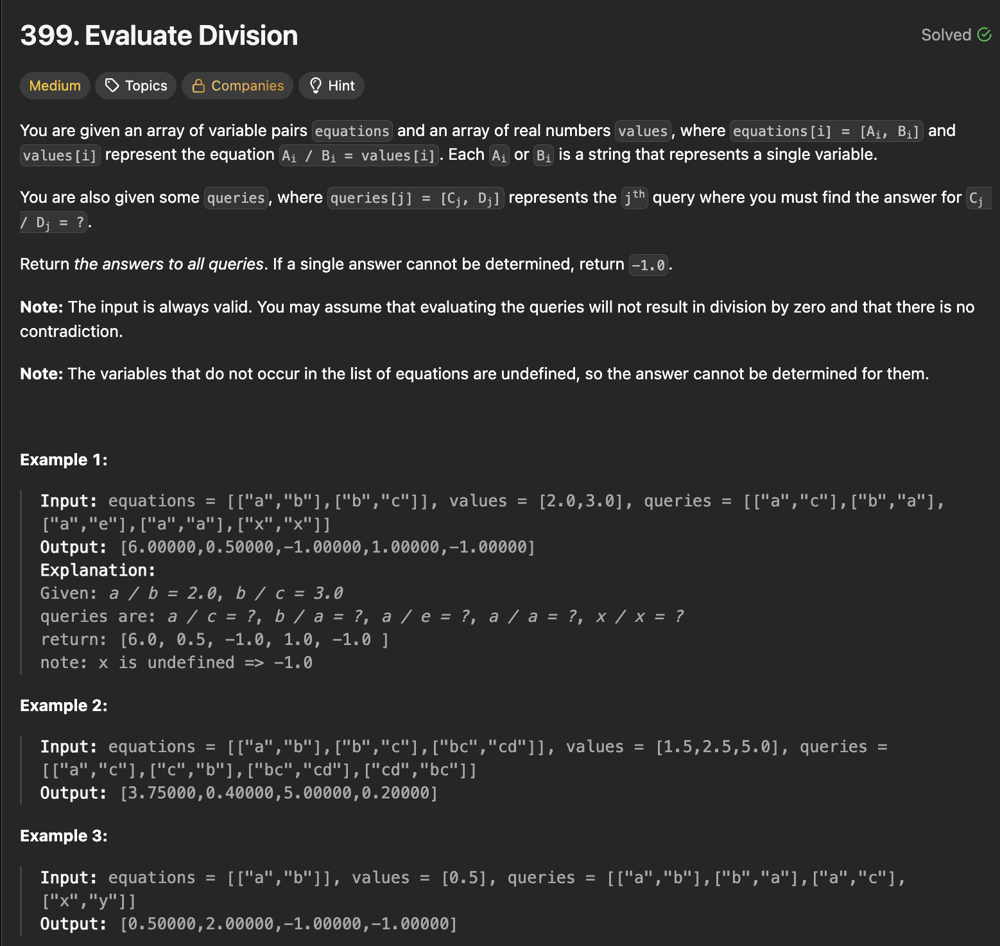

# 문제 설명
1부터 n까지의 숫자를 사전식 순서로 출력하는 문제다. 다만, 해당 정렬을 O(n) 시간 복잡도와 O(1) 공간 복잡도로 해결해야 한다.



## 풀이 및 해설
이 문제는 그래프 문제라고 인지하는 것이 핵심이다. 주어진 방정식과 값을 기반으로 그래프를 생성하고, 각 쿼리에 대해 DFS를 사용하여 시작 변수에서 종료 변수까지의 경로를 찾고, 경로에 있는 간선의 곱을 계산한다.

## 풀이
```python
class Solution:
    def calcEquation(self, equations: List[List[str]], values: List[float], queries: List[List[str]]) -> List[float]:
        # 1) build graph from equations
        graph = defaultdict(list)
        for (start, end), val in zip(equations, values):
            graph[start].append((end,val))
            graph[end].append((start,1/val))
        
        # 2) define DFS to find path product
        def dfs(start,end,visited):
            if start not in graph or end not in graph:
                return -1.0
            if start==end:
                return 1.0
            
            visited.add(start)
            for neighbor,val in graph[start]:
                if neighbor in visited:
                    continue
                product = dfs(neighbor, end, visited)
                if product != -1.0:
                    return val*product
            
            return -1.0


        # 3) solve each query with DFS
        results = []
        for start,end in queries:
            results.append(dfs(start,end,set()))
        
        return results
```
1. 주어진 방정식과 값을 기반으로 그래프를 생성한다. 각 노드는 변수이고, 간선은 나눗셈 값을 나타낸다.
2. 각 쿼리에 대해 DFS를 사용하여 시작 변수에서 종료 변수까지의 경로를 찾고, 경로에 있는 간선의 곱을 계산한다.

## Complexity Analysis


### 시간 복잡도
- O(Q * (V + E)) ; Q는 쿼리의 수, V는 그래프의 노드 수, E는 그래프의 간선 수

### 공간 복잡도
- O(V + E) ; 그래프를 저장하는 데 필요한 공간

## Constraint Analysis
```
Constraints:

1 <= equations.length <= 20
equations[i].length == 2
1 <= Ai.length, Bi.length <= 5
values.length == equations.length
0.0 < values[i] <= 20.0
1 <= queries.length <= 20
queries[i].length == 2
1 <= Cj.length, Dj.length <= 5
Ai, Bi, Cj, Dj consist of lower case English letters and digits.
```

# References
- [Leetcode 399. Evaluate Division](https://leetcode.com/problems/evaluate-division/)