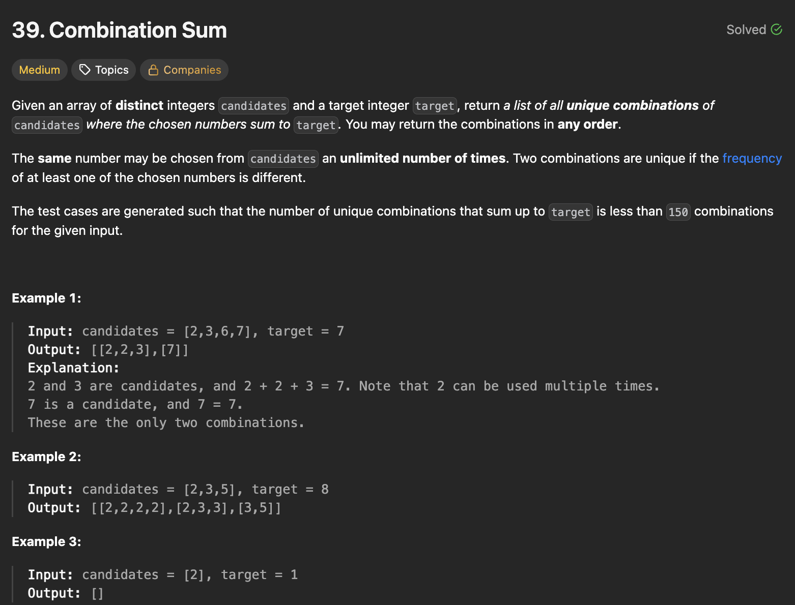
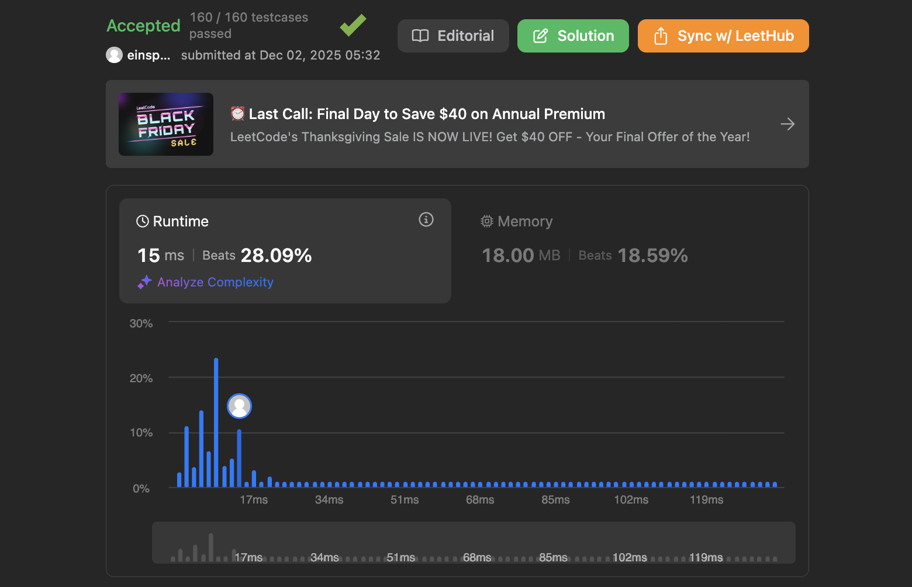

## 문제 설명
숫자들이 주어지면 그 숫자들의 합이 타겟 숫자가 되는 모든 조합을 반환하는 문제다.



## 풀이 및 해설
이 문제는 백트래킹(Backtracking) 기법을 사용하여 해결할 수 있습니다. 주어진 숫자들로 만들 수 있는 모든 조합을 재귀적으로 생성합니다.

- 백트래킹 함수를 정의하여 재귀적으로 가능한 모든 조합을 생성합니다.
- 기본 사례로, 현재 합이 타겟 숫자와 같아지면 현재 경로를 결과 리스트에 추가합니다.
- 재귀 단계에서는 주어진 숫자들 중에서 각 숫자를 경로에 추가하고 재귀적으로 다음 숫자를 선택합니다.
- 최종적으로 모든 가능한 조합을 반환합니다.

**핵심**: 기억해야 할 정보를 백트래킹 함수에 전달하여 타겟까지 도달하는 조합을 찾는 것이 중요하다.

```python
class Solution:
    def combinationSum(self, candidates: List[int], target: int) -> List[List[int]]:
        res = []

        def backtrack(idx, curr_comb, curr_sum):
            if curr_sum==target:
                res.append(curr_comb[:])
                return
            
            if idx==len(candidates) or curr_sum > target:
                return
            
            backtrack(idx, curr_comb+[candidates[idx]], curr_sum+candidates[idx])
            backtrack(idx+1, curr_comb, curr_sum)
        
        backtrack(0,[],0)
        return res
```

## 복잡도


### 시간복잡도
- `O(N^(T/M + 1))` ; N은 candidates의 길이, T는 target, M은 candidates의 최솟값입니다. 최악의 경우, 각 재귀 호출에서 N개의 선택지가 있으며, 최대 깊이는 T/M이 될 수 있습니다.

### 공간복잡도
- `O(k)` ; 재귀 호출 스택과 방문 집합에 사용되는 공간입니다.

## Constraint Analysis
```
Constraints:
1 <= candidates.length <= 30
2 <= candidates[i] <= 40
All elements of candidates are distinct.
1 <= target <= 40
```

# References
- [39. Combination Sum - LeetCode](https://leetcode.com/problems/combination-sum/)