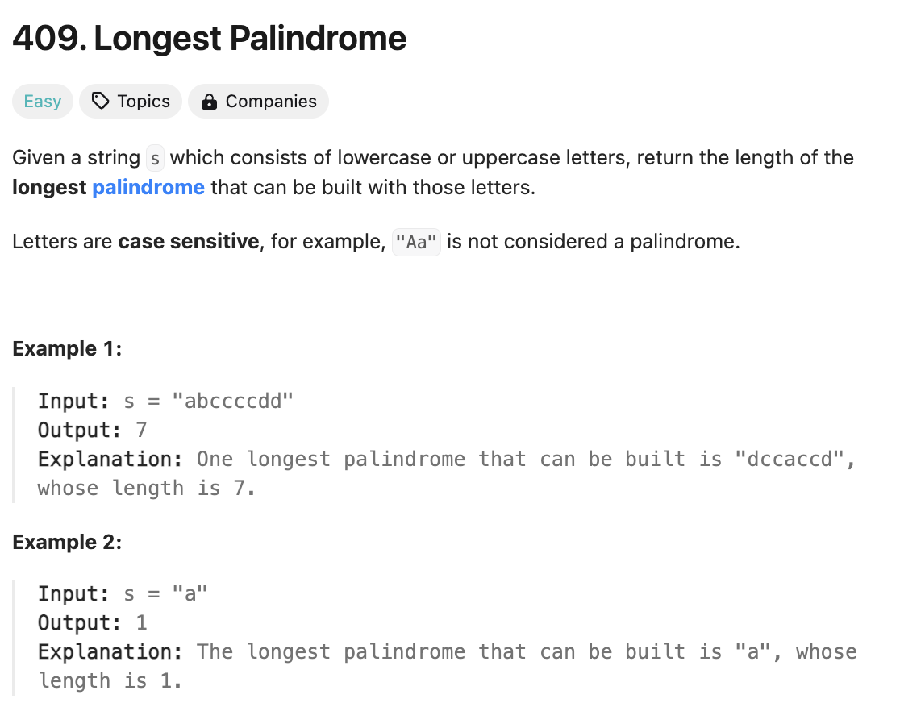
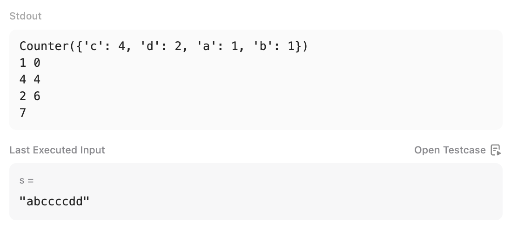

# 문제 설명
문자열 s가 주어지면 s에서 만들 수 있는 가장 긴 팰린드롬의 길이를 반환합니다.



## 풀이 및 해설
2의 배수인 문자열의 개수를 세고, 2의 배수가 아닌 문자열의 개수를 센다. 2의 배수인 문자열은 그대로 사용하고, 2의 배수가 아닌 문자열은 1개만 사용한다. 이후 2의 배수인 문자열의 개수와 2의 배수가 아닌 문자열의 개수를 더해준다.



## 풀이
```python
from collections import Counter

class Solution:
    def longestPalindrome(self, s: str) -> int:
        letters = Counter(s)
        longest = 0
        odd_count = 0
        
        for i, letter in enumerate(letters):
            if letters[letter] % 2 == 0:
                longest += letters[letter]
            else:
                longest += letters[letter] - 1
                odd_count = 1
        
        longest += odd_count
        return longest
```
- letters에 문자열 s의 각 문자의 개수를 저장한다.
- longest는 가장 긴 팰린드롬의 길이를 저장한다.
- odd_count는 2의 배수가 아닌 문자열의 개수를 저장한다.
- letters의 각 문자열을 순회하며 2의 배수인 문자열은 그대로 사용하고, 2의 배수가 아닌 문자열은 1개만 사용한다.
- 이후 2의 배수인 문자열의 개수와 2의 배수가 아닌 문자열의 개수를 더해준다.
- odd_count가 1이면 2의 배수가 아닌 문자열이 1개라는 뜻이므로, 1을 더해준다.
- longest를 반환한다.

## Complexity Analysis


### 시간 복잡도
- 문자열 s를 순회하므로 O(n)이다.

### 공간 복잡도
- Counter를 사용하므로 O(n)이다.

## Constraint Analysis
```
Constraints:
1 <= s.length <= 2000
s consists of lowercase and/or uppercase English letters only.
```

# References
- [409. Longest Palindrome](https://leetcode.com/problems/longest-palindrome/)