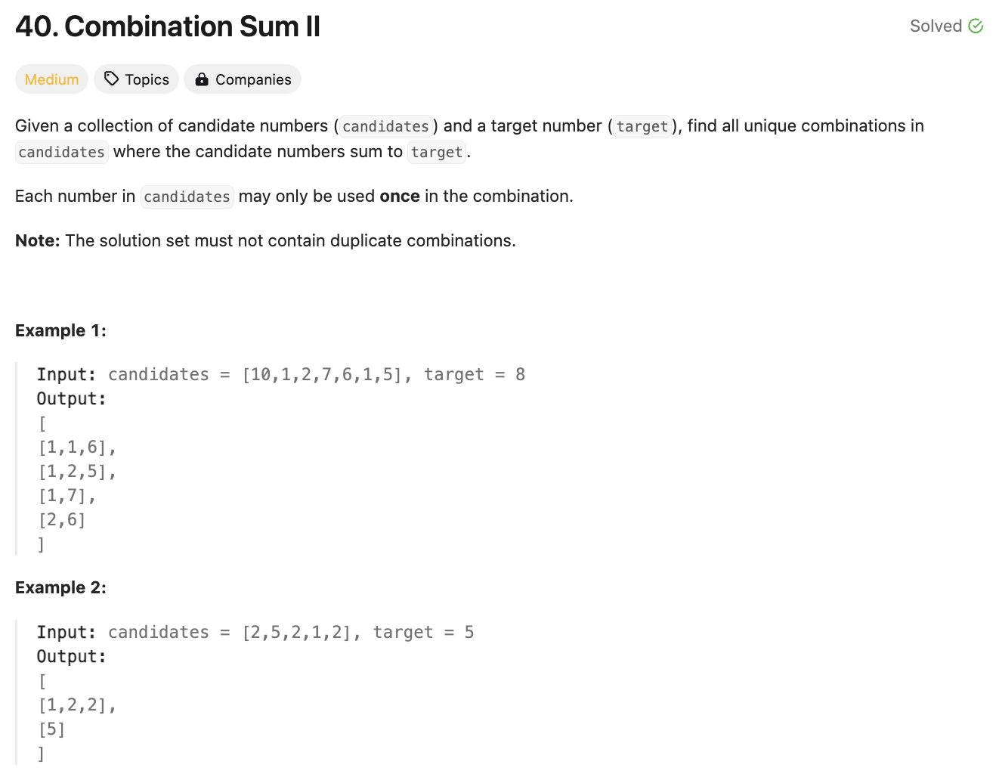
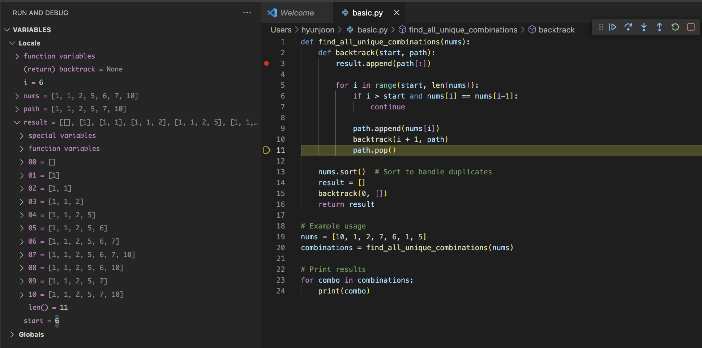
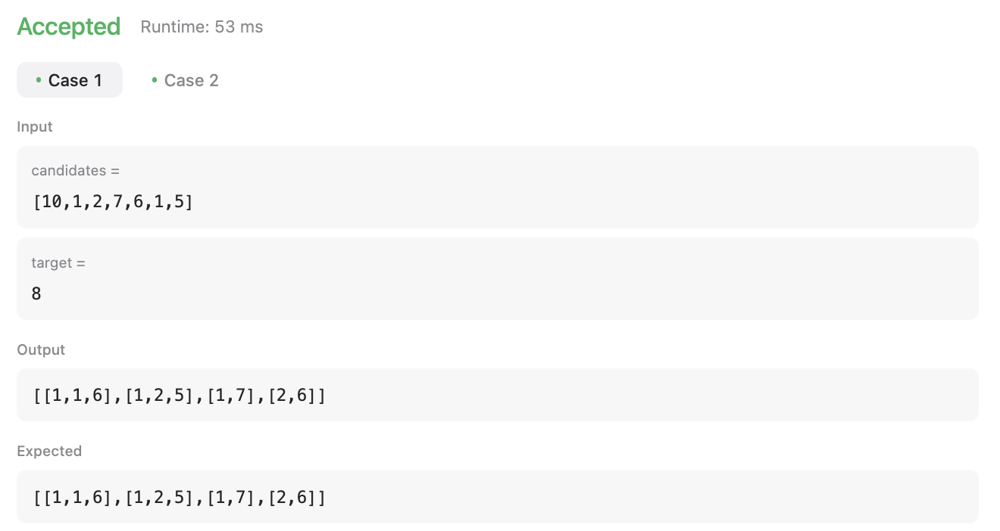
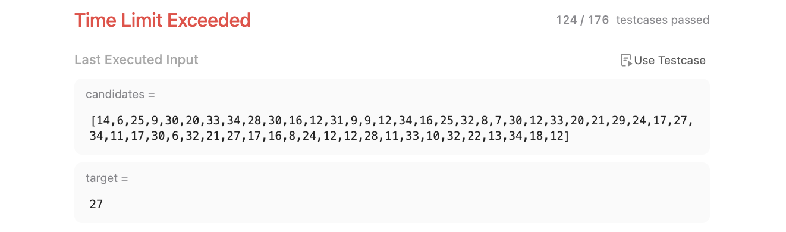
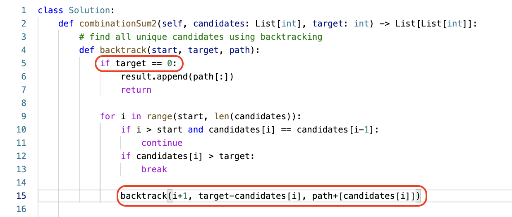
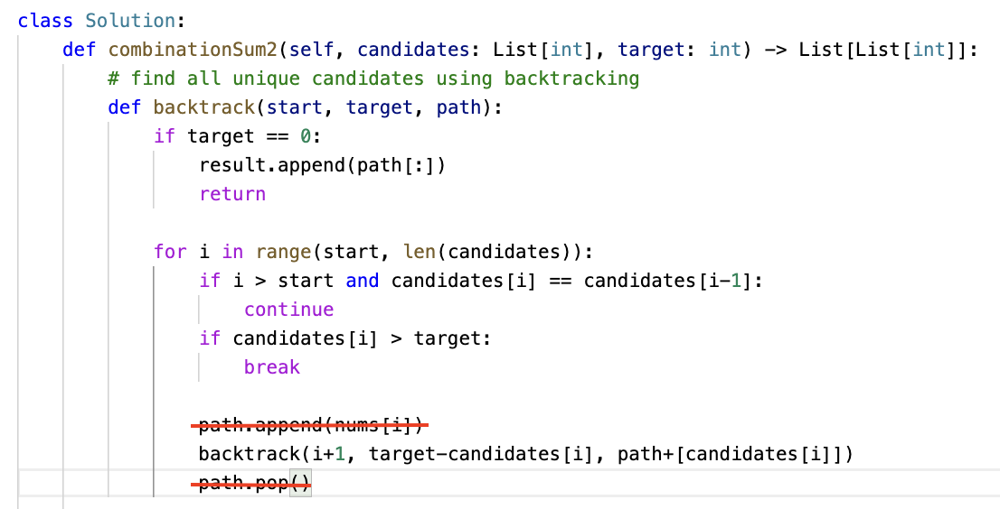
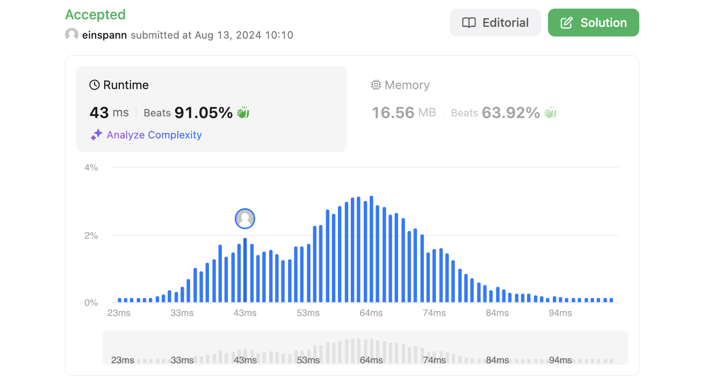

# 문제 설명
중복된 숫자가 있는 배열에서 숫자를 사용하여 target을 만들 수 있는 모든 unique 조합을 찾는 문제이다.



## 시도 1
해당 문제를 풀기 위해서는 일단 
1) unique combinations을 모두 찾아야 하며,
2) 해당 조합의 합이 target과 같아야 한다.

(1)을 구현하기 위해 어떻게 할 수 있을지 고민하다가 찾아보니까 backtracking을 사용하면 된다고 한다. backtracking을 사용하면 중복된 숫자를 사용하지 않고 unique한 조합을 찾을 수 있다.



위는 backtracking을 사용하여 중복된 숫자를 사용하지 않고 unique한 조합을 찾는 과정을 나타낸다. 

result에 조합을 저장하면서 재귀적으로 끝까지 갔다가, 마지막에 하나씩 pop을 하면서 다시 돌아오는 방식이다.

이를 응용해서 문제를 풀어봤지만, 시간초과가 발생했다. 
    
    




```python
def combinationSum2(self, candidates: List[int], target: int) -> List[List[int]]:
        # find all unique candidates using backtracking
        def backtrack(start, path):
            if sum(path[:]) == target:
                result.append(path[:])
            
            for i in range(start, len(candidates)):
                if i > start and candidates[i] == candidates[i-1]:
                    continue
                
                path.append(candidates[i])
                backtrack(i+1, path)
                path.pop()

        # sort items to handle duplicates
        candidates.sort()
        result = []
        backtrack(0,[])
        return result
```

## 풀이 및 해설
### sums
시간초과가 발생한 이유는 중복된 계산이 많이 발생하기 때문이다. 가장 많은 중복이 발생하는 부분은 sum(path[:]) == target 부분이다. 이를 해결하기 위해서는 sum을 매번 계산하는 것이 아니라, target에서 path의 합을 빼서 남은 값을 계산하면 된다.



### pop/append
또한, pop과 append를 매번 수행하는 것은 재귀적으로 돌아오는 과정에서 시간을 많이 소모한다. 이를 해결하기 위해서는 같은 path를 계속해서 수정하는 것이 아니라, 새로운 path를 만들어서 계산하면 된다.

`path + [candidates[i]]`를 사용하면 새로운 list가 생성되어서 공간이 더욱 필요하긴 하지만, 파이썬의 메모리 관리와 가비지 컬렉션이 잘 되어있기 때문에 큰 문제가 되지 않는다.



## 풀이
```python
def combinationSum2(self, candidates: List[int], target: int) -> List[List[int]]:
        # find all unique candidates using backtracking
        def backtrack(start, target, path):
            if target == 0:
                result.append(path[:])
                return
            
            for i in range(start, len(candidates)):
                if i > start and candidates[i] == candidates[i-1]:
                    continue
                if candidates[i] > target:
                    break
                
                backtrack(i+1, target-candidates[i], path+[candidates[i]])

        # sort items to handle duplicates
        candidates.sort()
        result = []
        backtrack(0,target,[])
        return result
```

## Complexity Analysis


### 시간 복잡도
- backtracking을 사용하여 모든 조합을 찾기 때문에 O(2^n)이다. ; n은 candidates의 길이
- 중복된 숫자를 제거하기 위해 sort를 사용하였기 때문에 O(nlogn)이 추가된다.
- 따라서, O(2^n) + O(nlogn) = O(2^n)이다.

### 공간 복잡도
- backtracking을 사용하여 모든 조합을 찾기 때문에 O(2^n)이다. ; n은 candidates의 길이
- 중복된 숫자를 제거하기 위해 sort를 사용하였기 때문에 O(n)이 추가된다.
- 따라서, O(2^n) + O(nlogn) = O(2^n)이다.

## Constraint Analysis
```
Constraints:
1 <= candidates.length <= 100
1 <= candidates[i] <= 50
1 <= target <= 30
```

# References
- [40. Combination Sum II](https://leetcode.com/problems/combination-sum-ii/)