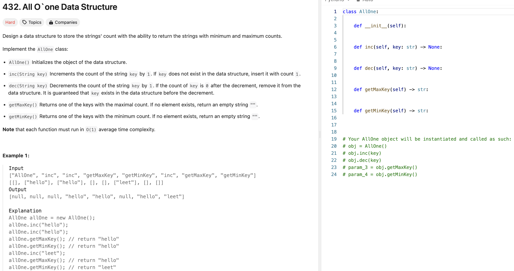
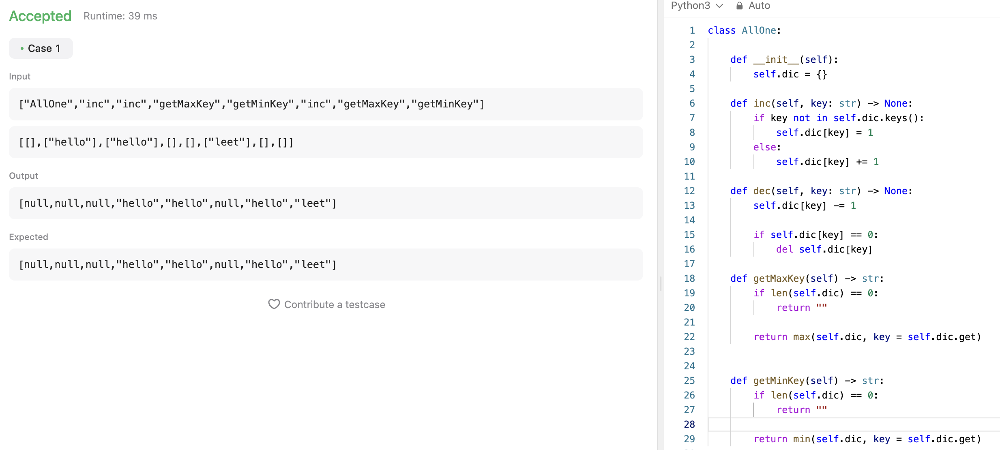
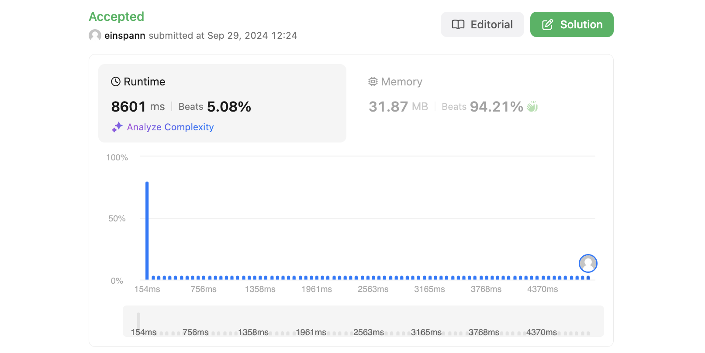
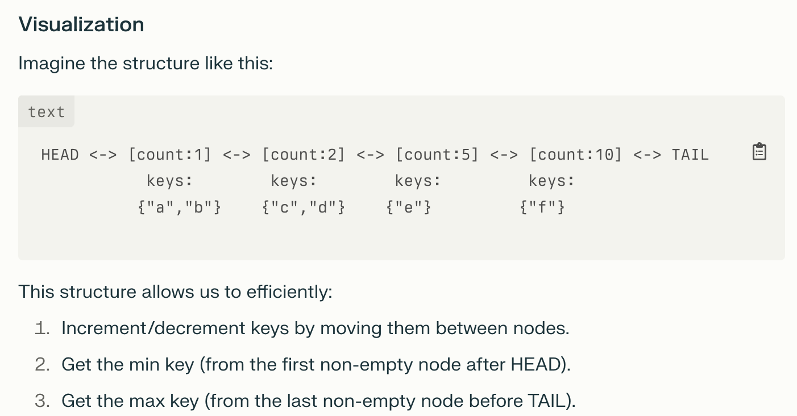
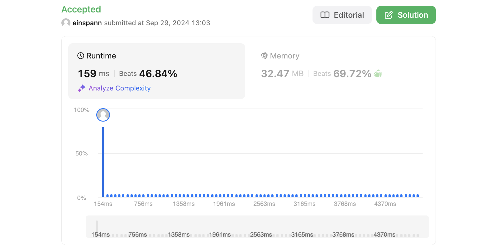

# 문제 설명



## 풀이 및 해설
도움 없이 바로 풀긴 했는데 너무 느리다. 조금 더 개선해보려 한다.



## 풀이 1
```python
class AllOne:

    def __init__(self):
        self.dic = {}

    def inc(self, key: str) -> None:
        if key not in self.dic.keys():
            self.dic[key] = 1
        else:
            self.dic[key] += 1

    def dec(self, key: str) -> None:
        self.dic[key] -= 1

        if self.dic[key] == 0:
            del self.dic[key]

    def getMaxKey(self) -> str:
        if len(self.dic) == 0:
            return ""
        
        return max(self.dic, key = self.dic.get)
        

    def getMinKey(self) -> str:
        if len(self.dic) == 0:
            return ""
        
        return min(self.dic, key = self.dic.get)
```

## Complexity Analysis

- inc: O(1)
- dec: O(1)
- getMaxKey: O(n)
- getMinKey: O(n)

생각해보면 풀리는게 이상하다. O(1)로 풀어야 하는데 O(n)으로 풀고 있다. 다시 생각해보자.

## 풀이 2
어쩐지 너무 쉽다 싶었는데, 역시 O(1)으로 맞추려면 확실히 개념도 복잡하고 구현하는것도 더 어려워진다.

```python
class Node:
    def __init__(self, key = '', count = 0):
        self.keys = set([key]) if key else set()
        self.count = count
        self.prev = None
        self.next = None

class AllOne:
    def __init__(self):
        self.dict = {}
        self.head = Node()
        self.tail = Node()
        self.head.next = self.tail
        self.tail.prev = self.head

    def inc(self, key: str) -> None:
        if key not in self.dict:
            if self.head.next.count == 1:
                node = self.head.next
                node.keys.add(key)
            else:
                node = Node(key, 1)
                self._add_after(self.head, node)
            self.dict[key] = node
        else:
            node = self.dict[key]
            next_node = node.next
            if next_node.count != node.count + 1:
                next_node = Node('', node.count+1)
                self._add_after(node, next_node)
            next_node.keys.add(key)
            self.dict[key] = next_node
            node.keys.remove(key)
            if not node.keys:
                self._remove(node)

    def dec(self, key: str) -> None:
        if key in self.dict:
            node = self.dict[key]
            if node.count > 1:
                prev_node = node.prev
                if prev_node.count != node.count - 1:
                    prev_node = Node('', node.count - 1)
                    self._add_after(node.prev, prev_node)
                prev_node.keys.add(key)
                self.dict[key] = prev_node
            else:
                del self.dict[key]
            node.keys.remove(key)
            if not node.keys:
                self._remove(node)

    def getMaxKey(self) -> str:
        return next(iter(self.tail.prev.keys)) if self.tail.prev != self.head else ""
        

    def getMinKey(self) -> str:
        return next(iter(self.head.next.keys)) if self.head.next != self.tail else ""
    
    def _add_after(self, node: Node, new_node: Node) -> None:
        new_node.prev = node
        new_node.next = node.next
        node.next.prev = new_node
        node.next = new_node

    def _remove(self, node: Node) -> None:
        node.prev.next = node.next
        node.next.prev = node.prev
```

표로 정리하면 다음과 같다:
노드로 count를 관리하고, 각 노드에는 key를 set으로 관리한다.


## Complexity Analysis


### 시간 복잡도
- inc: O(1)
- dec: O(1)
- getMaxKey: O(1)
- getMinKey: O(1)
- 즉, 모두 O(1)이다.

### 공간 복잡도
- O(n)
- n은 key의 개수이다.

## Constraint Analysis
```
Constraints:
1 <= key.length <= 10
key consists of lowercase English letters.
It is guaranteed that for each call to dec, key is existing in the data structure.
At most 5 * 104 calls will be made to inc, dec, getMaxKey, and getMinKey.
```

# References
- [432. All O`one Data Structure](https://leetcode.com/problems/all-oone-data-structure/)