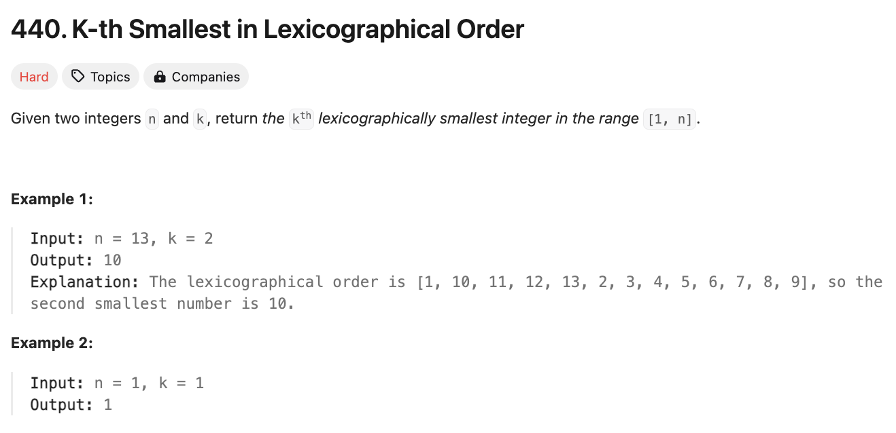

# 문제 설명
사전식 순서로 정렬된 숫자들이 주어질 때, k번째로 작은 숫자를 찾아라.



## 풀이 및 해설
어제 문제와 매우 유사하다. 그래서 일단은 직관적으로 배열을 만들고, 거기서 k번째 값을 반환하면 되지 않을까 했지만, 역시나 메모리 초과가 발생했다.


역시 그렇게 간단하지 않고, 딱 k만큼만 처리해야 풀 수 있는 문제 같다. 따라서, 다음과 같이 풀었다.

## 풀이
```python
def findKthNumber(self, n: int, k: int) -> int:
        def count_prefix(prefix, n):
            # 해당 prefix를 갖고 있는 수를 반환
            # 예: count_prefix(1, 13) = 5 (1, 10, 11, 12, 13)
            count = 0
            current = prefix
            next_prefix = prefix + 1
            while current <= n:
                count += min(n+1, next_prefix) - current
                current *= 10
                next_prefix *= 10
            return count
        

        current = 1
        k -= 1

        # k번째 수를 찾는만큼 한번식 조정
        while k > 0:
            # 이 값을 prefix으로 갖고 있는 수 반환
            count = count_prefix(current, n)

            # 현재 값들로는 아직 k에 닿지 못한다는 뜻
            if k >= count:
                k -= count
                current += 1
            # 현재 prefix를 갖고 있는 값들 중 하나라는 뜻
            else:
                k -= 1
                current *= 10  # 기존에 닿지 못했기 때문에 10을 곱해본다
                while current > n: # current가 너무 커졌으면 다시 낮추는 작업
                    current //= 10
                    current += 1

        return current
```
def count_prefix 함수는 해당 prefix를 갖고 있는 수를 반환하는 함수이다.    
예를 들어, count_prefix(1, 13) = 5 (1, 10, 11, 12, 13)이다.

count_prefix 함수는 다음과 같이 동작한다.
    - count = 0
    - current = prefix
    - next_prefix = prefix + 1
    - current가 n보다 작거나 같을 때까지 반복
        - count += min(n+1, next_prefix) - current
        - current *= 10
        - next_prefix *= 10
    - count 반환

current는 1로 초기화하고, k는 1을 빼준다.  
k가 0보다 클 때까지 다음을 반복한다.  
    - count = count_prefix(current, n)
    - k가 count보다 크다면
        - k에서 count를 빼고, current에 1을 더한다.
    - k가 count보다 작다면
        - k에서 1을 빼고, current에 10을 곱한다.
        - current가 n보다 크다면, current를 10으로 나누고 1을 더한다.
current를 반환한다.  


## Complexity Analysis


### 시간 복잡도
- while문은 +1 또는 *10을 실행해서 O(logN)이다.
- 그러나, 이 안에 count_prefix 함수가 있어서 O(logN) * O(logN) = O(logN^2)이다.

### 공간 복잡도
- O(1)

## Constraint Analysis
```
Constraints:
1 <= k <= n <= 109
```

# References
- [440. K-th Smallest in Lexicographical Order](https://leetcode.com/problems/k-th-smallest-in-lexicographical-order/)