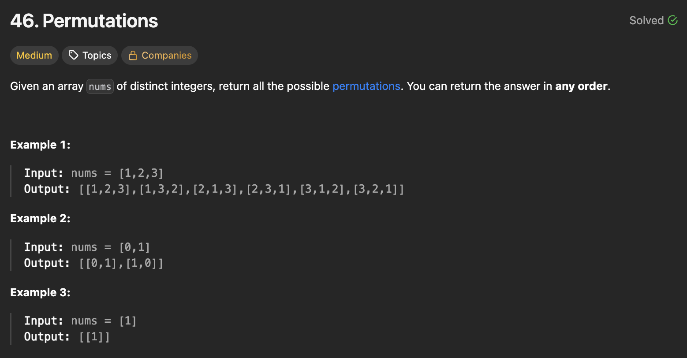

## 문제 설명
숫자들이 주어지면 그 숫자들로 만들 수 있는 모든 순열을 반환하는 문제다.



## 풀이 및 해설
이 문제는 백트래킹(Backtracking) 기법을 사용하여 해결할 수 있습니다. 주어진 숫자들로 만들 수 있는 모든 순열을 재귀적으로 생성합니다.

- 백트래킹 함수를 정의하여 재귀적으로 가능한 모든 순열을 생성합니다.
- 기본 사례로, 현재 경로의 길이가 주어진 숫자들의 길이와 같아지면 현재 경로를 결과 리스트에 추가합니다.
- 재귀 단계에서는 주어진 숫자들 중에서 아직 경로에 포함되지 않은 숫자들을 선택하여 경로에 추가하고 재귀적으로 다음 숫자를 선택합니다.
- 최종적으로 모든 가능한 순열을 반환합니다.

**핵심**: 현재 경로에 포함되지 않은 숫자들을 선택하여 재귀적으로 탐색해야 한다.

```python
class Solution:
    def permute(self, nums: List[int]) -> List[List[int]]:
        res = []

        def backtrack(path, visited):
            if len(path)==len(nums):
                res.append(path)
                return
            
            for num in nums:
                if num not in visited:
                    visited.add(num)
                    backtrack(path+[num], visited)
                    visited.remove(num)

        backtrack([], set())
        return res
```

## 복잡도


### 시간복잡도
- `O(k * k!)` ; k는 nums의 길이입니다. 모든 순열의 개수는 k!이고, 각 순열을 생성하는 데 O(k)의 시간이 소요됩니다.

### 공간복잡도
- `O(k)` ; 재귀 호출 스택과 방문 집합에 사용되는 공간입니다.

## Constraint Analysis
```
Constraints:
1 <= nums.length <= 6
-10 <= nums[i] <= 10
All the integers of nums are unique.
```

# References
- [46. Permutations - LeetCode](https://leetcode.com/problems/permutations/)