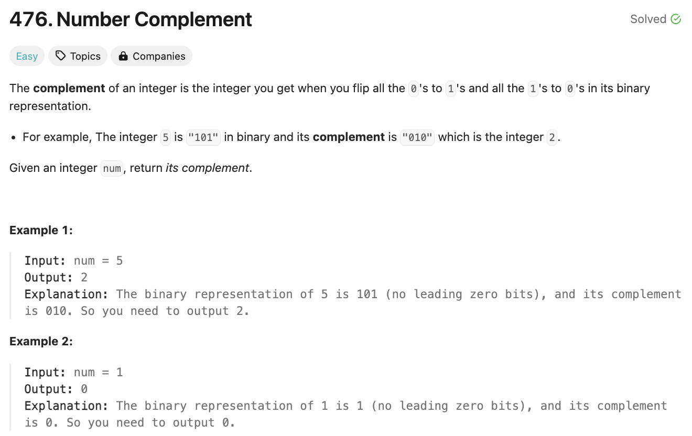
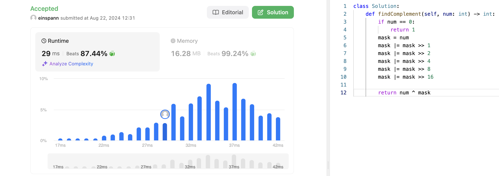

# 문제 설명



## 풀이 및 해설
주어진 숫자의 보수를 구하는 문제이다. 이 문제는 주어진 숫자를 2진수로 변환한 후, 각각의 비트에 대해 보수를 구하면 된다.

## 풀이
```python
class Solution:
    def findComplement(self, num: int) -> int:
        bin_num = bin(num).replace("0b", "")
        new_num = ""
        for c in bin_num:
            if int(c) > 0:
                new_num += str(0)
            else:
                new_num += str(1)
        
        return int(new_num,2)
```
- 주어진 숫자를 2진수로 변환한다. 이를 위해 bin 함수를 사용하고, "0b"를 제거한다.
- 각각의 비트에 대해 보수를 구하기 위해 for loop을 돌면서, 0이면 1로, 1이면 0으로 바꾼다.
- 최종적으로 2진수를 10진수로 변환하여 반환한다. 이걸 위해 int 함수를 사용하고, 2진수로 변환하기 위해 2를 넣어준다.

## Complexity Analysis


### 시간 복잡도
- 주어진 숫자를 2진수로 변환하는데 O(logN)이 소요된다. 여기서 N은 주어진 숫자이다.

### 공간 복잡도
- 주어진 숫자를 2진수로 변환한 후, 새로운 숫자를 만들기 위해 O(logN)이 소요된다.

## 개선사항
놀랍도록 이 문제는 O(1)으로도 풀 수 있다. 입력값의 크기와 무관하게 똑같은 시간이 걸리려면 다음과 같이 하면 된다.

```python
class Solution:
    def findComplement(self, num: int) -> int:
        if num == 0:
            return 1
        mask = num
        mask |= mask >> 1
        mask |= mask >> 2
        mask |= mask >> 4
        mask |= mask >> 8
        mask |= mask >> 16

        return num ^ mask 
```
1. `>>` (shift right):  
    x >> y는 x를 y만큼의 비트만큼 오른쪽으로 이동시킨다.   
    예시로, 1100>>1은 0110이 된다.
2. `|=` (Bitwise OR):
    x |= y는 x = x | y와 같다.  
    예시로, 1100 |= 1010은 1110이 된다.
3. `^` (Bitwise XOR):
    x ^ y는 x와 y의 비트가 다르면 1, 같으면 0이 된다.  
    예시로, 1100 ^ 1010은 0110이 된다.



## Constraint Analysis
```
Constraints:
1 <= num < 2^31
```

# References
- [476. Number Complement](https://leetcode.com/problems/number-complement/)