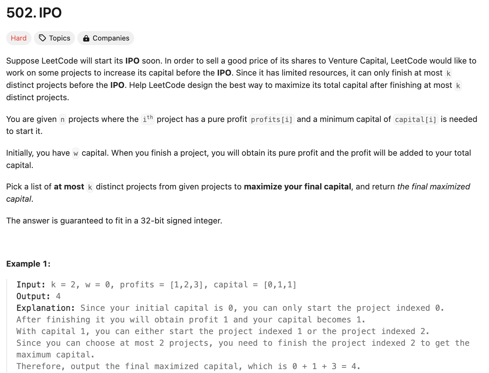
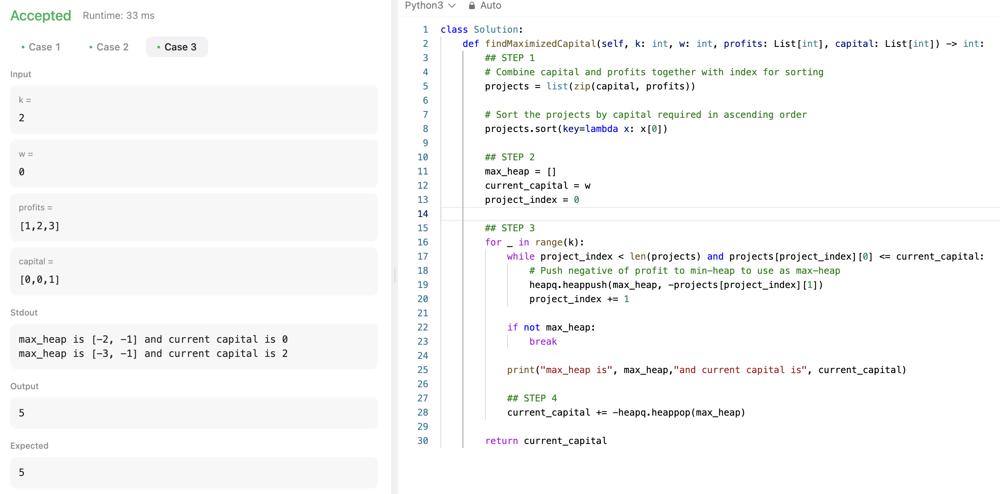
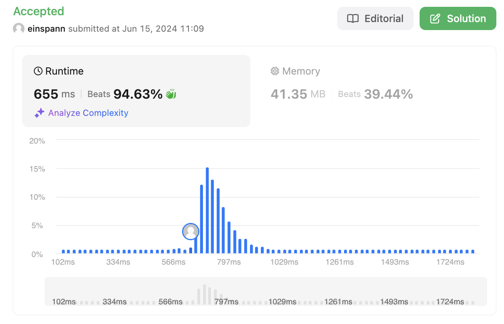

# 문제 설명
오랜만에 어려움으로 분류된 문제다. 변수가 총 4개 주어진다.  
- 수행 가능한 프로젝트 수 k
- 초기 자본 w
- 프로젝트를 수행했을 시 얻는 수익 배열 profits
- 프로젝트를 수행했을 시 필요한 자본 배열 capital

이 문제에서는 여러 프로젝트를 수행할 예정이고, 하나 수행할 때마다 초기 자본이 필요하다. 초기 자본이 투입된 이후, 프로젝트는 수익을 얻게 되고 이 수익을 다음 프로젝트의 초기 자본으로 사용할 수 있다.

이때, k개의 프로젝트를 수행할 수 있을 때, 최대 수익을 구하는 문제다.




## 풀이 및 해설
총 4개 단계로 풀 수 있다.
1. 필요 자본을 기준으로 정렬한다.
2. Max-Heap을 사용해서 가장 큰 수익을 가진 프로젝트를 저장.
3. 프로젝트들을 순회하면서, 자본이 충분하다면 수익을 저장하고, 다음 프로젝트로 넘어간다.
4. 가장 큰 수익을 가진 프로젝트를 빼서 순이익으로 추가하고, 다음 프로젝트로 넘어간다.

이렇게 구현하면 빠른 시간 복잡도 내에 문제를 해결할 수 있다.

## 풀이
```python
class Solution:
    def findMaximizedCapital(self, k: int, w: int, profits: List[int], capital: List[int]) -> int:
        ## STEP 1
        # Combine capital and profits together with index for sorting
        projects = list(zip(capital, profits))

        # Sort the projects by capital required in ascending order
        projects.sort(key=lambda x: x[0])

        ## STEP 2
        max_heap = []
        current_capital = w
        project_index = 0

        ## STEP 3
        for _ in range(k):
            while project_index < len(projects) and projects[project_index][0] <= current_capital:
                # Push negative of profit to min-heap to use as max-heap
                heapq.heappush(max_heap, -projects[project_index][1])
                project_index += 1
            
            if not max_heap:
                break
            
            print("max_heap is", max_heap,"and current capital is", current_capital)
            
            ## STEP 4
            current_capital += -heapq.heappop(max_heap)

        return current_capital
```



## Complexity Analysis



### Time Complexity
**O(NlogN + klogN)**  
- sorting: O(NlogN) ; N은 nums 배열의 길이
- insertion/extraction: O(KlogN) ; K은 입력 및 출력의 수

### Space Complexity
- O(N) ; N은 주어진 갯수

## Constraint Analysis
```
Constraints:

1 <= k <= 10^5
0 <= w <= 10^9
n == profits.length
n == capital.length
1 <= n <= 10^5
0 <= profits[i] <= 10^4
0 <= capital[i] <= 10^9
```

- 시간복잡도는 약 NlogN이니, 10^5 * log(10^5) = 10^5 * 17 = 1.7 * 10^6.  
- 공간복잡도는 O(N).

# References
- [LeetCode](https://leetcode.com/problems/ipo)
- [Python Docs - Zip()](https://docs.python.org/3.3/library/functions.html#zip)