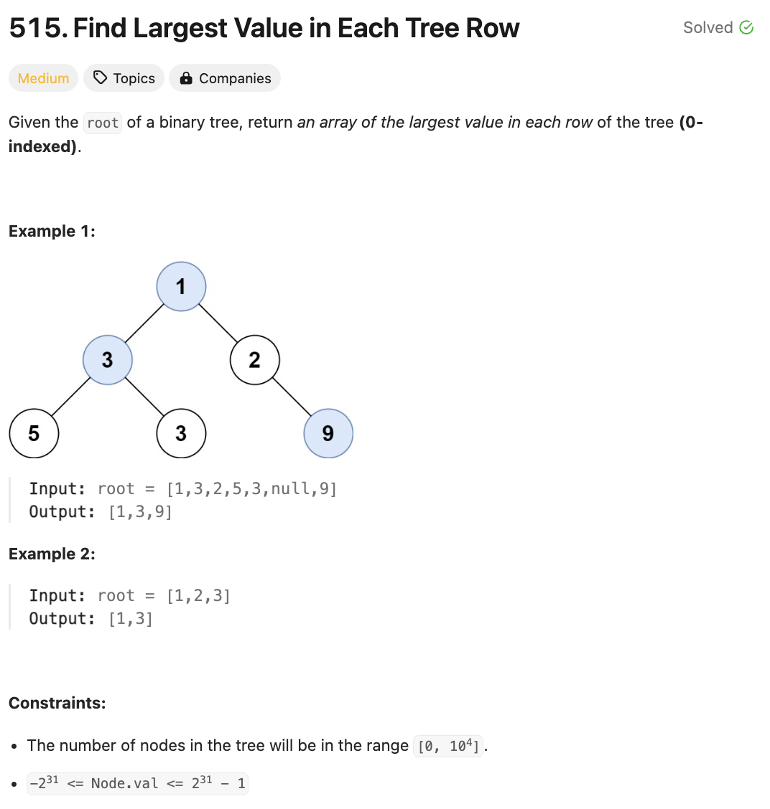

# 문제 설명
모든 층에 대해서 층의 가장 큰 숫자를 모두 반환하는 문제다.



-----
오늘은 크리스마스다! 어제 인턴 출근 2일차이며, 너무 달려와서 오늘은 늦잠 잘 생각을 하고 있었으나 눈이 6시에 떠지는 바람에 심심해서 회사 다녀왔다.

## 풀이 및 해설

## 풀이
```python
# Definition for a binary tree node.
# class TreeNode:
#     def __init__(self, val=0, left=None, right=None):
#         self.val = val
#         self.left = left
#         self.right = right
class Solution:
    def largestValues(self, root: Optional[TreeNode]) -> List[int]:
        if not root:
            return []

        result = []
        queue = deque([(root,0)])

        while queue:
            level_size = len(queue)
            level_max = float('-inf')

            for i in range(level_size):
                node, level = queue.popleft()

                level_max = max(level_max, node.val)

                if node.left:
                    queue.append((node.left, level+1))
                if node.right:
                    queue.append((node.right, level+1))

            result.append(level_max)
        
        return result
```
- 루트가 비어있으면 바로 반환
- result arr 하나 초기화
- deque를 (root,0)로 초기화
- 큐에 무언가 존재할 경우,
  - 층과 층의 지금까지 가장 높은 숫자를 초기화
    - 큐의 길이만큼,
      - 값과 층을 받고
      - 값이 지금 가장까지의 가장 큰 갑보다 큰 경우 교체
    - 왼쪽 자식이 있으면 큐에 추가
    - 오른쪽 자식이 있으면 큐에 추가

## Complexity Analysis

### 시간 복잡도
- BFS로 탐색을 하기 때문에 O(N)만큼 걸린다.

### 공간 복잡도
- O(N)

## Constraint Analysis
```
Constraints:
The number of nodes in the tree will be in the range [0, 104].
-2^31 <= Node.val <= 2^31 - 1
```

# References
- [515. Find Largest Value in Each Tree Row](https://leetcode.com/problems/find-largest-value-in-each-tree-row)