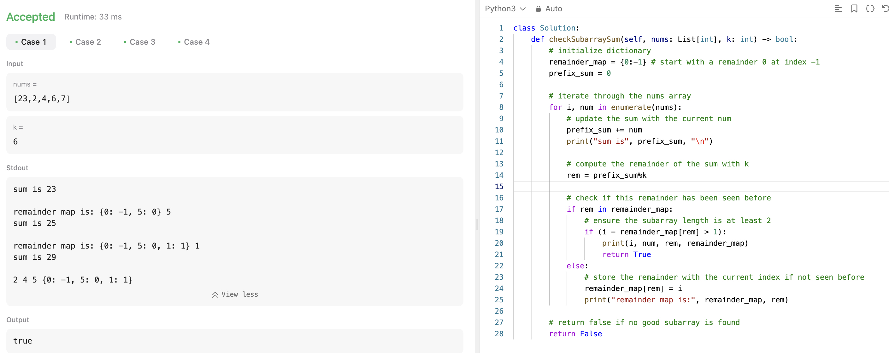
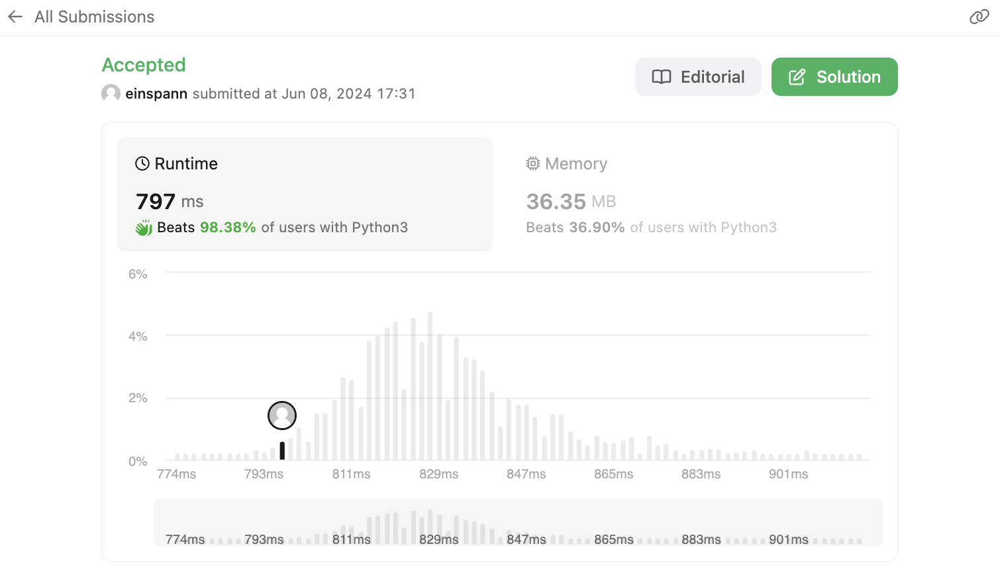

## 문제 설명
주어진 배열에서 연속된 부분배열의 합이 k의 배수인지 확인하는 문제다.


## 1차 시도
처음 보자마자 뭔가 DP 문제 같다. 두가지 가능성을 고려해야되는데, 처음부터 끝까지 다 더했을때 k의 배수인지, 중간에 있는 부분배열의 합이 k의 배수인지 확인해야한다. 그런데, 배수는 오히려 숫자가 올라가면서 생길 수 있는것이기 때문에 어떻게 접근해야 할지 조금 고민이다. 

뭔가 두개의 포인터를 사용해서 풀어야 할 것 같은데, 어느 지점에서 앞에 있는 포인터를 줄여야 할지 모르겠다. 일단 안 줄이고 끝까지 가보고, 끝까지 다 사이클을 했는데도 불구하고 없다면 하나를 줄이고 다시 시작해보는 방법을 사용해보자. 시간복잡도가 박살날것 같긴 하지만 일단 해보자.


일단 이렇게 하면 테케는 다 통과하긴 하는데 시간이 좀 느릴 것 같다. 계산해보자.

### 시간복잡도
- for loop: O(N) ; N은 nums 배열의 길이
- for loop: O(N) ; N은 nums 배열의 길이

전체: O(N^2)이다.

### 제한
```
1 <= nums.length <= 10^5
0 <= nums[i] <= 10^9
0 <= sum(nums[i]) <= 2^31 - 1
1 <= k <= 2^31 - 1
```

배열의 길이 N이 10^5까지 가능하므로, O(N^2)은 너무 느릴 것 같다. 최대 N^2이 10^10이므로, 10억이 넘어가는 숫자이다. 이렇게 큰 숫자를 계산하는 것은 불가능하다.

더 최적화된 방법을 찾아보자.

### 제출시도:
  

역시 시간제한에 걸린다.

## 2차 시도
## Hashmap
보니까 힌트에 hashmap을 사용하라고 나와있다. hashmap을 사용하면 O(1)에 접근이 가능하므로, 시간복잡도를 줄일 수 있을 것 같다. hashmap을 사용해서 누적합을 저장하고, k의 배수인지 확인하면 될 것 같다.

## 풀이 및 해설
해시맵을 사용해서 풀어봤다.  



- 해당 풀이는 dictionary를 우선 선언한다.
- 이후, 누적합을 저장할 변수를 선언하고, nums의 각 요소를 순회하면서 누적합을 계산한다.
- 누적합을 k로 나눈 나머지를 구한다.  


**핵심**
- 해당 누적합이 해시맵에 존재하지 않다면 추가한다.
- 만약 존재할 시, 이건 k에 대한 배수가 된다는 뜻이다. 왜?
    - 이미 한번 나눈 나머지가 존재한다는 뜻은 i번째 요소와 j번째 요소 사이의 누적합이 k의 배수라는 뜻이다.
    - 0부터 i까지의 누적합은 prefix_sum[i]이고, 0부터 j까지의 누적합은 prefix_sum[j]이다.
    - k로 나눈 나머지가 같다는 것은 prefix_sum[i]와 prefix_sum[j]의 차이가 k의 배수라는 뜻이다.


### 예시:
[23,2,4], k=6

**Prefix Sums:**

Index 0: 23 (prefix sum: 23)  
Index 1: 23 + 2 = 25 (prefix sum: 25)  
Index 2: 23 + 2 + 4 = 29 (prefix sum: 29)  

**Remainders:**

Index 0: 23 % 6 = 5  
Index 1: 25 % 6 = 1  
Index 2: 29 % 6 = 5  

이때, i와 j의 나머지가 둘 다 5다. 이때, 그러면 j의 누적합으로부터 i의 누적합을 빼면 29-23=6이다. 이때, 6은 k의 배수이므로, 이는 k의 배수가 된다.


## 풀이
```python
class Solution:
    def checkSubarraySum(self, nums: List[int], k: int) -> bool:        
        # initialize dictionary
        remainder_map = {0:-1} # start with a remainder 0 at index -1
        prefix_sum = 0

        # iterate through the nums array
        for i, num in enumerate(nums):
            # update the sum with the current num
            prefix_sum += num
            print("sum is", prefix_sum, "\n")

            # compute the remainder of the sum with k
            rem = prefix_sum%k

            # check if this remainder has been seen before
            if rem in remainder_map:
                # ensure the subarray length is at least 2
                if (i - remainder_map[rem] > 1):
                    print(i, num, rem, remainder_map)
                    return True
            else:
                # store the remainder with the current index if not seen before
                remainder_map[rem] = i
                print("remainder map is:", remainder_map, rem)
        
        # return false if no good subarray is found
        return False
```

## Complexity Analysis


매우 빠른것을 확인할 수 있다.

### Time Complexity
- for loop: O(N) ; N은 nums 배열의 길이
- dictionary lookup: O(1) ; dictionary의 길이는 k이다.

최종적으로 O(N)이다.

### Space Complexity
- O(N) ; N은 nums 배열의 길이

## Constraint Analysis
```
Constraints:

1 <= nums.length <= 10^5
```

- 시간복잡도는 O(10^5). 하나의 operation은 10^-6이 걸린다 생각하면 10^5 * 10^-6 = 0.1초이다. 충분히 빠르다.
- 공간복잡도는 O(10^5).

# References
- [LeetCode](https://leetcode.com/problems/replace-words)
- [Python Hashmaps - Datacamp](https://www.datacamp.com/tutorial/guide-to-python-hashmaps)
