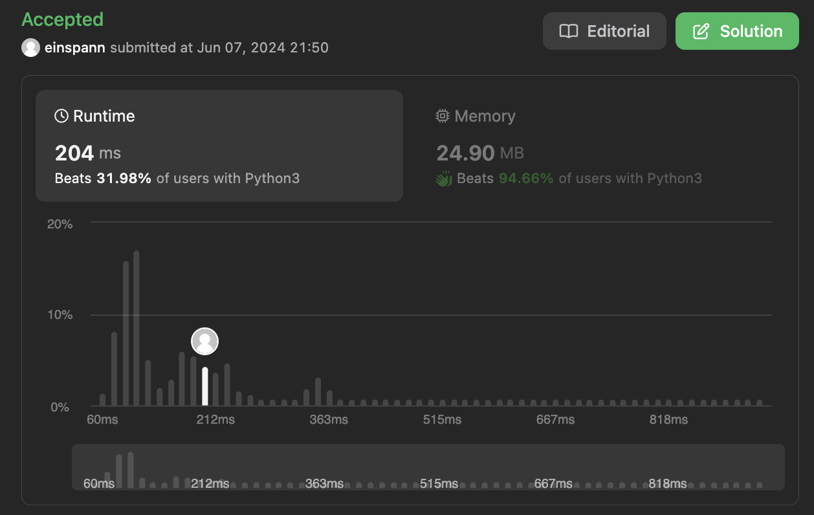

## 문제 설명
주어진 배열에서 연속된 부분배열의 합이 k의 배수인지 확인하는 문제다.


## 1차 시도
처음 보자마자 뭔가 DP 문제 같다. 두가지 가능성을 고려해야되는데, 처음부터 끝까지 다 더했을때 k의 배수인지, 중간에 있는 부분배열의 합이 k의 배수인지 확인해야한다. 그런데, 배수는 오히려 숫자가 올라가면서 생길 수 있는것이기 때문에 어떻게 접근해야 할지 조금 고민이다. 

뭔가 두개의 포인터를 사용해서 풀어야 할 것 같은데, 어느 지점에서 앞에 있는 포인터를 줄여야 할지 모르겠다. 일단 안 줄이고 끝까지 가보고, 끝까지 다 사이클을 했는데도 불구하고 없다면 하나를 줄이고 다시 시작해보는 방법을 사용해보자. 시간복잡도가 박살날것 같긴 하지만 일단 해보자.


일단 이렇게 하면 테케는 다 통과하긴 하는데 시간이 좀 느릴 것 같다. 계산해보자.

### 시간복잡도
- for loop: O(N) ; N은 nums 배열의 길이
- for loop: O(N) ; N은 nums 배열의 길이

전체: O(N^2)이다.

### 제한
```
1 <= nums.length <= 10^5
0 <= nums[i] <= 10^9
0 <= sum(nums[i]) <= 2^31 - 1
1 <= k <= 2^31 - 1
```

배열의 길이 N이 10^5까지 가능하므로, O(N^2)은 너무 느릴 것 같다. 최대 N^2이 10^10이므로, 10억이 넘어가는 숫자이다. 이렇게 큰 숫자를 계산하는 것은 불가능하다.

더 최적화된 방법을 찾아보자.

### 제출시도:
  

역시 시간제한에 걸린다.

## 2차 시도
## Hashmap
보니까 힌트에 hashmap을 사용하라고 나와있다. hashmap을 사용하면 O(1)에 접근이 가능하므로, 시간복잡도를 줄일 수 있을 것 같다. hashmap을 사용해서 누적합을 저장하고, k의 배수인지 확인하면 될 것 같다.


## 풀이 및 해설
위 방안에서 정렬을 해주니 해결되었다. 정렬을 해주면 가장 짧은 단어부터 비교하게 되므로, 가장 먼저 발견되는 단어가 가장 짧은 단어가 된다.


## 풀이
```python
class Solution:
    def replaceWords(self, dictionary: List[str], sentence: str) -> str:
        words = sentence.split()
        arr = []
        dictionary = sorted(dictionary)

        for word in words:
            root_found = False
            for root in dictionary:
                if root == word[:len(root)]:
                    print("comparing: ", root, word[:len(root)])
                    root_found = True
                    index = word.find(root)
                    result = word[:index + len(root)]
                    arr.append(result)
                    break
            if not root_found:
                arr.append(word)
        
        string = " ".join(arr)
        
        return string
```

## Complexity Analysis


### Time Complexity
- split: O(N) ; N은 문장의 길이
- sorted: O(klogk) ; k은 dictionary의 단어의 갯수
- for loop: O(WK) ; W는 문장의 단어의 갯수, K는 dictionary의 단어의 갯수
- compare: O(M) ; M은 접두사의 길이
- find: O(p) ; p는 단어의 길이
- append: O(1)
- join: O(N) ; 단어의 갯수

최종적으로 O(N + klogk + WKM + N) = O(WKM)이다.

### Space Complexity
- O(N+K) ; N은 문장의 길이, K는 dictionary의 단어의 갯수

## Constraint Analysis
```
Constraints:

- 1 <= dictionary.length <= 1000
- 1 <= dictionary[i].length <= 100
- dictionary[i] consists of only lower-case letters.
- 1 <= sentence.length <= 106
sentence consists of only lower-case letters and spaces.
- The number of words in sentence is in the range [1, 1000]
- The length of each word in sentence is in the range [1, 1000]
- Every two consecutive words in sentence will be separated by exactly one space.
- sentence does not have leading or trailing spaces.
```

- 시간복잡도는 O(10^6)+O(1000log1000)+O(10^8)+O(10^6) = O(10^8)이다.
- 공간복잡도는 O(w+k+n)=O(1000+1000+10^6)=O(10^6)

# References
- [LeetCode](https://leetcode.com/problems/replace-words)
- [Heap Queue](https://docs.python.org/3/library/heapq.html)
