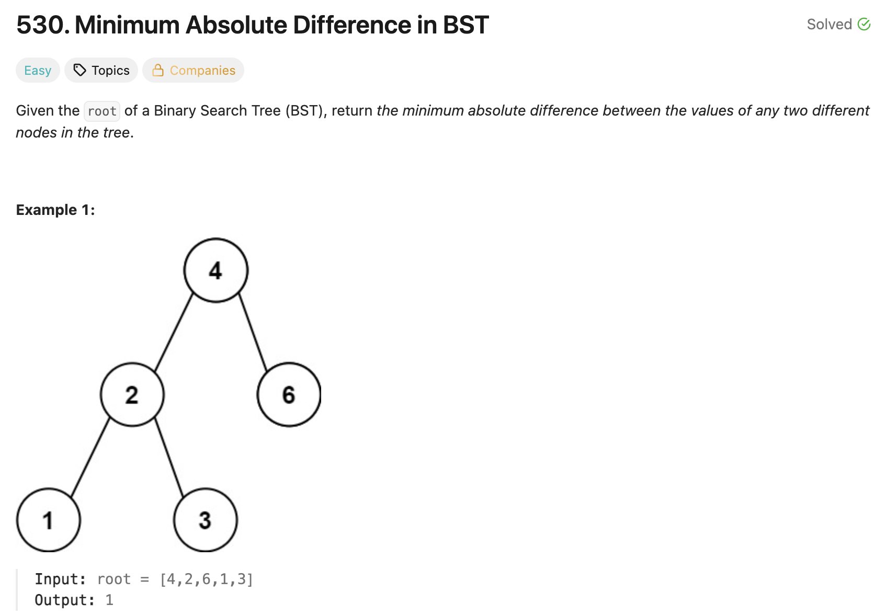

# 문제 설명
이진 탐색 트리에서 노드 간의 최소 절대 차이를 찾는 문제다.



## 풀이 및 해설
이 문제 같은 경우에는 이진 탐색 트리의 특성을 이용해서 풀 수 있다. 이진 탐색 트리의 특성상 왼쪽 자식 노드는 부모 노드보다 작고, 오른쪽 자식 노드는 부모 노드보다 크다. 따라서 중위 순회를 통해서 노드 값을 오름차순으로 정렬된 리스트를 얻을 수 있다. 이 리스트에서 인접한 값들 간의 차이를 계산하여 최소 절대 차이를 찾으면 된다.

## 풀이
```python
# Definition for a binary tree node.
# class TreeNode:
#     def __init__(self, val=0, left=None, right=None):
#         self.val = val
#         self.left = left
#         self.right = right
class Solution:
    def getMinimumDifference(self, root: Optional[TreeNode]) -> int:
        # initialize vars
        stack = []
        current = root
        prev_val = None
        min_diff = float('inf')

        while stack or current:
            # go to leftmost
            while current:
                stack.append(current)
                current = current.left
            
            # this is the leftmost
            current = stack.pop()

            # compare current's val with prev's val
            if prev_val is not None:
                min_diff = min(min_diff, current.val - prev_val)
            prev_val = current.val

            current = current.right
        
        return min_diff
```

## Complexity Analysis


### 시간 복잡도
- O(N)

### 공간 복잡도
- O(H); H는 트리의 높이

## Constraint Analysis
```
Constraints:
The number of nodes in the tree is in the range [2, 10^4].
0 <= Node.val <= 10^5
```

# References
- [530. Minimum Absolute Difference in BST - LeetCode](https://leetcode.com/problems/minimum-absolute-difference-in-bst/)