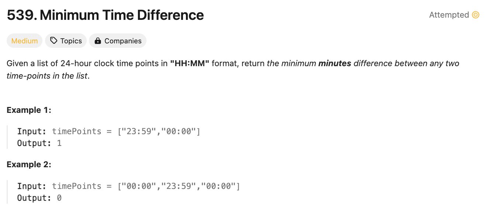

# 문제 설명
배열에 여러 시간들이 HH:MM 형식으로 저장되어 있을 때, 가장 가까운 두 시간의 차이를 구하라.



## 풀이 및 해설
이걸 풀기 위해서는 일단 정렬을 하고 가장 가까운 두개씩 비교하면 된다고 생각했다.   

그러나, 이렇게 했을 경우 앞에 있는 맨 앞 시간이 00:00인 경우와 마지막 시간이 23:59인 경우 계산을 틀리게 됐었다.  

1분이 가장 작은 차이인데, 두개를 비교하지 않아서 생긴 문제였다.  

그래서 이것 또한 예외처리로 맨 처음에 해줬으나 잘 도출되지 않았다.

## 풀이
```python
def findMinDifference(self, timePoints: List[str]) -> int:
    timePoints.sort()
    mintime = float('inf')

    #check first and last
    if len(timePoints) == 1:
        return 0
    else:
        firsthr = int(timePoints[0][:2])
        lasthr = int(timePoints[-1][:2])
        hrdiff = 60 * (24-lasthr - firsthr)
        mindiff = hrdiff + int(timePoints[0][3:]) - int(timePoints[-1][3:])
        if mindiff > 0:
            mintime = min(mintime, mindiff)

    for i in range(len(timePoints)-1):
        nextmin = int(timePoints[i+1][:2])*60+int(timePoints[i+1][3:])
        prevmin = int(timePoints[i][:2])*60+int(timePoints[i][3:])
        mintime = min(mintime, nextmin - prevmin)
    
    return mintime
```

위 풀이가 너무 복잡해서 조금 다듬어봤다:

```python
def findMinDifference(self, timePoints: List[str]) -> int:
    minutes = sorted([(int(time[:2])*60+int(time[3:])) for time in timePoints])
    mintime = float('inf')

    # check edgecase
    if len(timePoints) == 1:
        return 0
    
    # check first and last
    mintime = min(
        (minutes[-1]-minutes[0]),
        (1440+minutes[0] - minutes[-1])
    )

    for i in range(1, len(minutes)):
        diff = minutes[i] - minutes[i-1]
        mintime = min(diff, mintime)
    
    return mintime
```

## Complexity Analysis


### 시간 복잡도
- O(NlogN)

### 공간 복잡도
- O(N)

## Constraint Analysis
```
Constraints:
2 <= timePoints.length <= 2 * 10^4
timePoints[i] is in the format "HH:MM".
```

# References
- [539. Minimum Time Difference](https://leetcode.com/problems/minimum-time-difference/)