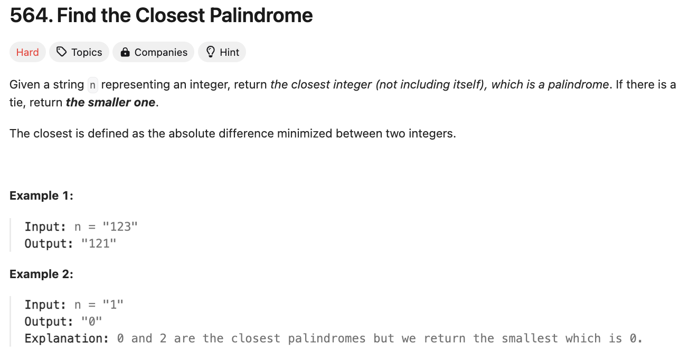

# 문제 설명
하나의 숫자 n이 주어졌을 때, 이와 가장 가까운 Palindrome 숫자를 찾는 문제이다. 만일 두 개의 Palindrome 숫자가 동일한 거리에 있다면, 더 작은 숫자를 반환한다.



## 풀이 및 해설

## 풀이
```python
def nearestPalindromic(self, n: str) -> str:
        if len(n) == 1:
            return str(int(n) - 1)
        
        num = int(n)
        length = len(n)

        # Generate candidate palindromes
        candidates = [
            10**(length - 1) - 1, # 99...9
            10**length+1 # 1000...1
        ]

        # Get the prefix of the number
        prefix = int(n[:(length + 1) // 2])
        for i in range(prefix-1, prefix+2):
            candidate = self.generatePalindrome(i, length%2==0)
            candidates.append(candidate)
        
        # Find the closest palindrome
        result = float('inf')
        for candidate in candidates:
            if candidate != num:
                if abs(candidate - num) < abs(result - num) or \
                (abs(candidate - num) == abs(result - num) and candidate < result):
                    result = candidate
        
        return str(result)
    
    def generatePalindrome(self, prefix: int, even: bool) -> int:
        p = prefix
        if not even:
            p = p // 10
        while p > 0:
            prefix = prefix*10 + p%10
            p //= 10
        return prefix
```
- 한자릿수인 경우, n-1을 반환한다.
- 주어진 숫자 n의 길이를 구한다.
- 주어진 숫자 n을 int로 변환한다.
- 후보 Palindrome 숫자를 생성한다.
  - 10^(length - 1) - 1
  - 10^length + 1
  - prefix - 1, prefix, prefix + 1
- 숫자의 접두사를 구한다.
- prefix - 1, prefix, prefix + 1에 대해 Palindrome 숫자를 생성한다.
- 가장 가까운 Palindrome 숫자를 찾는다.
- 결과를 반환한다.

generatePalindrome 함수는 주어진 prefix와 even 여부에 따라 Palindrome 숫자를 생성한다.
- prefix를 p에 저장한다.
- even이 False인 경우, p를 10으로 나눈다.
- p가 0보다 클 때까지 반복한다.
  - prefix를 prefix*10 + p%10으로 갱신한다.
  - p를 10으로 나눈다.
- prefix를 반환한다.

## Complexity Analysis


### 시간 복잡도
- candidate 생성: O(logn)
- generatePalindrome: O(logn)
- 가장 가까운 Palindrome 숫자 찾기: O(logn)

O(logn)

### 공간 복잡도
O(logn)

## Constraint Analysis
```
Constraints:
1 <= n.length <= 18
n consists of only digits.
n does not have leading zeros.
n is representing an integer in the range [1, 10^18 - 1].
```

# References
- [564. Find the Closest Palindrome](https://leetcode.com/problems/find-the-closest-palindrome/)