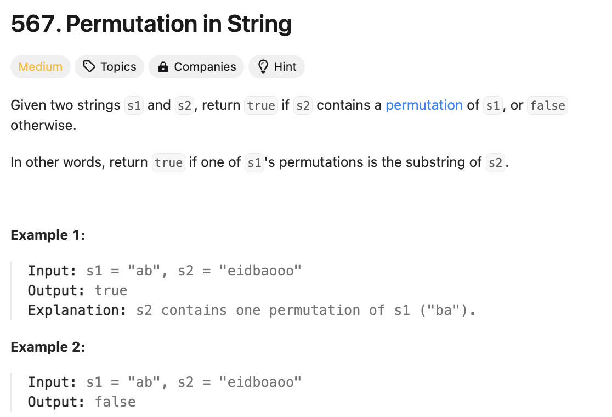

# 문제 설명
이 문제는 s1의 순열이 s2에 포함되어 있는지 확인하는 문제이다.




## 풀이 및 해설


## 풀이
```python
class Solution:
    def checkInclusion(self, s1: str, s2: str) -> bool:
        if len(s1) > len(s2):
            return False
        
        s1_count = [0] * 26
        window_count = [0] * 26

        for char in s1:
            s1_count[ord(char) - ord('a')] += 1
        

        for i in range(len(s1)):
            window_count[ord(s2[i]) - ord('a')] += 1
        
        if s1_count == window_count:
            return True

        
        for i in range(len(s1), len(s2)):
            window_count[ord(s2[i- len(s1)]) - ord('a')] -= 1

            window_count[ord(s2[i]) - ord('a')] += 1

            if s1_count == window_count:
                return True
        
        return False
```
- s1의 길이가 s2보다 길면 False를 반환한다.
- s1_count와 window_count를 26개의 0으로 초기화한다.
- s1의 각 문자를 순회하며 s1_count에 각 문자의 개수를 저장한다.
- s1의 길이만큼 s2를 순회하며 window_count에 각 문자의 개수를 저장한다.
- s1_count와 window_count가 같으면 True를 반환한다.
- s1부터 s2의 길이만큼 순회하며 window_count의 첫 문자를 빼고, 다음 문자를 더한다.
- s1_count와 window_count가 같으면 True를 반환한다.
- 모든 순회가 끝나면 False를 반환한다.

해당 풀이의 핵심 아이디어는 s1의 문자 개수와 s2의 문자 개수를 비교하는 것이다. s1의 문자 개수와 s2의 문자 개수가 같으면 s1이 s2에 포함되어 있는 것이다.

## Complexity Analysis


### 시간 복잡도
- O(N) : s2의 길이만큼 순회한다.

### 공간 복잡도
- O(1) : 상수 개수의 변수를 사용한다.

## Constraint Analysis
```
Constraints:
1 <= s1.length, s2.length <= 10^4
s1 and s2 consist of lowercase English letters.
```

# References
- [567. Permutation in String](https://leetcode.com/problems/permutation-in-string/)