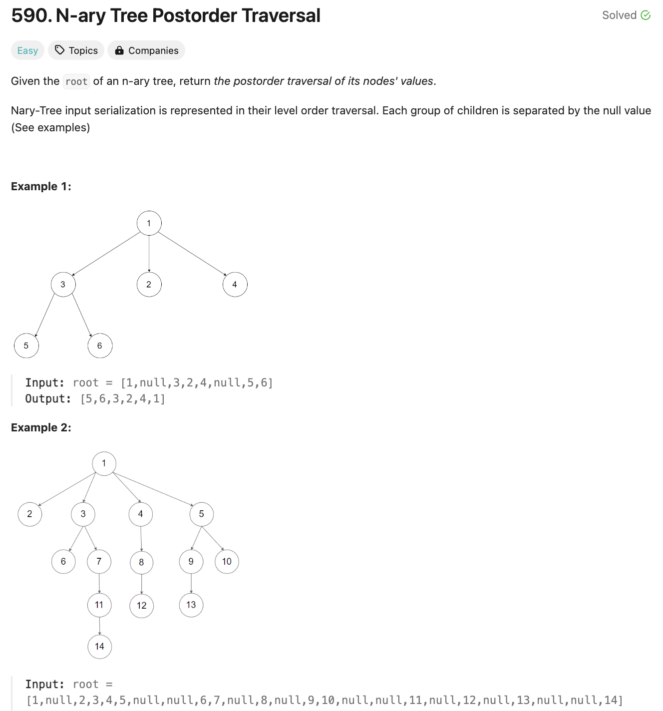

# 문제 설명
N-ary Tree의 Postorder Traversal을 구하는 문제다.




## 풀이 및 해설

## 풀이
```python
def postorder(self, root: 'Node') -> List[int]:
        result = []
        def traverse(node):
            if node is None:
                return
            for child in node.children:
                traverse(child)
            result.append(node.val)
        
        traverse(root)
        return result
```
- result 배열을 선언한다.
- traverse 함수를 정의한다.
    - for child in children
        - traverse(node.child)
        - result.append(node.val)
- traverse(root)
- return result

## Complexity Analysis


### 시간 복잡도
- O(N) ; N은 노드의 개수  
각 노드를 한번씩 방문하므로 O(N)이다.

### 공간 복잡도
- O(N) ; N은 노드의 개수
최악의 경우 모든 노드를 저장해야 하므로 O(N)이다.

## Constraint Analysis
```
Constraints:
The number of nodes in the tree is in the range [0, 10^4].
0 <= Node.val <= 10^4
The height of the n-ary tree is less than or equal to 1000.
```

# References
- [590. N-ary Tree Postorder Traversal](https://leetcode.com/problems/n-ary-tree-postorder-traversal/)