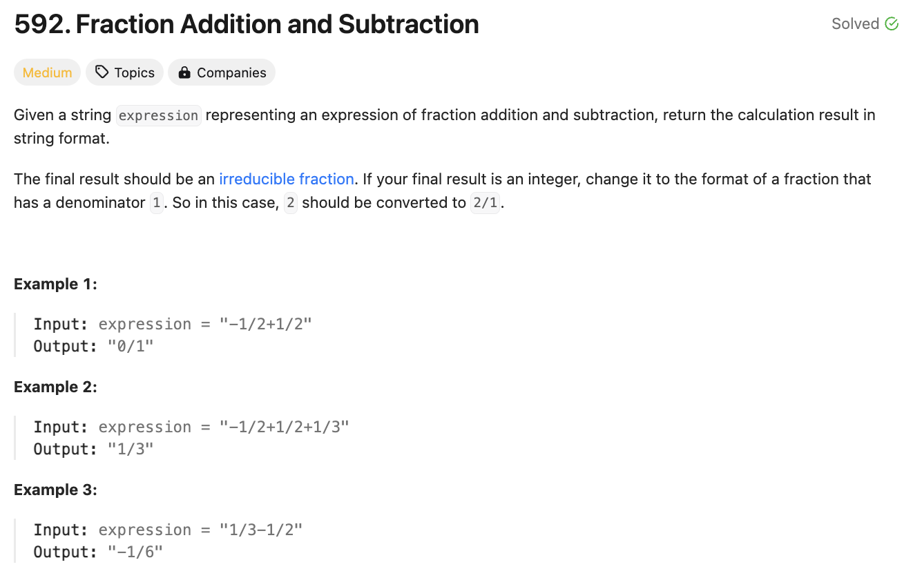

# 문제 설명
하나의 긴 문자열로 주어진 분수들을 더해서 하나의 분수로 만드는 문제이다.



## 풀이 및 해설
이해하는건 어렵지 않은 문제지만 구현이 어려운 문제였다. 일단 분수들을 모두 분리시켜야 하고, 음수인지 양수인지 처리하고, 분수들의 최소 공배수를 구한 뒤 더해줘야 했다. 이를 위해 gcd를 구하는 함수를 만들어서 사용했다.

## 풀이
```python
import re
from math import gcd
from functools import reduce

class Solution:
    def fractionAddition(self, expression: str) -> str:
        # split into fractions
        vals = re.split(r'([+-](?:\d+/\d+|\d+))', expression)
        while "" in vals:
            vals.remove("")
        
        # process fractions
        fractions = []
        for fr in vals:
            sign = ""
            if fr[0] in ['+','-']:
                sign = fr[0]
                fr = fr[1:]
            else:
                if '/' not in fr:
                    fr += '/1'
            num, den = map(int, fr.split('/'))
            num = num if sign != '-' else -num
            fractions.append((num,den))
        
        # find LCD
        def lcm(a,b):
            return abs(a*b) // gcd(a,b)
        
        lcd = reduce(lcm, [f[1] for f in fractions])

        # add fractions
        num_sum = sum(f[0] * (lcd // f[1]) for f in fractions)

        # simplify the results
        common_divisor = gcd(num_sum, lcd)
        numerator = num_sum // common_divisor
        denominator = lcd // common_divisor

        return f"{numerator}/{denominator}"
```
- 정규식을 사용하여 문자열을 분리한다.
- 분리된 문자열을 처리하여 분수로 만든다.
- 분수들의 최소 공배수를 구한다.
- 분수들을 더한다.
- 최대공약수를 구하여 결과를 출력한다.
- 최대공약수를 구하는 함수는 math 모듈의 gcd를 사용하였다.
- 최소 공배수를 구하는 함수는 reduce를 사용하여 구현하였다.
- 결과를 출력할 때는 f-string을 사용하여 출력하였다.
- 최종적으로 분자와 분모를 구하여 출력한다.
- 분모가 1인 경우는 분수가 아닌 정수이므로 분모를 1로 설정해주었다.
- 분자가 음수인 경우는 분모를 음수로 만들어주었다.
- 분자가 양수인 경우는 '+'를 생략하였다.

## Complexity Analysis


### 시간 복잡도
- 문자열을 분리하는데 O(n)
- 분수들을 처리하는데 O(n)
- 최소 공배수를 구하는데 O(n)
- 분수들을 더하는데 O(n)
- 최대공약수를 구하는데 O(n)
- 결과를 출력하는데 O(1)

따라서 총 시간 복잡도는 O(n)이다.

### 공간 복잡도
공간 복잡도는 O(n)이다.

## Constraint Analysis
```
Constraints:
The input string only contains '0' to '9', '/', '+' and '-'. So does the output.  
Each fraction (input and output) has the format ± numerator/denominator. If the first input fraction or the output is positive, then '+' will be omitted.  
The input only contains valid irreducible fractions, where the numerator and denominator of each fraction will always be in the range [1, 10]. If the denominator is 1, it means this fraction is actually an integer in a fraction format defined above.  
The number of given fractions will be in the range [1, 10].  
The numerator and denominator of the final result are guaranteed to be valid and in the range of 32-bit int.  
```

# References
- [592. Fraction Addition and Subtraction](https://leetcode.com/problems/fraction-addition-and-subtraction/)