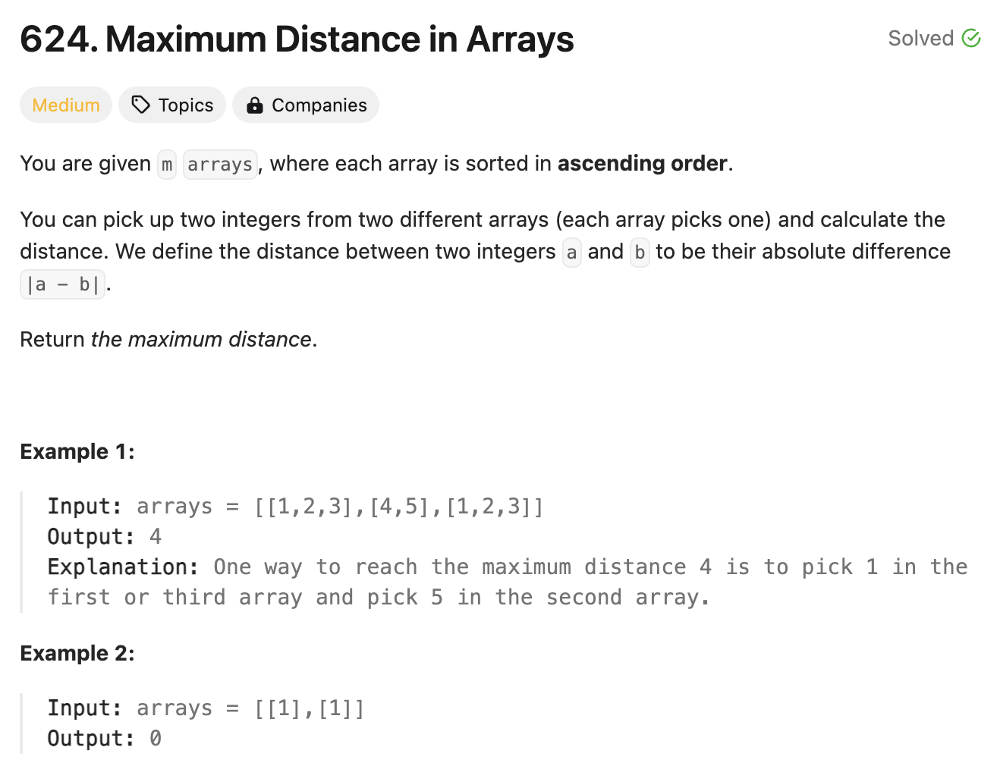

# 문제 설명
두 배열의 최대 차이를 구하는 문제입니다.



## 풀이 및 해설

## 풀이
```python
class Solution:
    def maxDistance(self, arrays: List[List[int]]) -> int:
        min_val, max_val = arrays[0][0], arrays[0][-1]
        result = 0

        for i in range(1, len(arrays)):
            a,b = abs(max_val - arrays[i][0]), abs(min_val - arrays[i][-1])
            result = max(result,a,b)
            min_val = min(min_val, arrays[i][0])
            max_val = max(max_val, arrays[i][-1])
        
        return result
```
- 두 배열의 최대 차이를 구하기 위해 두 배열의 첫번째 값과 마지막 값을 비교한다.
- 모든 배열의 첫번째 값과 마지막 값을 비교하면서 가장 작은 값과 가장 큰 값을 저장한다.
- 최솟값과 최댓값을 비교하면서 최대 차이를 구한다.
- 최대 차이를 반환한다.

## Complexity Analysis


### 시간 복잡도
- 배열의 길이를 n이라고 할 때, O(n)이다.

### 공간 복잡도
- O(1)이다.

## Constraint Analysis
```
Constraints:
m == arrays.length
2 <= m <= 10^5
1 <= arrays[i].length <= 500
-104 <= arrays[i][j] <= 10^4
arrays[i] is sorted in ascending order.
There will be at most 10^5 integers in all the arrays.
```

# References
- [624. Maximum Distance in Arrays](https://leetcode.com/problems/maximum-distance-in-arrays/)