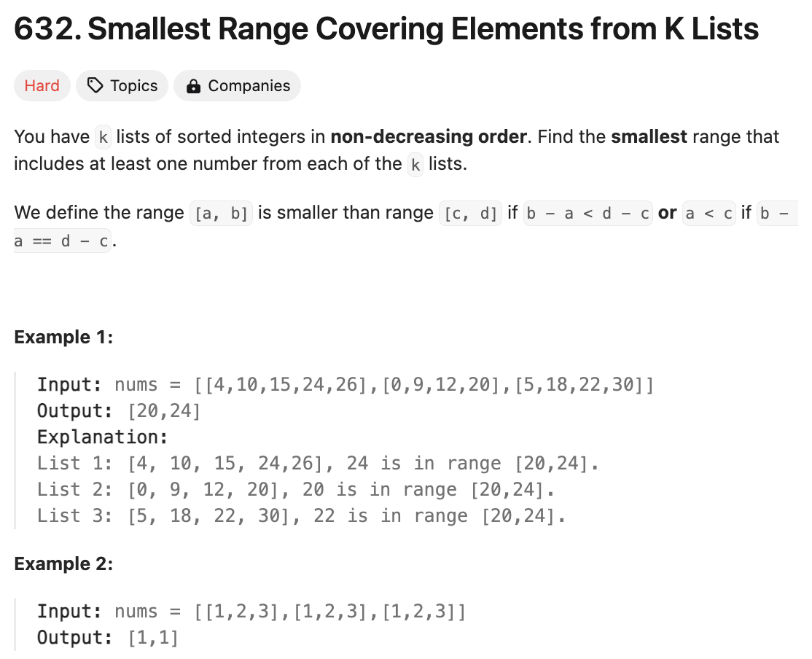

# 문제 설명
k개의 정렬된 리스트가 주어지면, 각 리스트에서 하나의 숫자를 선택하여 범위를 형성할 수 있다. 범위의 길이는 선택된 숫자 중 가장 큰 숫자와 가장 작은 숫자의 차이다. 최소 범위를 찾아서 반환한다.



## 풀이 및 해설

## 풀이
```python
class Solution:
    def smallestRange(self, nums: List[List[int]]) -> List[int]:
        heap = []
        max_val = float('-inf')

        # init heap with first element from each list
        for i, num_list in enumerate(nums):
            if num_list:
                heapq.heappush(heap, (num_list[0], i, 0))
                max_val = max(max_val, num_list[0])
            
        result = [0, 10**5]

        while len(heap) == len(nums):
            min_val, list_index, element_index = heapq.heappop(heap)

            # update the result if we find a smaller range
            if max_val - min_val < result[1] - result[0]:
                result = [min_val, max_val]
            
            # move to the next element in the current list
            if element_index + 1 < len(nums[list_index]):
                next_val = nums[list_index][element_index + 1]
                heapq.heappush(heap, (next_val, list_index, element_index+1))
                
                max_val = max(max_val, next_val)
        
        return result
```
- heap을 초기화하고, 각 리스트의 첫 번째 요소를 heap에 추가한다.
- heap에서 가장 작은 요소를 pop하고, 해당 요소가 속한 리스트의 다음 요소를 heap에 추가한다.
- heap의 길이가 리스트의 길이와 같아지면, 가장 작은 범위를 찾아서 반환한다.

## Complexity Analysis


### 시간 복잡도
- 시간 복잡도는 O(nlogk)이다. n은 리스트의 총 요소의 개수이고, k는 리스트의 개수이다.

### 공간 복잡도
- 공간 복잡도는 O(k)이다.

## Constraint Analysis
```
Constraints:
nums.length == k
1 <= k <= 3500
1 <= nums[i].length <= 50
-105 <= nums[i][j] <= 10^5
nums[i] is sorted in non-decreasing order.
```

# References
- [632. Smallest Range Covering Elements from K Lists](https://leetcode.com/problems/smallest-range-covering-elements-from-k-lists/)