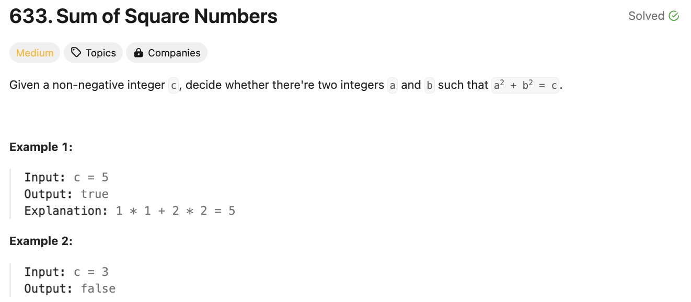
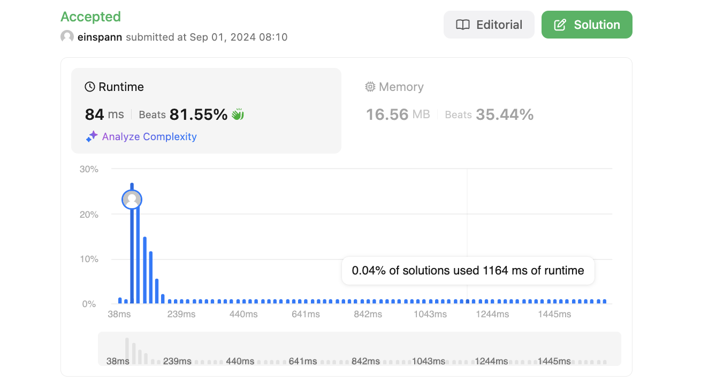

# 문제 설명
a^2 + b^2 = c^2를 만족하는지 확인하는 문제다.



## 풀이 및 해설

## 풀이
```python
def judgeSquareSum(self, c: int) -> bool:
    left, right = 0, int(c**0.5)

    while left <= right:
        current_sum = left*left + right*right
        if current_sum == c:
            return True
        elif current_sum < c:
            left += 1
        else:
            right -= 1
    
    return False
```
- left와 right를 0과 c의 제곱근으로 초기화한다.
- left가 right보다 작거나 같을 때까지 반복한다.
    - current_sum은 left와 right의 제곱의 합이다.
    - current_sum이 c와 같으면 True를 반환한다.
    - current_sum이 c보다 작으면 left를 1 증가시키고, 아니면 right를 1 감소시킨다.
- 반복이 끝나면 False를 반환한다.

## Complexity Analysis


### 시간 복잡도
- O(c^0.5) ; 최악의 경우 c의 제곱근까지 반복한다.

### 공간 복잡도
- O(1) ; 상수만큼의 공간을 사용한다.

## Constraint Analysis
```
Constraints:
0 <= c <= 2^31 - 1
```

# References
- [633. Sum of Square Numbers](https://leetcode.com/problems/sum-of-square-numbers/)