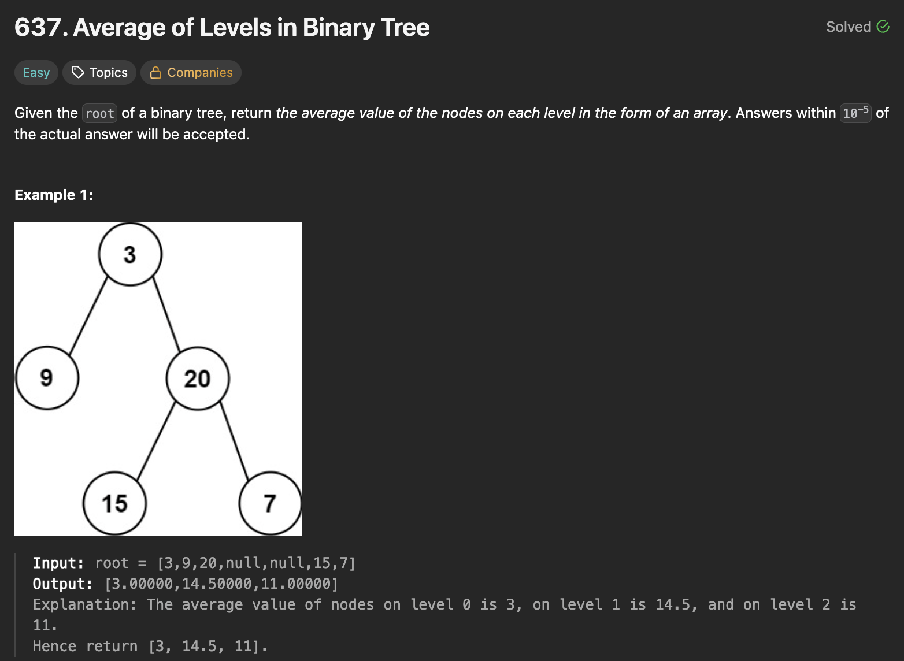
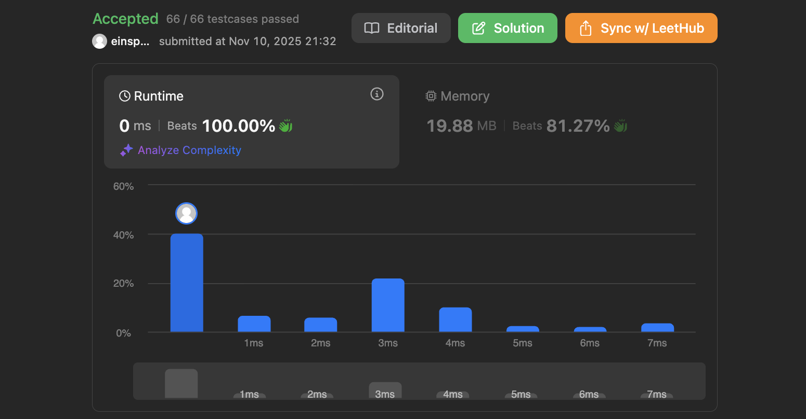

# 문제 설명
이 문제는 이진 트리가 주어지면 각 레벨의 평균값을 구하는 문제다. 딱 봤을 때 층별로 뭔가 하라고 하면 보통 BFS를 쓰고 BFS를 쓰면 큐(deque)를 쓰면 된다. 



## 풀이 및 해설
- deque를 이용하여 BFS를 Level Order Traversal (left-right) 방식으로 구하면 된다.
- 각 레벨마다 노드의 값을 더하고, 노드의 개수로 나누어 평균을 구한다.

## 풀이
```python
# Definition for a binary tree node.
# class TreeNode:
#     def __init__(self, val=0, left=None, right=None):
#         self.val = val
#         self.left = left
#         self.right = right
class Solution:
    def averageOfLevels(self, root: Optional[TreeNode]) -> List[float]:
        if not root:
            return []
        
        queue = deque([root])
        res = []

        while queue:
            level_size = len(queue)
            current_level = 0

            for _ in range(level_size):
                node = queue.popleft()
                current_level += node.val

                if node.left:
                    queue.append(node.left)
                if node.right:
                    queue.append(node.right)
            
            res.append(current_level/level_size)
        
        return res
```

## Complexity Analysis


### 시간 복잡도
- O(N)

### 공간 복잡도
- O(N)


## Constraint Analysis
```
Constraints:
The number of nodes in the tree is in the range [1, 10^4].
-2^31 <= Node.val <= 2^31 - 1
```

# References
- [LeetCode - 637. Average of Levels in Binary Tree](https://leetcode.com/problems/average-of-levels-in-binary-tree/description/?envType=study-plan-v2&envId=top-interview-150)