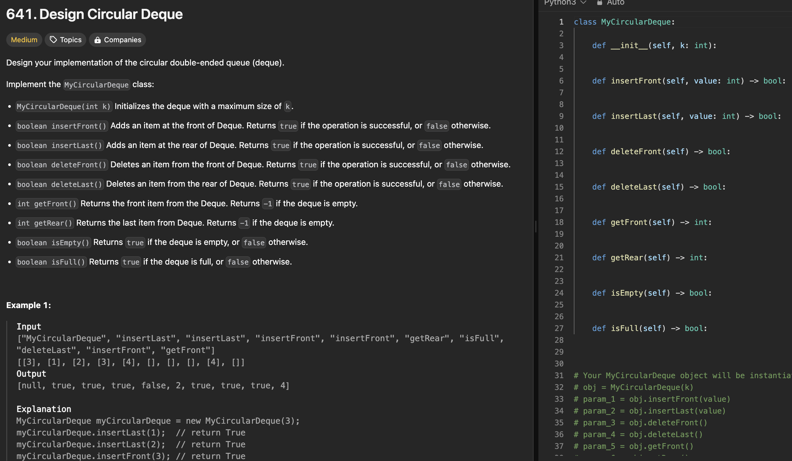

# 문제 설명
더블 엔디드 큐를 디자인하는 문제이다. 이런 문제들을 많이 풀어봐야 확실히 나중에 클래스 짜라고 하면 얼타지 않을것 같다.



## 풀이 및 해설
배열을 만들고, 그때 그때 조건에 안 맞으면 False를 리턴하면 된다.

## 풀이
```python
class MyCircularDeque:

    def __init__(self, k: int):
        self.queue = []
        self.max = k

    def insertFront(self, value: int) -> bool:
        if len(self.queue) + 1 > self.max:
            return False
        self.queue = [value] + self.queue
        return True

    def insertLast(self, value: int) -> bool:
        if len(self.queue) + 1 > self.max:
            return False
        self.queue = self.queue + [value]
        return True
        
    def deleteFront(self) -> bool:
        if len(self.queue) < 1:
            return False

        self.queue = self.queue[1:]
        return True

    def deleteLast(self) -> bool:
        if len(self.queue) < 1:
            return False

        self.queue = self.queue[:-1]
        return True

    def getFront(self) -> int:
        if len(self.queue) < 1:
            return -1

        return self.queue[0]

    def getRear(self) -> int:
        if len(self.queue) < 1:
            return -1

        return self.queue[-1]
        
    def isEmpty(self) -> bool:
        if len(self.queue) == 0:
            return True

        return False

    def isFull(self) -> bool:
        if len(self.queue) == self.max:
            return True
        
        return False
```

## Complexity Analysis


### 시간 복잡도
- insertFront: O(n)
- insertLast: O(n)
- deleteFront: O(n)
- deleteLast: O(n)
- getFront: O(1)
- getRear: O(1)
- isEmpty: O(1)
- isFull: O(1)

### 공간 복잡도
- O(n)

## Constraint Analysis
```
Constraints:
1 <= k <= 1000
0 <= value <= 1000
At most 2000 calls will be made to insertFront, insertLast, deleteFront, deleteLast, getFront, getRear, isEmpty, isFull.
```

# References
- [641. Design Circular Deque](https://leetcode.com/problems/design-circular-deque/)