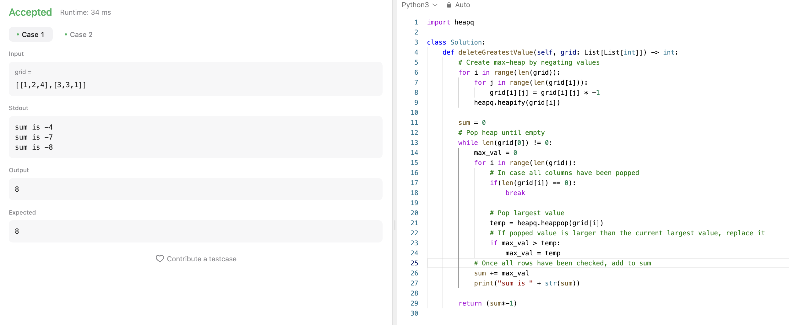

## 문제 설명
접두사 배열과 문장이 주어졌을 때, 문장의 단어에서 접두사가 존재한다면 접두사만 남겨두고 나머지 부분을 삭제.


## 1차 시도

단어에 접두사가 있는지만 확인해봤는데 이렇게 하면 안되는것 같다. 맨 앞에 있는 접두사를 기준으로 해야하는 것 같다. 어떻게 해야 맨 앞에 있는 단어를 갖고 올 수 있을까?

보면 내 답에서는 bbab에서 b를 먼저 발견해서 뒤에 있는 bab를 없애야 하는데, a를 먼저 발견해서 맨 마지막에 있는 b만 삭제한다.

## 2차 시도

맨 앞에 있는 글자를 기준으로 단어를 split했다. 그러나, 이렇게 하면 겹치는 단어가 여러개일 때 가장 짧은 단어 기준으로 해야한다. 정렬을 한번 해주면 될것 같다.


## 풀이 및 해설
위 방안에서 정렬을 해주니 해결되었다. 정렬을 해주면 가장 짧은 단어부터 비교하게 되므로, 가장 먼저 발견되는 단어가 가장 짧은 단어가 된다.




## 풀이
```python
class Solution:
    def replaceWords(self, dictionary: List[str], sentence: str) -> str:
        words = sentence.split()
        arr = []
        dictionary = sorted(dictionary)

        for word in words:
            root_found = False
            for root in dictionary:
                if root == word[:len(root)]:
                    print("comparing: ", root, word[:len(root)])
                    root_found = True
                    index = word.find(root)
                    result = word[:index + len(root)]
                    arr.append(result)
                    break
            if not root_found:
                arr.append(word)
        
        string = " ".join(arr)
        
        return string
```

## Complexity Analysis


### Time Complexity
- split: O(N) ; N은 문장의 길이
- sorted: O(klogk) ; k은 dictionary의 단어의 갯수
- for loop: O(WK) ; W는 문장의 단어의 갯수, K는 dictionary의 단어의 갯수
- compare: O(M) ; M은 접두사의 길이
- find: O(p) ; p는 단어의 길이
- append: O(1)
- join: O(N) ; 단어의 갯수

최종적으로 O(N + klogk + WKM + N) = O(WKM)이다.

### Space Complexity
- O(N+K) ; N은 문장의 길이, K는 dictionary의 단어의 갯수

## Constraint Analysis
```
Constraints:

- 1 <= dictionary.length <= 1000
- 1 <= dictionary[i].length <= 100
- dictionary[i] consists of only lower-case letters.
- 1 <= sentence.length <= 106
sentence consists of only lower-case letters and spaces.
- The number of words in sentence is in the range [1, 1000]
- The length of each word in sentence is in the range [1, 1000]
- Every two consecutive words in sentence will be separated by exactly one space.
- sentence does not have leading or trailing spaces.
```

- 시간복잡도는 O(10^6)+O(1000log1000)+O(10^8)+O(10^6) = O(10^8)이다.
- 공간복잡도는 O(w+k+n)=O(1000+1000+10^6)=O(10^6)

# References
- [LeetCode](https://leetcode.com/problems/replace-words)
- [Heap Queue](https://docs.python.org/3/library/heapq.html)
