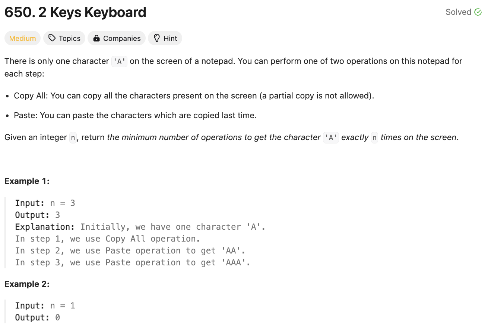

# 문제 설명
복사/붙혀놓기 기능을 이용하여 n개의 'A'를 만드는 문제이다.

 


## 풀이 및 해설
해당 문제를 풀 때, 가장 먼저 든 생각이 다음 두개 방식 중 어떤게 더 빠를지 고민했었다.

1. 한번 복사하고, 여러번 붙혀놓기
2. 한번 복사하고, 한번 분혜놓기를 여러번

이 중 어떤게 더 유리하고, 이걸 어떻게 판단하는지가 중요했다. 이에 대해서, DP가 어떻게든 적용될 것이라고 생각했고, 이를 어떻게 적용할지 고민했다.

오히려, n의 숫자가 주어지면 이걸 낮은 수부터 n까지 계산하기보다, 역으로 n을 작게 만들어가는 방식으로 접근하는게 더 효율적이라고 생각했다. 이를 위해, n을 가장 작은 소수인 2로 나누어가면서, 나누어 떨어지는 수를 찾아가는 방식으로 접근했다.

이렇게 2로 더 이상 나누어지지 않는다면, 그 다음으로 작은 소수인 3으로 나누어가면서, 나누어 떨어지는 수를 찾아가는 방식으로 접근했다.

즉, 아무리 큰 수여도 결국에는 소수로 나누어지는 수로 나누어가면서, 최종적으로 1이 되는 수를 찾아가는 방식으로 접근했을때, 가장 적은 수의 연산을 찾을 수 있었다.

## 풀이
```python
def minSteps(self, n: int) -> int:
        if n == 1:
            return 0
        
        # we can perform either 1 Copy, Many Pastes
        # or we can perform 1 Copy, 1 Paste several times
        # which one is better? how can we check? dp?

        steps = 0
        d = 2 # smallest prime factor
        while n > 1:
            while n%d==0:
                steps += d
                n = n // d
            d+=1
        
        return steps
```
- n이 1이면, 0을 반환한다.
- steps를 0으로 초기화하고, d를 2로 초기화한다.
- n이 1이 될때까지, n을 d로 나누어가면서, 나누어 떨어지는 수를 찾아가는 방식으로 접근한다.
- d를 1씩 증가시키면서, n이 1이 될때까지 반복한다.
- 최종적으로, steps를 반환한다.

## Complexity Analysis


### 시간 복잡도
- O(n) ; n이 1이 될때까지, n을 나누어가는 방식으로 접근한다.

### 공간 복잡도
- O(1) ; 추가적인 공간이 필요하지 않다.

## Constraint Analysis
```
Constraints:
1 <= n <= 1000
```

# References
- [650. 2 Keys Keyboard - LeetCode](https://leetcode.com/problems/2-keys-keyboard/)