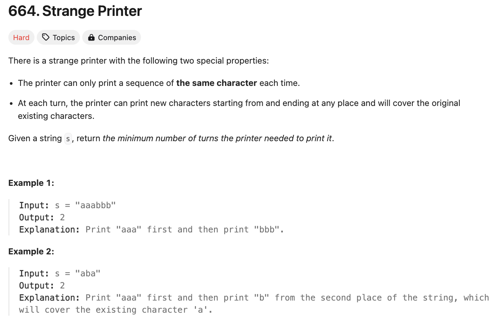
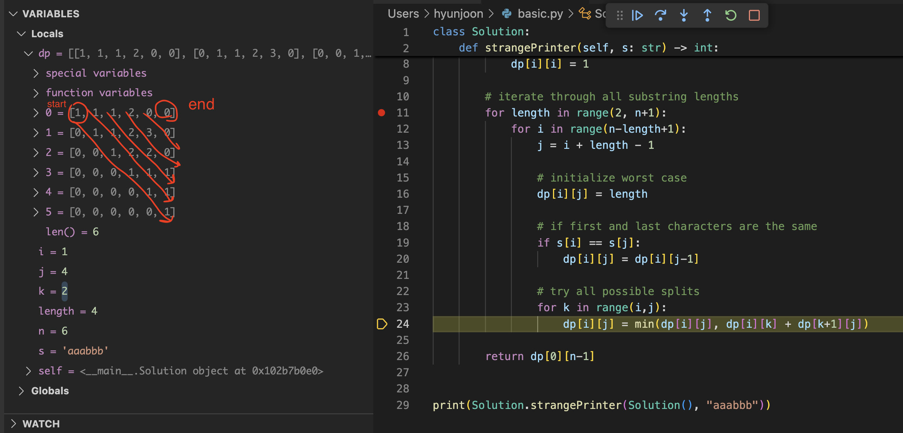
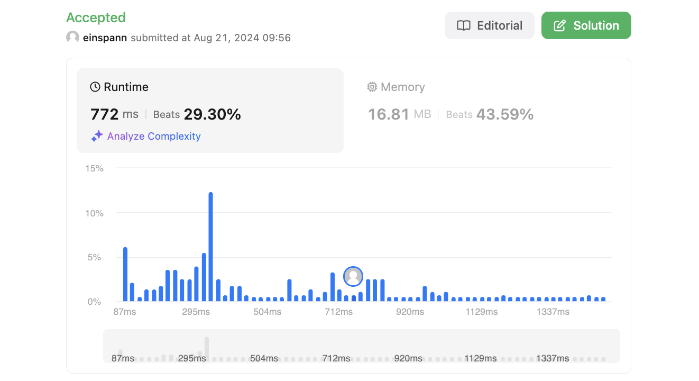

# 문제 설명
특이한 프린터가 주어지고, 주어진 문자열을 출력하기 위해 필요한 최소한의 프린트 횟수를 구하는 문제이다.

이 프린터는 다음과 같은 특징을 가진다.
- 한 번에 한 문자 종류만 출력할 수 있다.
- 출력하려는 문자가 이미 출력된 문자와 같다면, 추가적인 프린트 없이 출력할 수 있으며, 이렇게 프린트된 문자는 기존에 출력된 문자를 덮어쓴다.



## 풀이 및 해설
이 문제를 풀기 위해서는 각각의 substring에 대해 최소한의 프린트 횟수를 구하다 보면, 결국에 이게 전체 문자열에 대한 최소한의 프린트 횟수가 된다. 따라서 dp 배열을 이용하여 각각의 substring에 대한 최소한의 프린트 횟수를 구하면 된다.



풀이의 dp배열을 살펴보면 마치 diagonal 값들만 사용하고 그 기준으로부터 오른쪽 아래로만 값을 채워나가는 것을 볼 수 있다. 이는 dp[i][j]를 구하기 위해서는 dp[i][k] + dp[k+1][j]를 이용하여 값을 구할 수 있기 때문이다.

## 풀이
```python
class Solution:
    def strangePrinter(self, s: str) -> int:
        n = len(s)
        dp = [[0] * n for _ in range(n)]

        # base case
        for i in range(n):
            dp[i][i] = 1

        # iterate for all substrings
        for length in range(2, n+1):
            for i in range(n - length + 1):
                j = i + length - 1
                
                # initialize with worst case
                dp[i][j] = length

                # check if first value is same as last value
                if s[i] == s[j]:
                    dp[i][j] = dp[i][j-1]
                
                # try all possible splits
                for k in range(i,j):
                    dp[i][j] = min(dp[i][j], dp[i][k] + dp[k+1][j])
        
        return dp[0][n-1]
```
- dp 배열을 [0][0]부터 [n-1][n-1]까지 초기화한다.
- base case로서 dp[i][i]는 1로 초기화한다.
- 모든 substring에 대해 최소한의 프린트 횟수를 구하기 위해 2부터 n+1까지의 길이에 대해 모든 substring에 대해 최소한의 프린트 횟수를 구한다.
    - i부터 n-length+1까지 for loop을 돌면서 모든 substring에 대해 최소한의 프린트 횟수를 구한다.
        - j = i + length - 1로 설정한다.
        - dp[i][j]를 length로 초기화한다.
        - 만약 s[i]와 s[j]가 같다면, dp[i][j]는 dp[i][j-1]로 설정한다.
        - 모든 split에 대해 dp[i][j]를 구하기 위해 for loop을 돌면서 dp[i][j]를 min(dp[i][j], dp[i][k] + dp[k+1][j])로 설정한다.
- dp[0][n-1]을 return한다.

## Complexity Analysis


### 시간 복잡도
- O(n^3): 3번의 for loop을 사용하여 dp 배열을 채우기 때문에 O(n^3)의 시간 복잡도를 가진다.

### 공간 복잡도
- O(n^2): dp 배열을 사용하여 O(n^2)의 공간 복잡도를 가진다.

## Constraint Analysis
```
Constraints:
1 <= s.length <= 100
s consists of lowercase English letters.
```

# References
- [664. Strange Printer](https://leetcode.com/problems/strange-printer/)