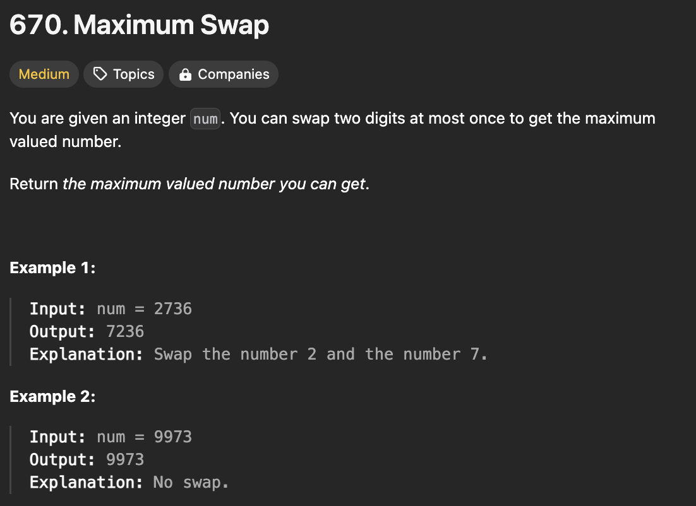
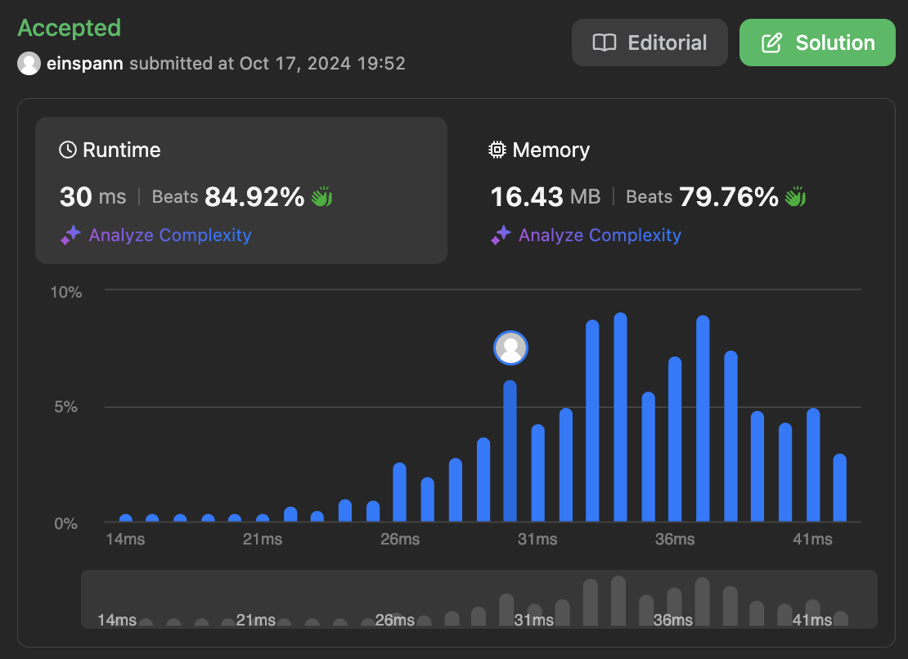

# 문제 설명
해당 문제는 두번의 스왑을 통해 가장 큰 숫자를 만들어라는 문제이다.



## 풀이 및 해설

## 풀이
```python
class Solution:
    def maximumSwap(self, num: int) -> int:
        li = list(str(num))
        last_occurrence = {int(d): i for i,d in enumerate(li)}

        for i,digit in enumerate(li):
            for d in range(9,int(digit), -1):
                if d in last_occurrence and last_occurrence[d] > i:
                    li[i], li[last_occurrence[d]] = li[last_occurrence[d]], li[i]
                    return int(''.join(li))
        
        return num
```
- 숫자를 문자열로 변환하여 리스트로 만든다.
- 각 숫자의 마지막 위치를 저장하는 딕셔너리를 만든다.
- 각 숫자를 순회하면서 9부터 현재 숫자까지 순회하면서 마지막 위치가 현재 위치보다 크면 바꾼다.
- 바꾼 숫자를 다시 숫자로 변환하여 리턴한다.
- 만약 바꿀 숫자가 없다면 원래 숫자를 리턴한다.

## Complexity Analysis


### 시간 복잡도
- 시간 복잡도는 O(N)이다. 이유는 숫자를 문자열로 변환하고 순회하면서 마지막 위치를 저장하고 순회하면서 바꾸기 때문이다.

### 공간 복잡도
- 공간 복잡도는 O(N)이다.

## Constraint Analysis
```
Constraints:
0 <= num <= 10^8
```

# References
- [670. Maximum Swap](https://leetcode.com/problems/maximum-swap/)