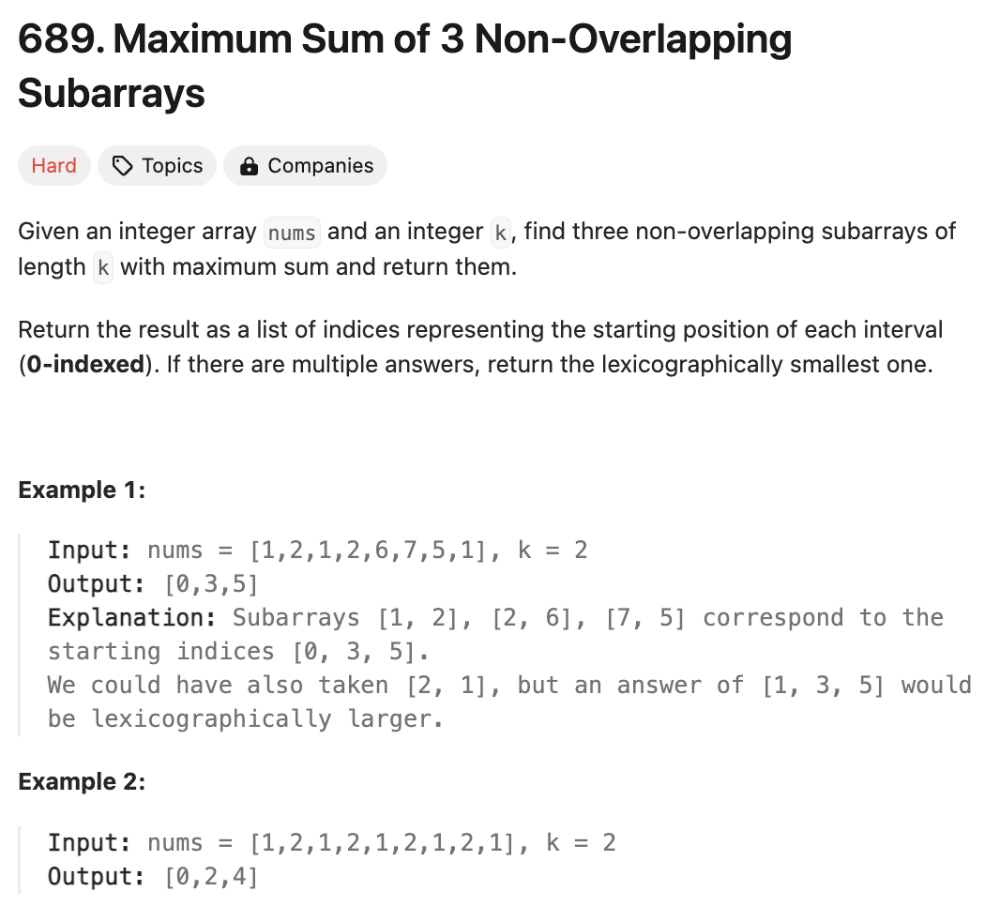

# 문제 설명
이 문제는 주어진 배열에서 3개의 non-overlapping subarrays의 합이 가장 큰 경우를 찾는 문제다. 이때, sum이 똑같은 크기의 경우, 가장 큰 lexigraphical order를 반환해야 한다.



## 풀이 및 해설
이 문제는 문제를 여러개로 분리하는 데에 초점이 맞춰져 있다.

1. k 길이의 subarray의 합을 계산하는 함수를 만든다.
2. k 길이의 subarray의 합을 계산한 뒤, left max sums와 right max sums를 계산한다.
3. left max sums와 right max sums를 이용해서 3개의 subarrays의 합을 계산한다.
4. 3개의 subarrays의 합을 계산한 뒤, 가장 큰 합을 가진 subarrays의 index를 반환한다.
5. 가장 큰 합을 가진 subarrays의 index를 이용해서 right index를 조정한다.

## 풀이
```python
class Solution:
    def maxSumOfThreeSubarrays(self, nums: List[int], k: int) -> List[int]:
        
        def calculateSlidingWindowSums(nums, k):
            if len(nums) < k:
                return []

            currentSum = sum(nums[:k])
            result = [currentSum]

            for i in range(len(nums) - k):
                currentSum = currentSum - nums[i] + nums[i+k]
                result.append(currentSum)
            
            return result
        
        window_sums = calculateSlidingWindowSums(nums, k)
        n = len(window_sums)

        left = [0] * n 
        right = [0] * n
        left_index = [0] * n

        # left max sums
        left[0] = window_sums[0]
        for i in range(1, n):
            if window_sums[i] > left[i-1]:
                left[i] = window_sums[i]
                left_index[i] = i
            else:
                left[i] =left[i-1]
                left_index[i] = left_index[i-1]
        
        # right max sums
        right[-1] = window_sums[-1]
        for i in range(n-2,-1,-1):
            if window_sums[i] >= right[i+1]:
                right[i] = window_sums[i]
            else:
                right[i] = right[i+1]
        

        max_sum = 0
        result = [0,0,0]
        for i in range(k,n-k):
            if i-k >= 0 and i+k < n:
                left_sum = left[i-k]
                mid_sum = window_sums[i]
                right_sum = right[i+k]
                total = left_sum + mid_sum + right_sum
                if total > max_sum:
                    max_sum = total
                    result = [left_index[i-k], i, n-1]
                elif total == max_sum and left_index[i-k] < result[0]:
                    result = [left_index[i-k], i, n-1]
        
        for i in range(result[1] + k, n):
            if window_sums[i] == right[result[1] + k]:
                result[2] = i
                break
    
        return result

```

## Complexity Analysis


### 시간 복잡도
- calculateSlidingWindowSums: O(n)
- arrays: O(n)
- left max sums: O(n)
- right max sums: O(n)
- finding max sum and optimal index: O(n)
- adjusting the right index: O(n)

따라서, O(n)만큼 걸린다.

### 공간 복잡도
- O(n)만큼의 공간이 필요하다.

## Constraint Analysis
```
Constraints:
1 <= nums.length <= 2 * 10^4
1 <= nums[i] < 2^16
1 <= k <= floor(nums.length / 3)
```

# References
- [689. Maximum Sum of 3 Non-Overlapping Subarrays](https://leetcode.com/problems/maximum-sum-of-3-non-overlapping-subarrays/)