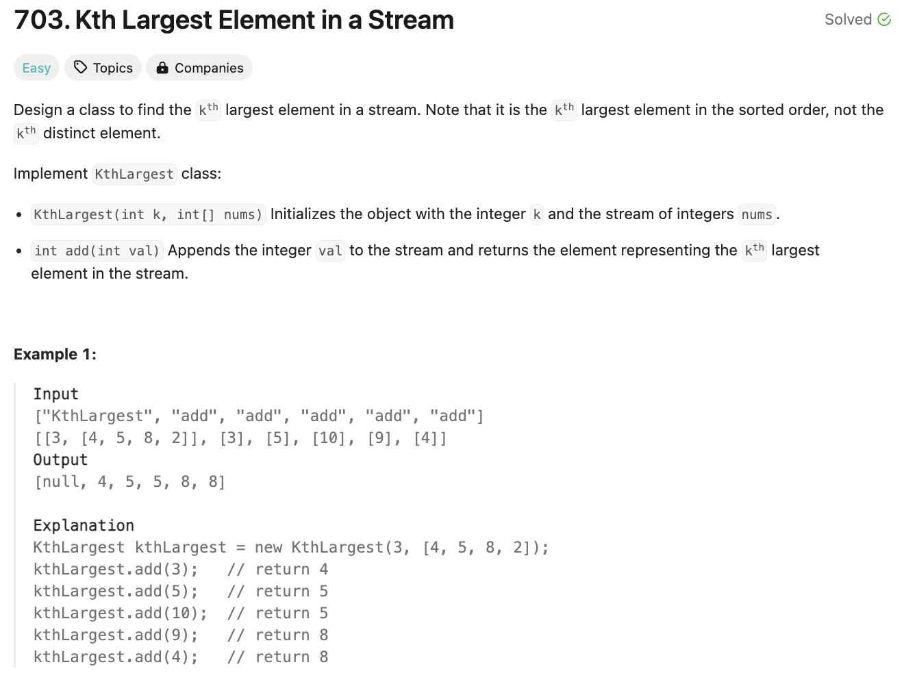
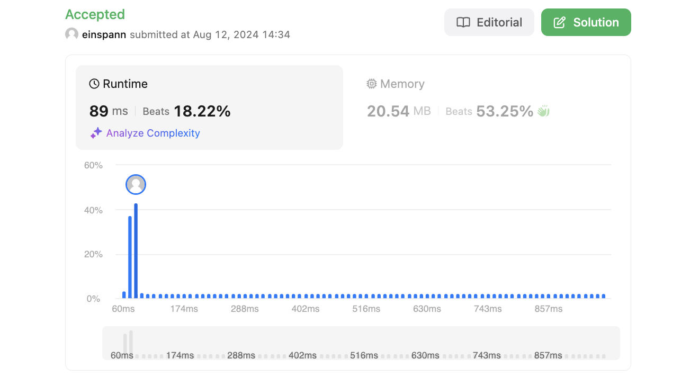

# 문제 설명
스트림에서 k번째로 큰 요소를 찾는 클래스를 구현하는 문제다.



해당 문제에서는 보편적인 알고리즘 문제가 아니라, 클래스를 구현하는 문제다. 따라서, 해당 클래스를 구현하는 방법을 이해하고, 해당 클래스를 사용하는 방법을 이해하는 것이 중요하다. 이런 유형의 문제를 실제로 라이브 코딩 테스트에서 겪은 적이 있는데, 이때 정말 기본적인 init 구현에 대한 확신이 없어서 시간을 많이 소비하고 결국에 못 풀고 넘긴 기억이 있다.

## 풀이 및 해설
- `__init__`에서는 k와 nums를 받아서 초기화한다.
- `add`에서는 val을 받아서 min_heap에 추가하고, min_heap의 길이가 k보다 크면 가장 작은 값을 제거한다.

## 풀이
```python
class KthLargest:

    def __init__(self, k: int, nums: List[int]):
        self.k = k
        self.min_heap = []

        for num in nums:
            self.add(num)

    def add(self, val: int) -> int:
        heapq.heappush(self.min_heap, val)

        if len(self.min_heap) > self.k:
            heapq.heappop(self.min_heap)
        
        return self.min_heap[0]
```
- self.k: k번째로 큰 요소를 찾기 위한 변수
- self.min_heap: min heap을 사용하여 k번째로 큰 요소를 찾기 위한 변수
- nums만큼 반복하면서 add 함수를 호출하여 min_heap에 추가한다.

- add 함수에서는 val을 받아서 min_heap에 추가하고, min_heap의 길이가 k보다 크면 가장 작은 값을 제거한다.
- 이렇게 하는 이유는 결국 가장 큰 값으로부터 k번째로 큰 값을 찾기 위해서는 k개의 요소만 유지하면 되기 때문이다. 즉, k이상의 작은 값은 필요가 없다.

## Complexity Analysis


### 시간 복잡도
- 시간 복잡도는 O(logk)이다. min_heap에 요소를 추가하거나 제거할 때 logk의 시간 복잡도가 소요된다.

### 공간 복잡도
- 공간 복잡도는 O(k)이다. min_heap에 k개의 요소만 유지하기 때문이다.

## Constraint Analysis
```
Constraints:
1 <= k <= 104
0 <= nums.length <= 104
-104 <= nums[i] <= 104
-104 <= val <= 104
At most 104 calls will be made to add.
It is guaranteed that there will be at least k elements in the array when you search for the kth element.
```

# References
- [703. Kth Largest Element in a Stream](https://leetcode.com/problems/kth-largest-element-in-a-stream/)