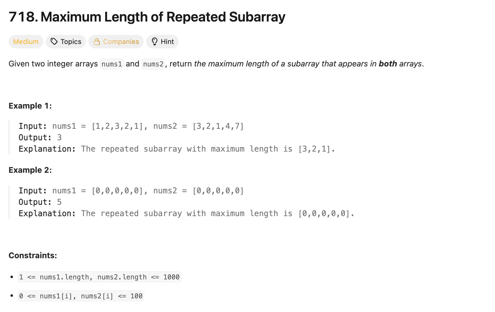
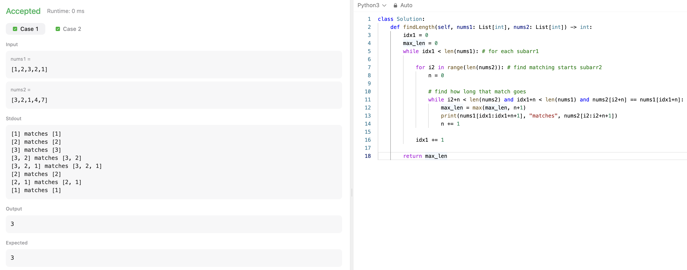
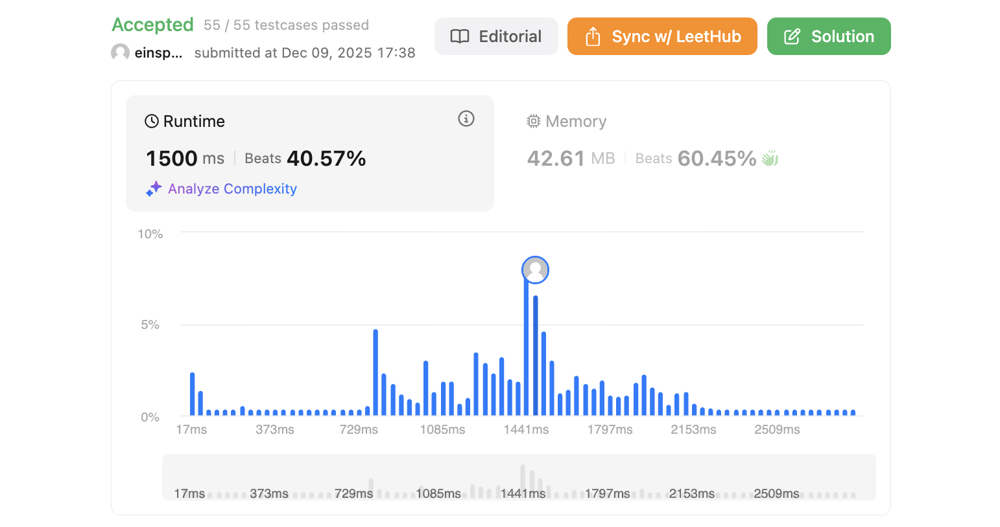

# 문제 설명
배열이 두 개 주어질 때, 두 배열에서 공통으로 나타나는 가장 긴 연속 부분 배열의 길이를 찾는 문제입니다.



## 풀이 및 해설
이 문제를 처음 풀어볼때는 다음과 같은 접근 방식으로 풀어봤습니다.  

1. 모든 nums1의 요소마다 순회
2. 모든 nums2의 요소마다 순회 (두개가 동일할 경우 일치 subarray 찾았다고 인식)
3. 일치하는 길이를 카운트



## 풀이
```python
class Solution:
    def findLength(self, nums1: List[int], nums2: List[int]) -> int:
        idx1 = 0
        max_len = 0
        while idx1 < len(nums1): # for each subarr1

            for i2 in range(len(nums2)): # find matching starts subarr2
                n = 0

                # find how long that match goes
                while i2+n < len(nums2) and idx1+n < len(nums1) and nums2[i2+n] == nums1[idx1+n]: 
                    max_len = max(max_len, n+1)
                    print(nums1[idx1:idx1+n+1], "matches", nums2[i2:i2+n+1])
                    n += 1

            idx1 += 1
        
        return max_len
```

그러나 이렇게 할 경우 while/for 문이 3종으로 중첩되어 단번에 시간 복잡도가 O(n^3)으로 비효율적이게 됩니다.  
테스트는 풀릴지언정 시간초과가 발생할 것이 예상되며 더 좋은 방법이 있을 것이라 생각했습니다.  

## 2차 개선
역시 이 문제는 DP로 접근할수 있었습니다. DP 테이블을 만들어서 각 인덱스마다의 최대 길이를 저장하는 방식입니다. Longest Common Substring 문제와 동일한 접근법입니다.  

```python
class Solution:
    def findLength(self, nums1: List[int], nums2: List[int]) -> int:
        n,m = len(nums1), len(nums2)
        dp = [[0] * (m+1) for _ in range(n+1)]
        max_val = 0

        for i in range(1,n+1):
            for j in range(1,m+1):
                if nums1[i-1] == nums2[j-1]:
                    dp[i][j] = dp[i-1][j-1] + 1
                    max_val = max(max_val, dp[i][j])
        
        return max_val
```


## Complexity Analysis


### 시간 복잡도
- O(n*m)이다. 여기서 n과 m은 각각 nums1과 nums2의 길이이다. 두개 같은 길이일 경우 O(n^2)이다.

### 공간 복잡도
- O(n*m)이다. DP 테이블을 저장하기 위해 n*m 크기의 2차원 배열이 필요하다.

## Constraint Analysis
```
Constraints:
1 <= nums1.length, nums2.length <= 1000
0 <= nums1[i], nums2[i] <= 100
```

# References
- [718. Maximum Length of Repeated Subarray - LeetCode](https://leetcode.com/problems/maximum-length-of-repeated-subarray/)