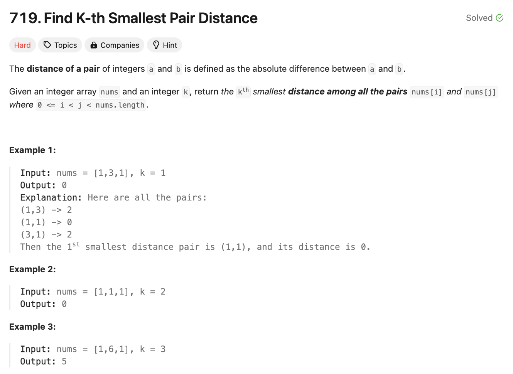

# 문제 설명
주어진 배열에서 k번째로 작은 pair distance를 찾는 문제다.



## 풀이 및 해설

## 풀이
```python
def smallestDistancePair(self, nums: List[int], k: int) -> int:
        def count_pairs(mid):
            #counts how many pairs are smaller than mid.
            count = left = 0
            for right in range(1,n):
                while nums[right]-nums[left] > mid:
                    left += 1
                count += right - left
            return count
        
        nums.sort()
        n = len(nums)

        low, high = 0, nums[-1]-nums[0]
        while low < high:
            mid = (low+high)//2
            if count_pairs(mid) < k:
                low = mid + 1
            else:
                high = mid
        
        return low
```
- `count_pairs` 함수는 주어진 mid 값보다 작은 pair의 개수를 세는 함수다.
- `low`와 `high`를 이용해 이진 탐색을 진행한다.
- `count_pairs` 함수의 결과가 k보다 작으면 `low`를 mid+1로 업데이트하고, 그렇지 않으면 `high`를 mid로 업데이트한다.
- `low`가 `high`보다 커지면 `low`를 반환한다.

## Complexity Analysis


### 시간 복잡도
- 이진 탐색을 사용하므로 O(nlogn)이다.

### 공간 복잡도
- O(1)이다.

## Constraint Analysis
```
Constraints:
n == nums.length
2 <= n <= 104
0 <= nums[i] <= 106
1 <= k <= n * (n - 1) / 2
```

# References
- [LeetCode - 719. Find K-th Smallest Pair Distance](https://leetcode.com/problems/find-k-th-smallest-pair-distance/)