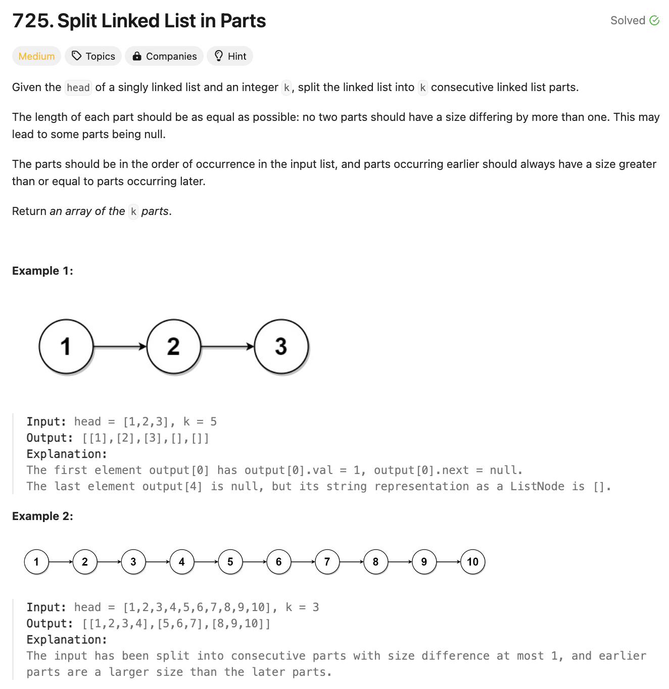

# 문제 설명
이 문제는 주어진 링크드 리스트를 k개의 파트로 나누는 문제이다.




## 풀이 및 해설


## 풀이
```python
def splitListToParts(self, head: Optional[ListNode], k: int) -> List[Optional[ListNode]]:
    # 리스트 길이 계산
    length = 0
    curr = head
    while curr:
        length += 1
        curr = curr.next
    
    # 각 부분의 크기 계산
    base_size, remainder = divmod(length, k)
    
    result = []
    curr = head
    for i in range(k):
        part_head = curr
        for _ in range(base_size + (1 if i < remainder else 0) - 1):
            if curr:
                curr = curr.next
        if curr:
            next_start = curr.next
            curr.next = None
            curr = next_start
        result.append(part_head)
    
    return result
```
- 링크드리스트의 길이를 구한다:
    - `length = 0`
    - `curr = head`
    - `while curr: length += 1, curr = curr.next`
- 기본 길이와 나머지를 divmod를 사용해서 구한다.
    - `base, rem = divmod(length, k)`
- 나눠야하는 k만큼 반복한다.
    - `for i in range(k):`
    - 파트의 헤드를 저장한다.
        - `part_head = curr`
    - 파트의 사이즈를 구한다.
        - `part_size = base + (1 if i < rem else 0)`
    - 파트의 사이즈만큼 반복한다.
        - `for _ in range(part_size - 1):`
            - `if curr: curr = curr.next`
    - 파트의 끝을 구한다.
        - `next_start = curr.next`
        - `curr.next = None`
        - `curr = next_start`
    - 결과에 파트의 헤드를 추가한다.
        - `result.append(part_head)`

## Complexity Analysis


### 시간 복잡도
O(N) ; N은 리스트의 길이

### 공간 복잡도
O(1)

## Constraint Analysis
```
Constraints:
The number of nodes in the list is in the range [0, 500].
0 <= Node.val <= 1000
1 <= k <= 50
```

# References
- [725. Split Linked List in Parts](https://leetcode.com/problems/split-linked-list-in-parts/)