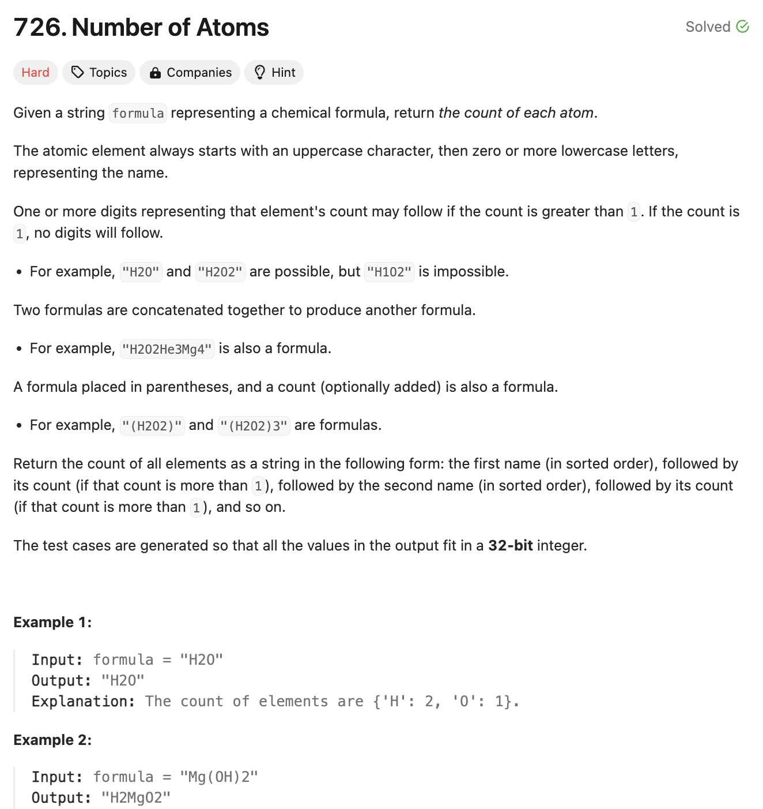
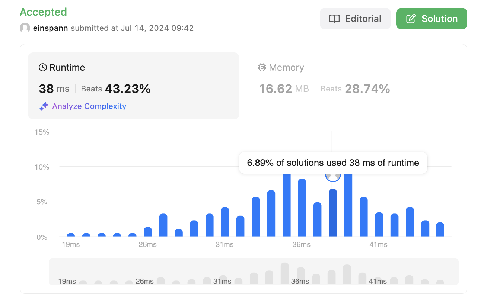

# 문제 설명
문자열로 주어진 화합물의 원자 수를 계산하는 문제다.


## 풀이 및 해설
오늘 문제는 어렵다. 일단 한 눈에 봤을 때, 원소들의 수를 세야 하기 때문에 dictionary/hashmap을 사용해야 할 것 같으며, parenthesis 처리를 해줘야 하기 때문에 stack을 사용해야 할 것 같다. 또한, 원소들이나 숫자들이 두 자리수 이상일 수 있기 때문에, 숫자를 처리할 때도 주의해야 할 것 같으며, 숫자들이 괄호 이후에 나오기 때문에 원소의 수에 hashmap에 곱해주는 연산도 진행해야 할 것 같다.

관건은 이 둘을 어떻게 합칠것이며, 한번에 잘 사용하는 것인데, 이게 이 문제를 어렵게 만드는 요인이다.

## 풀이
```python
def countOfAtoms(self, formula: str) -> str:
    def parse_count(i):
        '''
        Parses string by reading digits until it failure.
        ex: H123
        reads: 1 -> reads 2, adds to 1 becoming 21 -> 123
        '''
        count = 0
        while i < len(formula) and formula[i].isdigit():
            count = count * 10 + int(formula[i])
            i += 1
        return max(1, count), i
    
    def multiply_dict(d,n):
        '''
        Returns a dictionary multiplied by the count provided.
        '''
        return {k: v*n for k,v in d.items()}

    # parse numbers and letters in parenthesis
    stack = [{}]
    i = 0
    while i < len(formula):
        if formula[i] == "(":
            stack.append({})
            i += 1
        elif formula[i] == ")":
            top = stack.pop()
            i += 1

            # parse the value of the following number
            # which could be larger than 1 digit
            count, i = parse_count(i)

            # pop top dictionary and count it
            # then append it to the larger dictionary
            for k,v in multiply_dict(top,count).items():
                #get(k,0) returns either k or 0 if it doesn't exist
                stack[-1][k] = stack[-1].get(k,0)+v   
        else:
            element = formula[i]
            i += 1
            # if this char is a lowercase, add it to atom str
            if i < len(formula) and formula[i].islower():
                element += formula[i]
                i += 1
            
            count, i = parse_count(i)
            stack[-1][element] = stack[-1].get(element,0) + count

    result = stack[0]
    # order: first name (sorted), count(if >1), second name(sorted), so on.
    return ''.join(k + (str(v) if v>1 else '') for k,v in sorted(result.items()))
```
- `parse_count` 함수는 숫자를 파싱하는 함수다. 숫자가 두 자리수 이상일 수 있기 때문에, 이를 처리해주는 함수다.
- `multiply_dict` 함수는 dictionary의 모든 값을 n배 해주는 함수다.
- `stack`은 stack을 사용해 괄호를 처리하는데 사용한다.
- `while`문을 통해 formula를 순회하며, 괄호를 처리한다.
    - `(`가 나오면 stack에 빈 dictionary를 추가한다.
    - `)`가 나오면 stack에서 dictionary를 pop하고, 다음 숫자를 파싱한다.
    - 그리고 pop한 dictionary를 count만큼 곱해주고, stack에 append한다.
    - 그 외의 경우에는 element를 파싱하고, count를 파싱하여 stack에 추가한다.
- 마지막으로 stack의 첫번째 dictionary를 result에 저장하고, 정렬하여 반환한다.

## Complexity Analysis
- 시간 복잡도: O(N)
- 공간 복잡도: O(N)
- N: formula의 길이


### 시간 복잡도
- formula를 한번 순회하며, 각 문자를 처리하므로 O(N)이다.
- `parse_count` 함수는 숫자를 파싱하는데, 이는 O(1)이다.
- `multiply_dict` 함수는 dictionary의 모든 값을 n배 해주는데, 이는 O(N)이다.
- sorted(result.items())는 O(KlogK)이다. 이때, K는 서로 다른 원소의 개수이다. 보통 K는 N보다 작으므로, O(N)으로 예상된다.
- 따라서 전체 시간 복잡도는 O(N)이다.

### 공간 복잡도
- stack에는 dictionary를 저장하므로, O(N)이다.
- 따라서 전체 공간 복잡도는 O(N)이다.

## Constraint Analysis
```
Constraints:
1 <= formula.length <= 1000
formula consists of English letters, digits, '(', and ')'.
formula is always valid.
```

# References
- [Leet](https://leetcode.com/problems/number-of-atoms/)