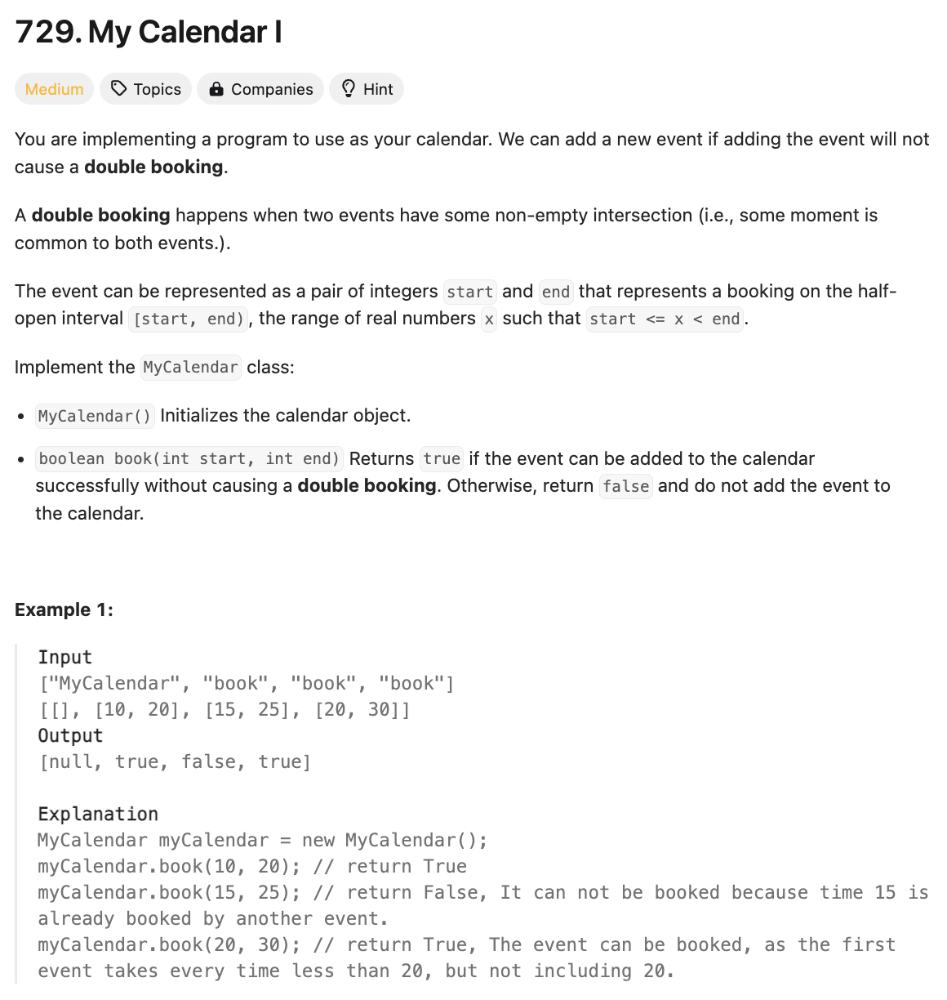
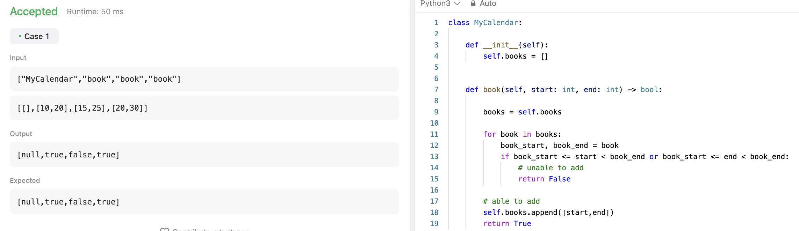
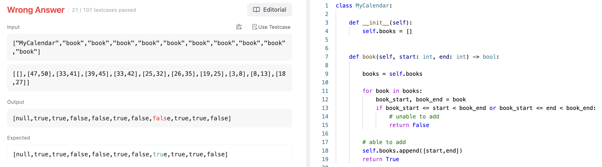
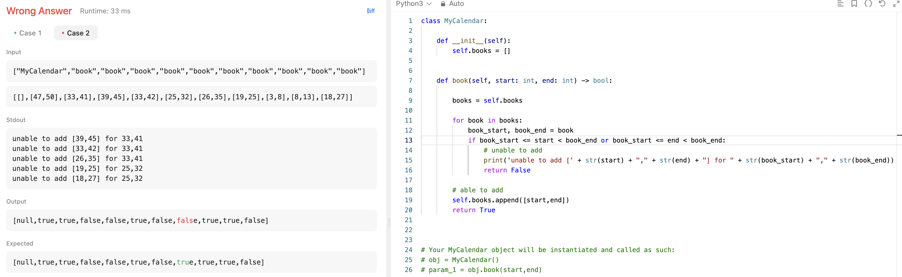
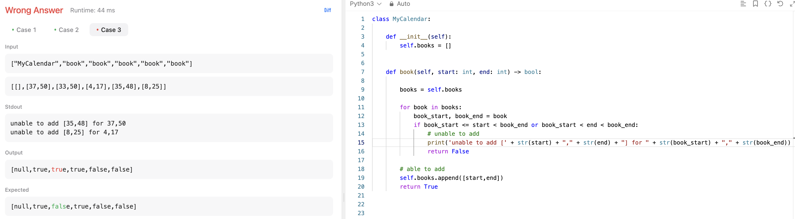
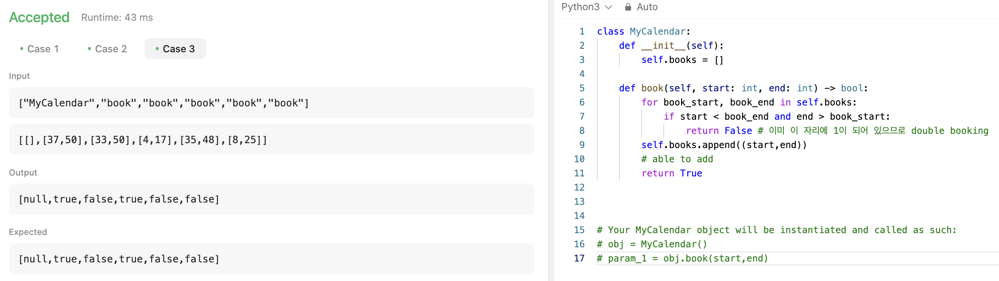
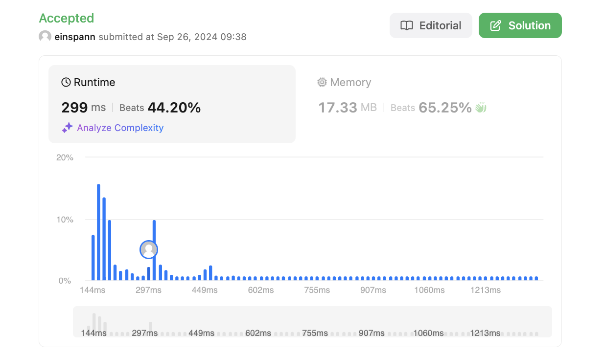

# 문제 설명

이 문제는 시간대가 겹치는 일정이 두개 이상이면 False를 반환하고, 겹치지 않는다면 True를 반환하는 문제이다.



## 풀이 및 해설
클래스를 구현해야 되는 문제다. 다음과 같이 만들었는데 실패했다.

## 풀이
```python
class MyCalendar:

    def __init__(self):
        self.books = []
        

    def book(self, start: int, end: int) -> bool:

        books = self.books

        for book in books:
            book_start, book_end = book
            if book_start <= start < book_end or book_start <= end < book_end:
                # unable to add
                return False

        # able to add
        self.books.append([start,end])
        return True
```




왜 틀렸나 확인하기 위해 디버깅을 해봤다. 보니까, [19,25]가 [25,30]이랑 겹친다고 해서 False라고 뜨는데, 실제로는 True가 나와야 하는거다. 근데 문제에서는 `The event can be represented as a pair of integers start and end that represents a booking on the half-open interval [start, end), the range of real numbers x such that start <= x < end.`라고 하지 않았나? 왜 이런거지?

`book_start <= start < book_end`로 바꿔주니까 해결됐다.



범위 설정을 잘못해서 틀렸었다. 예를 들어, start와 end 모두 범위 안에 안 들어있을 때 잘못 들어가게 된다.

예시로 다음을 살펴볼 수 있다.

[3,5]가 books에 있을 때, [2,6]을 넣으려고 하면 겹치기 때문에 안되어야 하는데, 2와 6 모두 [3,5]에 포함되지 않기 때문에 들어가게 된다. 반면에 `if start < book_end and end > book_start:`로 바꾸면, 2와 6 모두 [3,5]에 포함되기 때문에 들어가지 않게 된다.



## Complexity Analysis


### 시간 복잡도
- book 함수는 O(N)이다.
- N개의 일정을 추가해야 할때는 O(N^2)이다.

### 공간 복잡도
- O(N)이다.

## Constraint Analysis
```
Constraints:
0 <= start < end <= 10^9
At most 1000 calls will be made to book.
```

# References
- [729. My Calendar I](https://leetcode.com/problems/my-calendar-i/)