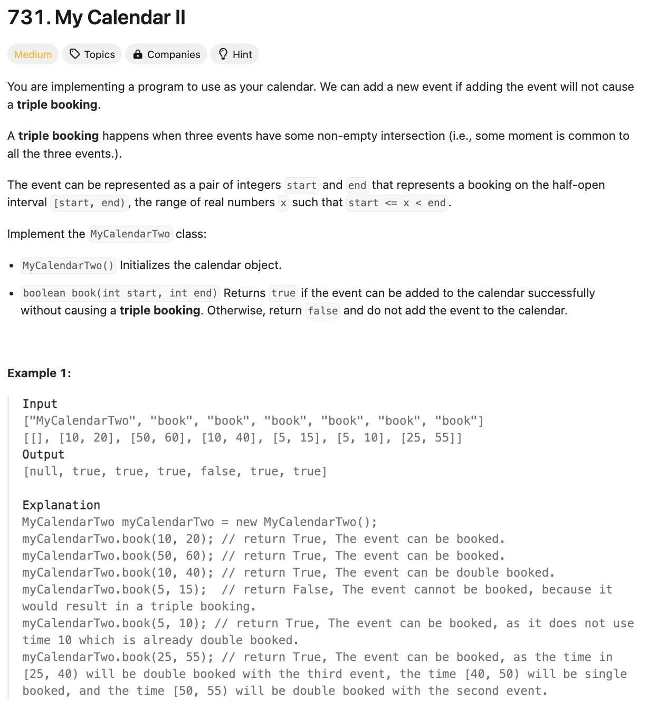
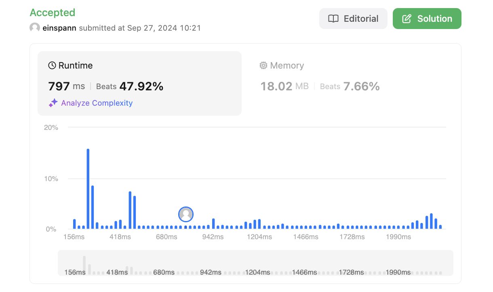

# 문제 설명
어제랑 똑같지만 triple booking을 허용하지 않는다.




## 풀이 및 해설

## 풀이
```python
from sortedcontainers import SortedDict

class MyCalendarTwo:

    def __init__(self):
        self.events = SortedDict()

    def book(self, start: int, end: int) -> bool:
        self.events[start] = self.events.get(start, 0) + 1
        self.events[end] = self.events.get(end, 0) - 1

        ongoing = 0
        for event in self.events:
            ongoing += self.events[event]
            if ongoing > 2:
                # revert everything and return False
                self.events[start] -= 1
                if self.events[start] == 0:
                    del self.events[start]
                self.events[end] += 1
                if self.events[end] == 0:
                    del self.events[end]

                return False
        
        return True
```
- `SortedDict`를 사용하여 시작과 끝을 정렬된 상태로 관리한다.
- `book` 함수에서 시작과 끝을 받아서 시작은 1을 더하고 끝은 1을 뺀다.
- 이후에 `ongoing` 변수를 사용하여 현재 진행중인 이벤트의 수를 관리한다.
- `ongoing`이 2를 초과하면 False를 반환한다.
- 이후에는 `ongoing`이 2를 초과하지 않는다면 True를 반환한다.

## Complexity Analysis


### 시간 복잡도
- `book` 함수에서 `for`문을 돌면서 `ongoing`을 계산하기 때문에 `O(N)`이다.

### 공간 복잡도
- `SortedDict`를 사용하여 시작과 끝을 정렬된 상태로 관리하기 때문에 `O(N)`이다.

## Constraint Analysis
```
Constraints:
0 <= start < end <= 10^9
At most 1000 calls will be made to book.
```

# References
- [731. My Calendar II](https://leetcode.com/problems/my-calendar-ii/)